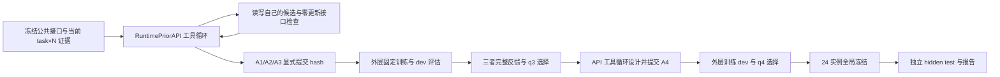

# Experiment 1：API 设计先验与固定训练流程

当前规范为 [EXPERIMENT1_CODEX_EXECUTION_HANDOFF.md](EXPERIMENT1_CODEX_EXECUTION_HANDOFF.md)，并采用用户最新要求的 RuntimePriorAPI 工具循环。开发分支是 `dev`。当前实际进度及结果以 [实验报告](experiments/experiment1/EXPERIMENT1_REPORT.md) 为准；准备、预检和 mock 测试均不算正式训练完成。

开发 Codex 实现公共工具、B0/B1、训练器、评估器和固定调度。GPT-6 Astra／max 通过真实 Responses API 决定 A1–A4 的归纳偏置并写出候选代码。机器人部署策略仍是冻结的数值策略，不在线调用 LLM。

固定矩阵为六个 MetaWorld 单技能任务 × N=2/5/10/20 × B0/B1/A1/A2/A3/A4，单次重复 seed=0，共 144 个正式训练槽位。每槽位 20,000 optimizer updates、50 dev 回合、100 hidden-test 回合。q1/q3/q4 复用四个 API 候选的结果，不额外训练，也不把 B0 当作 API 候选的 fallback。



API 可用工具为 `list_files`、`read_file`、`read_trajectory`、`read_image`、`write_file`、`replace_text`、`run_checks`、`submit_candidate`、`submit_invalid`，以及反馈阶段的 `record_selection`。没有 shell、任意 Python 执行或训练工具。候选进程通过已实测的 Linux Landlock 与 seccomp 隔离，只读当前授权数据和公共文件，无网络和 API 凭证；评估器独立持有环境及隐藏初态，策略 IPC 仅传因果观测与采样 RNG。

初始候选提交前可多次编辑，同一候选最多三次接口检查（首次检查加两次修复检查），不增加模型数。提交后源码、配置、说明与 hash 固定，A1–A3 的任何性能反馈均在三者全部提交后才可发送；性能驱动的新增设计仅有 A4。API、工具、检查、修复、训练和环境交互分别记账。

## 运行

始终在本仓库使用 Pixi；本机二进制为 `/home/users/oscar/.pixi/bin/pixi`。默认 MetaWorld 依赖保持原锁定版本，Round 4 专用 feature/入口已撤下。

用户最新分配为物理 GPU 4、5、6、7，每卡一个独立 worker；0–3 归其他用户使用。候选进程按 `nvidia-smi` 查询的 UUID 绑定并核验实际设备身份。旧验证记录保留原始卡号及验证限制。

```bash
# 安全读取当前代理凭证；不写入仓库或候选环境。
read -rs -p '代理令牌: ' LOCAL_OPENAI_BEARER_TOKEN
export LOCAL_OPENAI_BEARER_TOKEN

pixi run --locked experiment1-preflight
pixi run --locked experiment1-freeze
pixi run --locked experiment1-run --resume --detach
pixi run --locked experiment1-status
pixi run --locked experiment1-report
```

当前 provider 为 `http://127.0.0.1:8080/responses`，模型 `gpt-6-astra`，推理档位 `max`，`store=false`。项目 API 设置由 `EXPERIMENT1_API_PROVIDER/BASE_URL/MODEL/KEY_ENV_NAME/MODE/TIMEOUT_SECONDS/MAX_OUTPUT_TOKENS` 配置；它们在正式运行前冻结。凭证仅由指定环境变量提供，不读取秘密文件。

`preflight` 核验真实数据、隔离、真实 API 工具提交和公共 GPU 拟合/恢复记录。`run --resume` 使用 SQLite/WAL、API 请求/响应、工具 call ID、内容对象、代码版本、候选提交、每个 run 自有锁和完整 RNG checkpoint 继续执行。若网络调用中断且无法确认服务端结果，保留 unknown 费用和阻塞，不自动重抽 proposal。已失败的正式槽位不会被静默重训。训练/评估调度独立于 API 工具循环。

`--detach` 用独立进程启动完整 runner，返回实际 PID 和日志路径，后续设计、训练、全局冻结、测试及报告由 runner 自行推进。省略该参数可在前台运行。只有确认进程存活和实际进度后，才能称任务正在运行；CLI 或本文件的存在不意味着任何正式训练已启动。

## 记录与历史

- [数据交付核验](experiments/experiment1/audits/data_delivery.json)：120 条完整支持示范、300 dev 和 600 hidden-test 初态、24 个独立证据包、384 帧真实回放图。
- [初态独立性核验](experiments/experiment1/audits/split_novelty.json)：与被检查的历史 manifest 做实际 seed/state hash 对照；任务和旧支持示范历史上已用于开发，不宣称 unseen-task transfer。
- `experiments/experiment1/state.sqlite`、`api_records/`、`generated/`、`objects/` 保存完整设计调用和版本；`runs/`、`attempts/`、`selections/` 保存训练、评估、费用与选择。
- [归档索引](archive/legacy_rounds/README.md)与[路径映射](archive/legacy_rounds/path_mapping.json)保留 Round 1/2/3 的实际文件及缺失说明；未完成 Round 4 按精确清单删除，共享环境和 DP 代码保留。
- [通用接口](INTERFACES.md)：Env/RobotEnv、MetaWorldEnv、Policy、rollout 和单次 GPT-6 API 接口。

测试命令是 `pixi run --locked python -m pytest -q`。测试中的 synthetic/mock fixture、零更新检查和公共拟合成本在报告中与正式 API 候选及训练结果严格区分。开发规则见 [AGENTS.md](AGENTS.md)和[agent.md](agent.md)。
