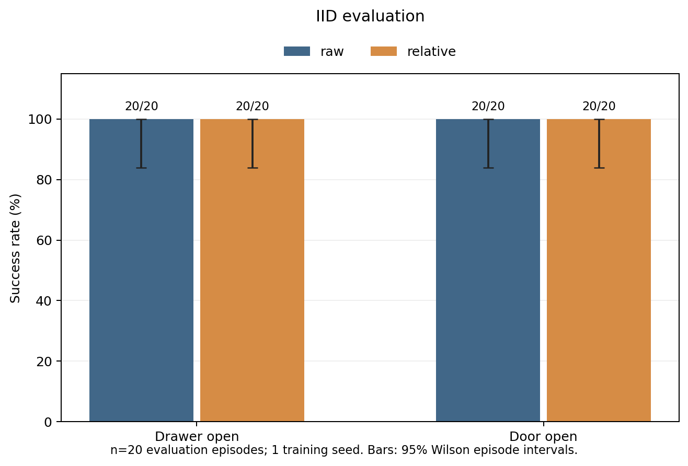
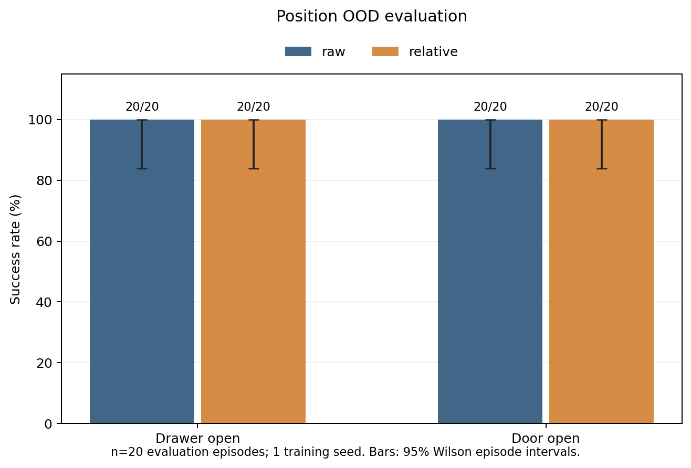
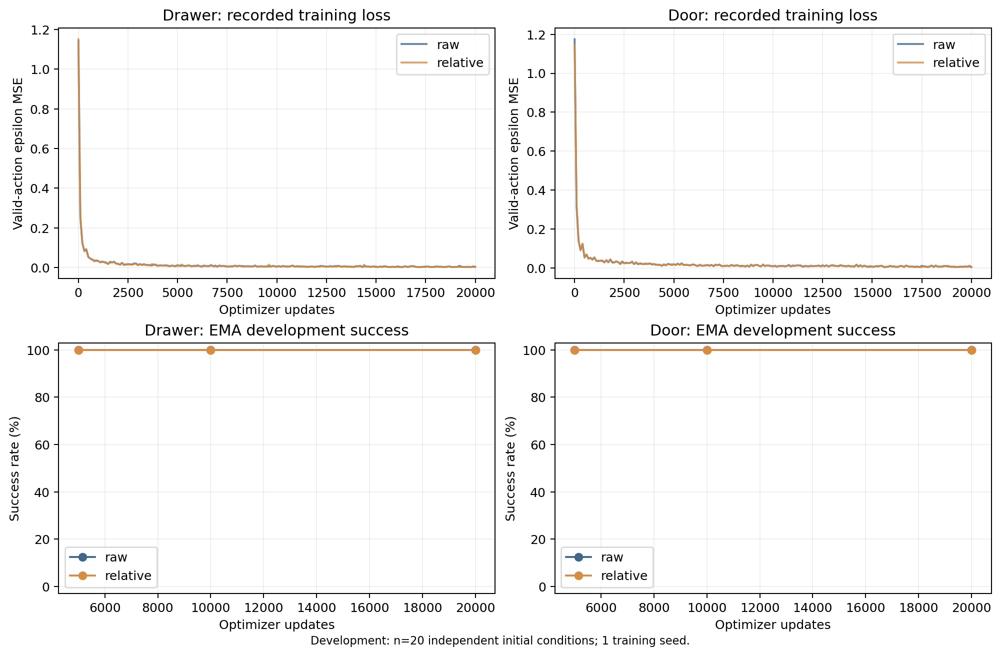
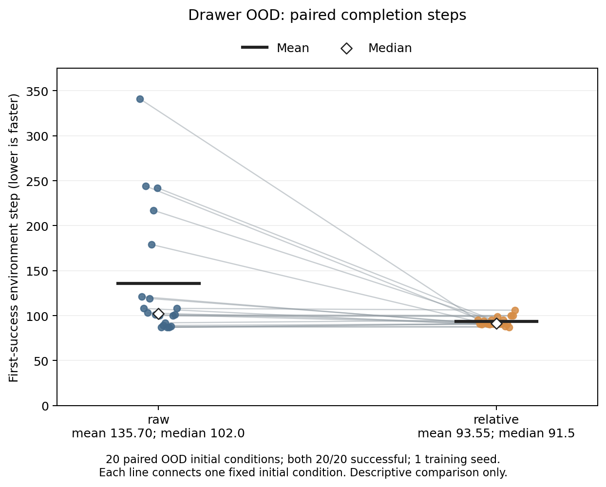

# 第一轮相对坐标先验实验报告

生成时间（UTC）：2026-09-07 07:43:17。
实际状态：正式训练完成 **4/4**；正式测试记录 **160/160**；全部测试 hash 冻结：**是**。
只有完成训练校验和全部测试冻结的行标为 complete；短训练、运行中任务和缺失结果均不视为完成。

## 四个 run 的真实结果

| Run | 状态 / 最后更新 | IID | 位置 OOD | 选定 checkpoint | IID / OOD 成功平均步数 | 更新 / 评价秒数 |
|---|---|---|---|---:|---|---|
| drawer_raw_n20_s0 | complete / 20000 | 20/20 (100%) | 20/20 (100%) | 10000 | 86.95 / 135.70 | 397.6 / 89.8 |
| drawer_relative_n20_s0 | complete / 20000 | 20/20 (100%) | 20/20 (100%) | 10000 | 87.10 / 93.55 | 655.4 / 79.6 |
| door_raw_n20_s0 | complete / 20000 | 20/20 (100%) | 20/20 (100%) | 5000 | 77.65 / 80.00 | 410.7 / 73.4 |
| door_relative_n20_s0 | complete / 20000 | 20/20 (100%) | 20/20 (100%) | 20000 | 77.65 / 81.40 | 410.7 / 74.2 |

表中更新秒数只累计 `Trainer.update`（含首次编译）；评价秒数累计 dev + test episode。包含保存 checkpoint / 日志的训练循环墙钟时间另见 summary 的 `train_loop_wall_seconds`，不把这些嵌套计时重复相加。

原始表：[summary.csv](results/summary.csv)。逐 episode 文件位于 `results/<run_id>/test_iid.json` 与 `test_ood.json`；包含 checkpoint / 数据 / 初始状态 hash、配对采样 seed、成功首步、return、结束标志、异常与耗时。

## 主要观察

- drawer：relative − raw 的 IID 差为 **+0 个百分点**，位置 OOD 差为 **+0 个百分点**。这是同一训练 seed、同组初始条件下的描述性结果。
- door：relative − raw 的 IID 差为 **+0 个百分点**，位置 OOD 差为 **+0 个百分点**。这是同一训练 seed、同组初始条件下的描述性结果。

主要终点出现**成功率上限效应**：四个 run 的 IID 与 OOD 均为 20/20。本轮没有观察到 relative 的成功率收益；这不等于证明两种表示等价，也不能据此估计更困难任务或其他训练 seed 的差异。

次要描述性观察：Drawer OOD 平均完成步数从 **135.70 降至 93.55**，差为 **-42.15 步**（平均步数减少 **31.1%**）。中位数从 102.0 降至 91.5；同一组 20 个初始条件中 relative 更快 14 个、持平 1 个、更慢 5 个，配对差值中位数 -6.0 步。平均差距部分来自 raw 的较慢尾部，不能直接解释为某一交互阶段已获改善。

其他完成时间差异较小且方向混合：Drawer IID 为 86.95→87.10 步；Door IID 均为 77.65 步；Door OOD 为 80.00→81.40 步。以上均是单训练 seed 的描述，不构成跨训练 seed 稳定收益的证据。

接近、建立交互和持续打开阶段的归因仍属**未知**：本轮保存原生诊断 info 和固定规则重放视频，但没有经验证的阶段分类器。最终成功率和个别视频不足以单独证明某一阶段的机制改善。

## 固定设置与公平性

每任务采集 100 条成功脚本专家轨迹，以预先固定 RNG 选择 train20。四个正式 run 均只使用同任务相同的 20 条示范计算输入统计和更新网络；其余 80 条不进入优化器或 normalization。dev / IID / OOD 各 20 个独立初始条件，按真实基座位置划分；OOD 左右各 10 个。原始数据、split 与 train20 在训练前冻结。

状态为目标可见的 native 39 维观测（18 维当前、18 维原生历史、3 维目标）。每个历史位置块使用自身 handle；当前 goal 使用当前 handle。relative 保留 handle 世界坐标，将 hand 与 goal 替换为相对 handle 位置；姿态、夹爪和占位不丢失。native reset 重复首帧历史；DP 另用相同的 2 步观测历史。变换先于仅来自 train20 的 mean/std（std 下限 1e-3），OOD 输入不裁剪。完整字段、handle 固定 offset、动作内部缩放和 reset 语义见 [observation_schema.json](artifacts/observation_schema.json) 与 [DATA_SEMANTICS.md](docs/DATA_SEMANTICS.md)。

Conditional 1D U-Net 使用官方 DP 必需模块，两个表示网络和参数量一致。每次条件为 `(o[t-1], o[t])`，目标为 `a[t:t+16]`，执行 `[0:4]`；尾部无效 action 不计 loss。动作是原生 4 维归一化 Cartesian 增量与夹爪，实际 env.step 输入裁剪到 [-1,1]，不再按示范范围归一化。单个 chunk 中一旦原生 success 或终止/截断触发立即结束。

正式预算：每 run 20,000 更新，有效 batch=128，AdamW lr=0.0001、weight_decay=1e-06，恒定学习率，梯度范数上限 1.0。U-Net down_dims=[64, 128, 256]，diffusion embedding=128，kernel=5，groups=8。100 步 squaredcos 训练扩散，epsilon MSE；DDIM 16 步、eta=0、clean sample clipping；EMA decay=0.995。训练 seed=0。最终实际冻结配置与训练身份见 `runs/<run_id>/`；资源调整见 README / PROGRESS。

每个 5k/10k/20k EMA checkpoint 在相同 dev20 和相同 episode 采样 seed 上评价。依次按成功率最高、成功 episode 平均首成功步最少、checkpoint 最早选择；全失败时直接选最早。四个选择全部冻结后才运行正式 test。训练 loader、训练 diffusion、dev、test 和视频使用独立 RNG；同任务 raw/relative 共享 episode 采样 seed。

预先统一的执行兼容性设置：`torch_compile=True`、`inference_torch_compile=True`，float32，TF32 关闭、确定性算法开启；不改变有效 batch、网络、示范数或更新预算。两个表示模型均有 4,696,644 个参数（完整 run identity 可核对）。

## 数据与实现校验

冻结 manifest SHA256：`1695e14b53a8602343a640bc04cff53cfdc53a3e2230e6c64b9249c4622f6ec3`。

| Task | 专家池成功 / 尝试 | train_pool 真实 x 范围 | dev 真实 x 范围 | IID 真实 x 范围 | OOD 真实 x 范围 |
|---|---|---|---|---|---|
| door | 100 / 100 | [0.03038, 0.06993] | [0.03243, 0.06955] | [0.03022, 0.06816] | [0.00193, 0.09880] |
| drawer | 100 / 100 | [-0.03991, 0.03996] | [-0.03996, 0.03649] | [-0.03793, 0.02632] | [-0.09951, 0.09711] |

单位为米；OOD 行显示两端样本的总体 min/max，中间空隙没有采样。规定 drawer 训练 x∈[-0.04,0.04]、OOD x∈[-0.10,-0.06]∪[0.06,0.10]；door 训练 x∈[0.03,0.07]、OOD x∈[0,0.02]∪[0.08,0.10]，所有 door split y∈[0.88,0.92]。本安装版本原生范围与规格一致，无区间调整。所有 eval 初始条件专家预检查成功，排除清单为空；实际清单和 seed 见 manifest。

独立数据审计实际检查 320 个初始 snapshot，完整重放 200 条示范、16,444 个实际动作；snapshot 容差 1e-09，存储 float32 观测最大误差 2.980e-08，raw→relative→raw 最大误差 2.980e-08。动作标签与真实重放输入一致，reward/success/终止标志检查通过。证据：[dataset_audit.json](artifacts/dataset_audit.json)。

完整 preflight 实际通过：`True`；证据：[preflight.json](artifacts/preflight.json)、[preflight_tests.xml](artifacts/preflight_tests.xml)。独立 debug checkpoint 和 midpoint rollout 不作为任何正式 run 初始化。

最终配对完整性检查：`True`（未完成时为 null）；[paired_integrity.json](results/paired_integrity.json) 验证同任务两个 run 的初始权重 hash、全部窗口/timestep/noise 序列 digest、参数量、train20 来源、normalization 输入数、20k 更新和其余配置一致。

## 运行恢复与执行调整

首个 `drawer_raw_n20_s0` 已完成 20,000 更新。随后同一进程中的 relative 训练显著变慢，仍在实际计算；收到 SIGTERM 后在第 65 次更新完整保存并正常进入可恢复暂停。已完成 raw 保留，原始运行日志与耗时保留，没有将慢任务冒充完成。

独立新进程从原始初始化重放 65 次更新，与保存状态的模型、EMA、完整 AdamW、loader RNG、diffusion RNG、初始权重 hash、样本数和配对 digest **逐位一致**（校验 passed=`True`）。原慢前缀更新耗时 227.932 秒；诊断重放更新 4.392 秒，诊断总墙钟 5.636 秒。诊断输出不进入正式初始化或正式训练预算；relative 从原始第 65 步继续完成剩余 19,935 步。

执行调整仅涉及 CLI 编排：每个正式 run 在新的 Pixi 子进程中顺序执行，父进程持有管线锁。冻结的模型/训练/数据/配置、精度、编译选项、有效 batch 和 20k 预算均未改变，无正式结果被作废，也没有增加正式 run。最初较慢的 227.93 秒保留在 relative 累计训练耗时中。

原因仍是**根据源码的推断**：固定 PyTorch 2.7.1 的 CUDA graph generation 逻辑会优先使用非零全局 `MarkStepBox` 计数，而先前 debug inference 调用了显式 step 标记；跨 Trainer 保留的 graph 状态可能导致性能异常。主机 ptrace 权限不允许附加堆栈检查，因此没有直接堆栈证据，未更改系统权限或驱动。

证据：[RUNTIME_RECOVERY.md](docs/RUNTIME_RECOVERY.md)、[runtime_recovery_check.json](artifacts/runtime_recovery_check.json)、[诊断日志](logs/runtime_recovery_check.log)、[原始调用日志](logs/round1_invocation_804594.log)、[原始调用计时](artifacts/pipeline_timing_804594.json)。

## 图与视频







图中 n=20 evaluation episodes，1 training seed。Wilson 95% 区间只描述 episode 二项不确定性，不能作为跨训练 seed 稳定性的证据。成功次数相差 1 对应 5 个百分点。



配对步数图直接使用同一组 20 个冻结 OOD 初始条件的首成功步数，每条线连接同一个 episode；全部 episode 成功，没有删除慢轨迹。它补充展示成功率达到上限后仍可观察到的完成时间差异。

- [drawer_raw_n20_s0 / test_iid / success](results/videos/drawer_raw_n20_s0_test_iid_success.mp4)（与冻结轨迹 hash 一致）。
- drawer_raw_n20_s0 / test_iid / failure：absent；No failure episode in this split。
- [drawer_raw_n20_s0 / test_ood / success](results/videos/drawer_raw_n20_s0_test_ood_success.mp4)（与冻结轨迹 hash 一致）。
- drawer_raw_n20_s0 / test_ood / failure：absent；No failure episode in this split。
- [drawer_relative_n20_s0 / test_iid / success](results/videos/drawer_relative_n20_s0_test_iid_success.mp4)（与冻结轨迹 hash 一致）。
- drawer_relative_n20_s0 / test_iid / failure：absent；No failure episode in this split。
- [drawer_relative_n20_s0 / test_ood / success](results/videos/drawer_relative_n20_s0_test_ood_success.mp4)（与冻结轨迹 hash 一致）。
- drawer_relative_n20_s0 / test_ood / failure：absent；No failure episode in this split。
- [door_raw_n20_s0 / test_iid / success](results/videos/door_raw_n20_s0_test_iid_success.mp4)（与冻结轨迹 hash 一致）。
- door_raw_n20_s0 / test_iid / failure：absent；No failure episode in this split。
- [door_raw_n20_s0 / test_ood / success](results/videos/door_raw_n20_s0_test_ood_success.mp4)（与冻结轨迹 hash 一致）。
- door_raw_n20_s0 / test_ood / failure：absent；No failure episode in this split。
- [door_relative_n20_s0 / test_iid / success](results/videos/door_relative_n20_s0_test_iid_success.mp4)（与冻结轨迹 hash 一致）。
- door_relative_n20_s0 / test_iid / failure：absent；No failure episode in this split。
- [door_relative_n20_s0 / test_ood / success](results/videos/door_relative_n20_s0_test_ood_success.mp4)（与冻结轨迹 hash 一致）。
- door_relative_n20_s0 / test_ood / failure：absent；No failure episode in this split。

## 依赖、许可证与计算成本

实际平台：`Linux-6.8.0-117-generic-x86_64-with-glibc2.39`；Python `3.11.16 (main, Sep  2 2026, 23:39:52) [GCC 15.3.0]`；CUDA 可用 `True`；渲染后端 `egl`。
GPU：`[{"index": 0, "name": "NVIDIA RTX A6000", "total_memory": 50899386368}]`。

实际使用主机**物理 GPU 1**；Pixi 设置 `CUDA_VISIBLE_DEVICES=1`，因此进程内部对应 `cuda:0`。CPU、内存、所有 GPU 与后端探测记录：[host_resources.json](artifacts/host_resources.json)。

固定 MetaWorld commit：`6e01ad7e2ffb2302e4dca04f796fcd8837df8540`；DP commit：`5ba07ac6661db573af695b419a7947ecb704690f`。

完整依赖版本、源码 hash 与元数据：[artifacts/environment.json](artifacts/environment.json)；固定环境：[pixi.lock](pixi.lock)。DP 模块来源与修改说明：[PROVENANCE.md](src/relative_dp/vendor/diffusion_policy/PROVENANCE.md)，许可证：[LICENSE](src/relative_dp/vendor/diffusion_policy/LICENSE)。官方源码来源：[MetaWorld](https://github.com/Farama-Foundation/Metaworld)、[Diffusion Policy](https://github.com/real-stanford/diffusion_policy)。

| 包 | 实际版本 | 许可证（安装元数据） |
|---|---|---|
| metaworld | 3.1.1 | MIT License |
| mujoco | 3.3.0 | Apache License 2.0 |
| torch | 2.7.1 | BSD-3-Clause |
| diffusers | 0.35.1 | Apache 2.0 License |
| gymnasium | 1.2.0 | MIT License |
| numpy | 2.2.6 | Copyright (c) 2005-2024, NumPy Developers.  All rights reserved.   Redistribution and use in sour…（完整见环境记录） |
| matplotlib | 3.10.3 | License agreement for matplotlib versions 1.3.0 and later  ======================================…（完整见环境记录） |

记录的正式训练更新耗时 1874.4 秒；训练循环（含 checkpoint/log）1895.9 秒；dev 185.9 秒；test 131.1 秒；视频重放 12.3 秒；数据采集 17.7 秒。更新所占 GPU 小时 0.521。

其他实测阶段：数据审计 16.7 秒、完整 preflight 17.1 秒、EGL render check 0.8 秒；运行恢复诊断另计 5.6 秒。

已结束的 `round1` 调用共 3 次，累计管线墙钟 **2283.9 秒**。只汇总 `artifacts/invocation_*.json` 中 `command=round1` 的记录（包含原始暂停和后续恢复）；不重复加入相同内容的 `pipeline_timing*.json`、重叠的训练子进程或单独 report 命令。仍在运行的调用尚未写入最终计时，不包含在这个累计数中。完整调用清单/hash 和阶段细分见 [compute_cost.json](results/compute_cost.json)。

管线墙钟与内部训练/评价/编译阶段是嵌套计时，不能相加；恢复诊断的 65 步也不是额外正式训练。更新计时不包括模型/数据初始化，episode 计时不包括 checkpoint 读取。未测量的环境安装/调度开销明确为未知，无新增付费云资源。

只读资源采样：[resource_usage_summary.json](artifacts/resource_usage_summary.json)、[原始调用采样](artifacts/resource_usage_summary_804594.json)、[resources.jsonl](logs/resources.jsonl)。每 10 秒采样，覆盖部分运行窗口；功率包含设备空闲基线。能量估算既不是完整实验总能耗，也不是增量能耗或收费计量。

## 解释边界与下一步

本轮 relative 变换可逆且大体为仿射重参数化，没有增加传感信息。在第一层线性映射足够自由时，它未必缩小可表达函数集合。正结果支持有限数据下表示对优化或泛化有效，不能证明任意组合能力，也没有验证 VLM/Agent 自动选择先验。负结果和两方法都差的情况均保留，不通过增加示范、更新次数、辅助损失或修改 OOD 分布追求胜出。

仅 1 个训练 seed 与每 split 20 个 episode 可支持本次固定条件下的初步配对观察，不能估计训练随机性，不能宣称普遍收益。下一步建议：保持相同数据、架构和位置分布，另行预注册多训练 seed 的配对复验；本轮不自动增加正式训练。若当前尚未完成，优先恢复并完成本轮后再作比较。

## 复现与恢复

```bash
pixi run doctor
pixi run test
pixi run collect-round1
pixi run train-round1
pixi run evaluate-round1
pixi run report-round1
# 顺序执行并根据完整身份 / hash 恢复或跳过
pixi run round1
```

单 run 恢复命令以 [README](README.md) 为准；训练恢复包含 optimizer、EMA 和 RNG。进度及活动进程：[PROGRESS.md](PROGRESS.md)。过期 hash 或运行异常会报错，不能凭目录存在跳过任务。
