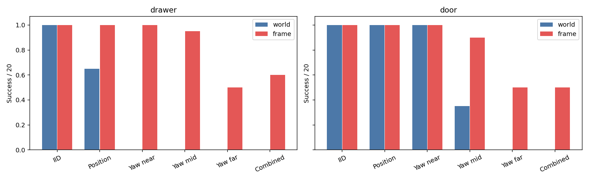
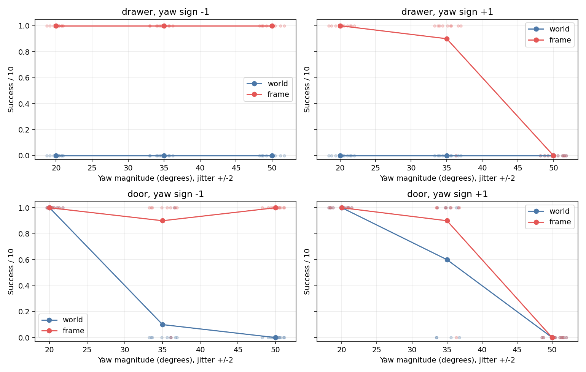
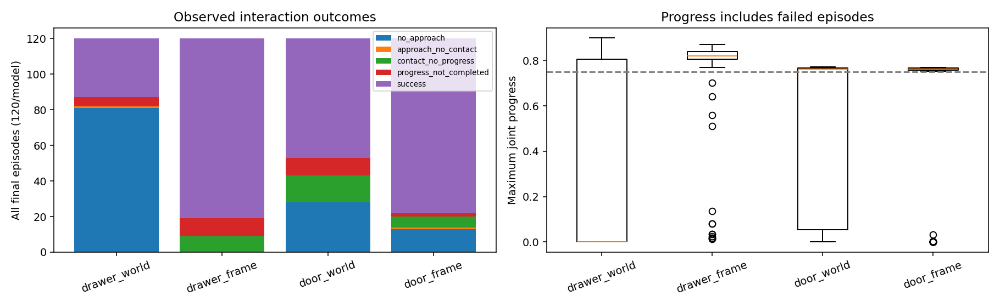
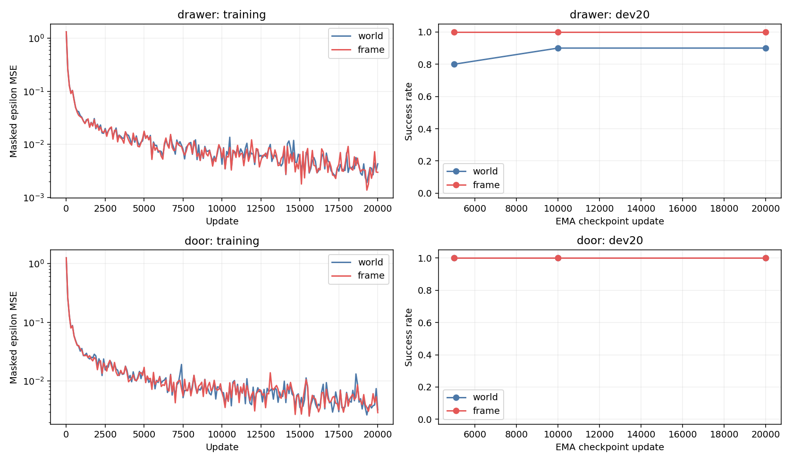
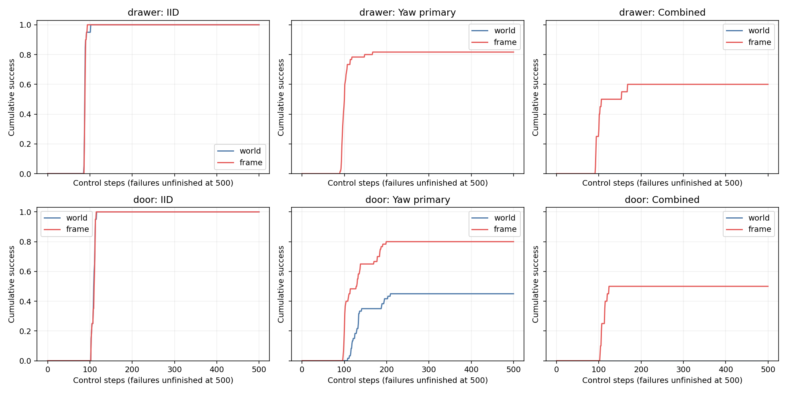

# Round 2 实验报告

本轮在真实旋转柜体的自定义 MetaWorld 扩展中，完成了 40 条新示范、四次各 20,000 步正式训练、240 次 dev 评测和 480 次冻结测试。两方法共享数据、信息、网络参数量和训练预算。

| 模型 | EMA 步数 | IID | 位置 OOD | yaw near | yaw mid | yaw far | combined | yaw 主指标 |
|---|---:|---:|---:|---:|---:|---:|---:|---:|
| r2_drawer_world_n20_s0 | 20000 | 100.0% | 65.0% | 0.0% | 0.0% | 0.0% | 0.0% | 0.0% |
| r2_drawer_frame_n20_s0 | 20000 | 100.0% | 100.0% | 100.0% | 95.0% | 50.0% | 60.0% | 81.7% |
| r2_door_world_n20_s0 | 20000 | 100.0% | 100.0% | 100.0% | 35.0% | 0.0% | 0.0% | 45.0% |
| r2_door_frame_n20_s0 | 20000 | 100.0% | 100.0% | 100.0% | 90.0% | 50.0% | 50.0% | 80.0% |

各单项分母为20；yaw 主指标为 near/mid/far 等权平均，合计60。所有异常保留在原分母中。训练仅一个 seed，每个测试状态各执行一次推理、两方法共用该状态的推理 seed；不能把这些结果外推为跨训练 seed 的稳定提升。

drawer：frame 的 yaw 主成功率相对 world 变化 +81.7 个百分点。world/frame 的 yaw 接触率分别为 0.0%/100.0%，开始打开率为 0.0%/93.3%。这些诊断是相关证据，不能单独证明失败机制。
yaw 失败类别（world/frame 回合数）：未接近 60/0；接近但无直接接触 0/0；接触但未开始打开 0/4；已开始打开但未完成 0/7。
其中减少最多的失败类别是“未接近”，是本轮最直接的诊断线索；该分类依据控制步接触与进度记录，仍无法排除多个因素共同作用。

door：frame 的 yaw 主成功率相对 world 变化 +35.0 个百分点。world/frame 的 yaw 接触率分别为 85.0%/90.0%，开始打开率为 71.7%/83.3%。这些诊断是相关证据，不能单独证明失败机制。
yaw 失败类别（world/frame 回合数）：未接近 18/8；接近但无直接接触 0/0；接触但未开始打开 7/2；已开始打开但未完成 8/2。
其中减少最多的失败类别是“未接近”，是本轮最直接的诊断线索；该分类依据控制步接触与进度记录，仍无法排除多个因素共同作用。

远档存在明显方向差异：drawer frame 在约−50°为10/10、约+50°为0/10；door frame 在约−50°为10/10、约+50°为0/10。这一参数化没有消除所有方向上的泛化失败。

当前配对实验支持带方向的坐标先验改善 yaw 泛化；改善幅度与任务相关，尚待独立训练种子确认。

yaw 主指标对应的操作诊断如下。首次成功均步数仅对成功回合计算；不同失败率下不能单独比较。裁剪率包含 xyz 与 gripper，逐坐标计数保留在逐回合 JSON。

| 模型 | 首次成功均步数 | 平均最大 / 最终进度 | 实际动作步裁剪率 | 越界 / 异常回合 |
|---|---:|---:|---:|---:|
| r2_drawer_world_n20_s0 | — | 0.000 / 0.000 | 27.1% | 0 / 0 |
| r2_drawer_frame_n20_s0 | 101.57 | 0.762 / 0.761 | 25.3% | 10 / 0 |
| r2_door_world_n20_s0 | 141.07 | 0.448 / 0.443 | 22.2% | 0 / 0 |
| r2_door_frame_n20_s0 | 124.04 | 0.636 / 0.635 | 48.9% | 2 / 0 |

三步开度阈值达成不一定等于有效成功：若回合历史出现超过预定容差的关节越界，仍判失败。因此“未完成”类别可能包含已打开但无效的轨迹，不能单凭该标签断言未打开。以下只用于解释既定规则，不替换主指标。

| 模型 | yaw 三步阈值达成 | 其中曾越界 | 有效成功 |
|---|---:|---:|---:|
| r2_drawer_world_n20_s0 | 0/60 | 0 | 0/60 |
| r2_drawer_frame_n20_s0 | 54/60 | 5 | 49/60 |
| r2_door_world_n20_s0 | 27/60 | 0 | 27/60 |
| r2_door_frame_n20_s0 | 50/60 | 2 | 48/60 |

全部拆分的次要指标见 [metrics_by_split.csv](results/round2/metrics_by_split.csv)。

## 设置与可比性

两任务最终都采用 A 档：训练 yaw ±10°，测试 ±20°/±35°/±50°，各含 ±2° 扰动。每任务最终57项物理/专家复查全部通过；校准没有读取模型结果。训练仅使用按四个 yaw 区间直接采集的20条成功示范，dev/test使用独立初始状态。
相对 Round 1：本轮真实旋转柜体，统一 XYZW 四元数、修正抽屉把手偏移、以真实关节进度和连续三步定义成功；frame 同时变换观测和动作。两方法的四元数与 yaw 不标准化，扩散采样均取消 clean-sample 裁剪，动作先解码到 world 再作原生裁剪。门的目标与旧版 world-X success 不同，因此不能直接把两轮成功率作同任务难度比较。
校准曾发现后挡条穿透旋转抽屉并造成零动作开启；统一后移该配件后修复。旧探测和失败版本均保留。机器人、桌面、重力、关节范围、原生控制尺度与频率保持一致。详见 [协议](ROUND2_PROTOCOL.md) 与 [几何审计](docs/ROUND2_GEOMETRY.md)。
该表示保留 world 把手位置与 yaw，未强制网络丢弃世界信息；固定末端姿态也意味着完整系统不是严格旋转等变的。

模型测试结束后，使用完全不变的冻结专家对全部240个测试状态补充了执行参考，用于解释剩余失败。该结果是后置诊断，未用于选角度、调专家、换测试样本或训练模型，也不应被称为理论物理上限。

| 专家参考 | IID | 位置 | near | mid | far | combined |
|---|---:|---:|---:|---:|---:|---:|
| drawer | 20/20 | 20/20 | 20/20 | 20/20 | 20/20 | 20/20 |
| door | 20/20 | 20/20 | 20/20 | 19/20 | 17/20 | 20/20 |

完整记录见 [expert_reference.json](results/round2/expert_reference.json)。所有校准与该参考检查合计仍受每任务600次专家 rollout 上限约束。
门专家参考中有4次已达到三步开度阈值、但因历史关节越界而无效的回合。
冻结专家在两个任务的正向 far 状态上的有效成功数分别为：drawer 10/10；door 10/10。这些相同状态上的成功专家轨迹说明，frame 在该方向的失败不能一概解释为物理不可行；仍有未解决的策略泛化问题。

## 验证与诊断

40/40 条示范完整重放，280/280 个 dev/test 初始快照重置通过。几何/表示/动作/归一化/时间对齐测试通过。每配置200步短调试在100步换进程恢复，正式训练各从头初始化。配对初始权重、参数量以及20,000步采样/噪声/timestep摘要一致；EMA选择只依据dev20，并在全部测试前统一冻结。
接触来自真实把手碰撞 geom 与 gripper geom 的接触对；距离单独报告。按控制步采样可能漏掉物理子步内短暂接触。关节异常与仿真异常见逐回合 JSON；有异常的回合不能算成功。成功者平均步数是条件均值，失败率不同时不宜单独比较。累计成功曲线将失败回合保留到500步。

## 视频

按预先固定规则选取 IID/far 的首个成功和首个失败；另取首个 world 失败而 frame 成功的配对状态并排展示（左 world、右 frame）。不存在的类别明确列出；没有挑选最佳表现。

- [r2_drawer_world_n20_s0_test_iid_first_success](artifacts/round2/videos/r2_drawer_world_n20_s0_test_iid_first_success.mp4)：r2_drawer_test_iid_000
- r2_drawer_world_n20_s0_test_iid_first_failure：不存在符合条件的回合。
- r2_drawer_world_n20_s0_test_yaw_far_first_success：不存在符合条件的回合。
- [r2_drawer_world_n20_s0_test_yaw_far_first_failure](artifacts/round2/videos/r2_drawer_world_n20_s0_test_yaw_far_first_failure.mp4)：r2_drawer_test_yaw_far_000
- [r2_drawer_frame_n20_s0_test_iid_first_success](artifacts/round2/videos/r2_drawer_frame_n20_s0_test_iid_first_success.mp4)：r2_drawer_test_iid_000
- r2_drawer_frame_n20_s0_test_iid_first_failure：不存在符合条件的回合。
- [r2_drawer_frame_n20_s0_test_yaw_far_first_success](artifacts/round2/videos/r2_drawer_frame_n20_s0_test_yaw_far_first_success.mp4)：r2_drawer_test_yaw_far_000
- [r2_drawer_frame_n20_s0_test_yaw_far_first_failure](artifacts/round2/videos/r2_drawer_frame_n20_s0_test_yaw_far_first_failure.mp4)：r2_drawer_test_yaw_far_010
- [r2_door_world_n20_s0_test_iid_first_success](artifacts/round2/videos/r2_door_world_n20_s0_test_iid_first_success.mp4)：r2_door_test_iid_000
- r2_door_world_n20_s0_test_iid_first_failure：不存在符合条件的回合。
- r2_door_world_n20_s0_test_yaw_far_first_success：不存在符合条件的回合。
- [r2_door_world_n20_s0_test_yaw_far_first_failure](artifacts/round2/videos/r2_door_world_n20_s0_test_yaw_far_first_failure.mp4)：r2_door_test_yaw_far_000
- [r2_door_frame_n20_s0_test_iid_first_success](artifacts/round2/videos/r2_door_frame_n20_s0_test_iid_first_success.mp4)：r2_door_test_iid_000
- r2_door_frame_n20_s0_test_iid_first_failure：不存在符合条件的回合。
- [r2_door_frame_n20_s0_test_yaw_far_first_success](artifacts/round2/videos/r2_door_frame_n20_s0_test_yaw_far_first_success.mp4)：r2_door_test_yaw_far_000
- [r2_door_frame_n20_s0_test_yaw_far_first_failure](artifacts/round2/videos/r2_door_frame_n20_s0_test_yaw_far_first_failure.mp4)：r2_door_test_yaw_far_010
- [drawer_first_world_failure_frame_success](artifacts/round2/videos/drawer_first_world_failure_frame_success.mp4)：r2_drawer_test_position_000
- [door_first_world_failure_frame_success](artifacts/round2/videos/door_first_world_failure_frame_success.mp4)：r2_door_test_yaw_mid_001

## 计算成本与复现

| 阶段 | 实际计量 |
|---|---:|
| 专家校准 | 633 次；129.9 秒 |
| 冻结测试的后置专家参考 | 240 次；45.3 秒 |
| 已记录零动作检查 | 90.1 秒 |
| 数据采集 / 完整审计 | 40.7 / 38.6 秒 |
| 短调试更新 / 8步闭环检查 | 800 updates；56.2 / 22.3 秒 |
| 正式训练 | 80000 updates；1614.4 秒 |
| dev / final test | 274.5 / 1151.0 秒 |
| 视频渲染 | 12.0 秒 |

表中各项为互不重复的已计量区间；训练时间包括同步和首次编译，未完整覆盖进程启动、checkpoint写盘、绘图以及早期未计时零动作诊断。无法从这些墙钟区间推断精确分配 GPU 小时，未把编辑和等待时间算作训练。具体数据见 [compute.json](results/round2/compute.json)。
运行：`pixi run round2`；阶段入口见 [协议](ROUND2_PROTOCOL.md)。主要产物：[汇总 CSV](results/round2/summary.csv)、[完整结果 JSON](results/round2/summary.json)、[checkpoint 选择](results/round2/selection.json)、[数据 manifest](data/round2/manifest.json)、`runs/round2/` 中的 checkpoint 和日志、[视频清单](artifacts/round2/videos/manifest.json)。

## 唯一下一步

保持本轮环境、数据规模和评测协议不变，补充独立训练 seed，检查当前坐标先验效应的稳定性；本轮不自动启动额外训练。
