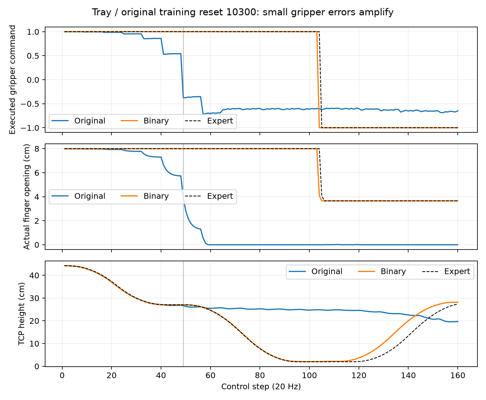

# Exp2 frozen-DP diagnosis: training resets, gripper feedback and intermediate-state coverage

Reviewed: 2026-09-19. Developer-owned diagnostic study, authorized after the user questioned the weak DP baseline. **No retraining, Runtime API requests, API-output edits, or changes to Exp1 or the frozen Exp2 scientific implementation/results.**

## Main conclusion

The new tasks' poor naive-DP results cannot be explained solely by unfamiliar initial layouts. All four new task models fail from all twelve original demonstration resets within the diagnostic 1,500-step cap, while the drawer model succeeds on 9/12. Recorded expert actions complete all 60 replay trials.

We identified a concrete failure mechanism: **small continuous gripper-command errors alter finger opening, and the model responds to that changed opening by closing further, eventually attempting a grasp in free space.** A paired-noise input intervention isolates finger position as the cause of premature closing in the inspected tray trajectory. A live, one-factor change that executes only the sign of the gripper command substantially improves three new tasks without changing weights, arm commands, DDPM sampling, or observations.

This is not the whole explanation. Tray packing still fails after that intervention. Its demonstrated post-placement states are extremely narrow, and successful-but-offset red placements lead into states from which the policy stalls. Giving the unchanged model a physically replayed expert prefix restores all three inspected tray completions. The evidence therefore supports **both an unstable gripper feedback loop and insufficient tolerance to intermediate-state deviations**, rather than task semantics alone determining difficulty.

The original paper's naive-DP numbers remain valid measurements of its executed configuration. They should not be presented as a strong, fully diagnosed representative of what DP can achieve on these tasks. These adaptive diagnostics are separate from the formal four-method matrix.

## 1. Design and evidence ownership

- Five frozen naive-DP checkpoints, twelve original training demonstrations per task.
- Reset seeds are the original demonstration seeds, with exact equality checked across every recorded initial observation field. The environment uses its ordinary reset implementation; no object/robot pose overwrite after reset.
- Original learned-policy trials retain two-frame observation history throughout. There is no policy switching and no APPL history reset.
- Original inference: last EMA, full DDPM100, prediction horizon 16, executed slice 1:9 (eight actions), native absolute joint targets, original normalizer, and original seed-based diffusion RNG.
- Diagnostic learned-action cap: **1,500 control steps**, at 20 Hz. The underlying wrapper remains 5,000. Failure below means “not successful within this diagnostic cap,” not a new 5,000-step score.
- Existing formal naive-DP evaluation has 17 ID successes, all within its first 1,500 steps; no formal OOD successes. That motivates the shorter diagnostic cap but does not prove that a modified controller cannot benefit from longer execution.
- Original-reset rollouts: all twelve per task. Adaptive interventions: fixed demonstration indices **0, 5, 11** per task, chosen before their intervention results were available.
- Devices 2/3/4/5/7, at most five physical GPUs. Multiple jobs shared these devices; unrelated processes were preserved.

The [plan](plan.json) stores input/source/checkpoint hashes. [Completion audit](completion.json) validates stepwise goals, action transformations, all 155 videos, unchanged frozen inputs, and worker closure. [Summary CSV](summary.csv) and [machine-readable results](summary.json) are the numerical entry points.

## 2. Results

| Task | Existing formal ID, 5,000-step cap | Frozen DP: all training resets, 1,500 cap | Original DP on three intervention resets | Same DP + binary gripper | Expert-prefix takeover |
| --- | ---: | ---: | ---: | ---: | ---: |
| Drawer exchange | 15/30 | **9/12** | 2/3 | 2/3 | 3/3 |
| Two-block sorting | 1/30 | **0/12** | 0/3 | **3/3** | 3/3 |
| Buffer-assisted swap | 0/30 | **0/12** | 0/3 | **2/3** | 1/3 |
| Unstack and sort | 1/30 | **0/12** | 0/3 | **3/3** | 3/3 |
| Tray packing | 0/30 | **0/12** | 0/3 | **0/3** | 3/3 |

Expert action replay: **12/12 success for each task, 60/60 overall**. Every reset exactly matches its recorded initial observation. Full contact trajectories are bitwise identical for 32/60 replays (drawer 1, sorting 9, buffer 2, unstack 12, tray 8); the other replays have measured post-reset differences. Thus this rules out a general inability to execute the recorded solutions, not every possible simulation discrepancy.

The three-reset binary-gripper experiment is paired by initial layout and initial diffusion RNG, not by subsequent state or action history. Subsequent observations necessarily change. In drawer exchange, one original failure becomes success and one original success becomes failure: aggregate 2/3 is unchanged. This is not a universal fix demonstrated across all resets.

## 3. A localized gripper execution problem

### 3.1 The demonstration/controller combination

All sixty demonstrations use exactly two gripper commands: **−1 and +1**. The DP predicts a continuous value. The actual native controller is a `PDJointPosMimicController` with per-finger limits −0.01 to 0.04 m and normalized action input. Its target position is:

`finger_target_m = 0.015 + 0.025 × gripper_command`

Thus `+0.54` does not mean “keep opening.” It commands a total target opening of about **5.7 cm**, compared with 8 cm for `+1`. The shared action interface is consistent between collection and deployment; the issue is how small prediction errors behave under that continuous position-control interpretation.

### 3.2 Observed amplification

Tray training reset 10300, original frozen model:

| Recorded control step | Executed gripper command | Actual total finger opening |
| --- | ---: | ---: |
| 24 | 0.986 | 7.93 cm |
| 32 | 0.955 | 7.78 cm |
| 40 | 0.859 | 7.30 cm |
| 48 | 0.541 | 5.73 cm |
| 49 | −0.376 | closing in free space |

At the first negative command the TCP is still about 24 cm above the red cube. The expert first closes on physical action 105. The model's arm initially follows the intended approach; the premature closure subsequently accompanies a departure from that approach and the object is never lifted.

### 3.3 Input intervention, with diffusion noise controlled

At the original rollout's state after step 48, sample sixteen action sequences using the same noise for each input variant. Only the specified two-frame observation components change:

| Input to the same frozen tray model | Mean next gripper command | Samples with negative next command |
| --- | ---: | ---: |
| Actual rollout history | −0.378 | 16/16 |
| Replace only finger positions with expert values | **+0.999** | **0/16** |
| Replace arm joint positions and velocities | −0.375 | 16/16 |
| Replace TCP pose | −0.379 | 16/16 |
| Complete expert history at the same time | +1.000 | 0/16 |

This isolates an input dependency within the model; hybrid observations are not themselves a physical controller. The separate live sign-execution experiment supplies physical evidence that suppressing the finger drift can improve task completion. See [probe plan](conditioning/plan.json), [results](conditioning/result.json), and [plot](figures/tray_conditioning.png).

### 3.4 The live one-factor test

Execute `gripper = +1 if predicted_gripper >= 0 else -1`. Leave the seven predicted arm targets, checkpoint, two-frame history, DDPM100, eight-action queue, initial state, and RNG seed unchanged. Store both raw and executed actions.

Across the twelve paired resets belonging to the four new tasks, completions increase from **0/12 to 8/12**. No new optimizer update or extra sensor information is involved. This makes “the network is simply too small” or “the task is intrinsically beyond this DP” inadequate explanations for these failures.

Classification: a consequential **action-decoding / learned-feedback weakness**, not evidence of a joint-index swap, wrong sign convention, or off-by-one dataset bug. Continuous gripper execution is not intrinsically invalid; this model/data/controller combination is unstable. Binary execution needs broader validation before becoming a new baseline configuration.

## 4. Why does drawer exchange behave differently?

The core model, input/action dimensions, denoising budget and execution length match. A prior [equivalence audit](../naive_equivalence_audit.json) checked the full training windows, action encode/decode, normalizers and DDPM samples against the original M0 implementation. There is no APPL policy-switch history clearing in the naive-DP path.

A new controlled sensitivity comparison uses the expert states 32 actions before red and blue grasp closure, three demonstrations per task, eight noise samples per condition. Reduce total observed finger opening by the same physical amount in both history frames; leave every other feature unchanged. Average predicted gripper command over the next executed chunk:

| Task | No opening error | 2 mm reduction | 4 mm reduction | 8 mm reduction |
| --- | ---: | ---: | ---: | ---: |
| Drawer | 1.000 | **0.967** | **0.928** | **0.820** |
| Sorting | 0.999 | 0.910 | 0.806 | 0.537 |
| Buffer swap | 0.999 | 0.925 | 0.832 | 0.542 |
| Unstack | 0.999 | 0.915 | 0.818 | 0.577 |
| Tray | 0.999 | **0.880** | **0.755** | **0.495** |

The frozen new-task models are more sensitive to the same finger-position error on this subset. This is measured behavior, rather than an inference from the tasks' names. Per-task plans and raw predictions are under [grip_sensitivity](grip_sensitivity/).

The data and normalization also differ in relevant ways. Drawer demonstrations include gripping a thinner handle: the observed per-finger minimum is about 7 mm, versus 18.2 mm for the block-only tasks. Consequently, the limits-normalization half-range is about 16.5 mm for drawer fingers versus 10.9 mm for the new tasks: the same physical error is approximately **1.5× larger in normalized finger coordinates**. This is a plausible contributor; we did not isolate it through retraining. It is not the historical 700× quaternion issue. Maximum absolute normalized inputs in the 60 diagnostic rollouts range from 1.81 for drawer to 6.34 for unstack.

Other differences remain: the expert's grasp orientation and joint-space paths differ, and drawer interaction adds a distinctive state transition. The newer tasks use the opposite parallel-jaw closing direction to avoid the wrist limit during collection. These are real data differences, not demonstrated independent causes. Semantically fewer subgoals do not imply the learned closed-loop controller has a larger tolerance to error.

## 5. Intermediate states can be outside demonstration support even from a training reset

### 5.1 Expert-prefix takeover

For the same three selected demonstrations, replay the original actions physically until 32 actions before the blue-pick closing transition. Then deploy the unchanged original continuous-gripper DP, providing the **actual preceding and current observations**. No expert actions, state replacement, or future information is supplied after takeover. The diffusion RNG is freshly seeded at the takeover; this is not an exact continuation of the original rollout's RNG stream.

Results: drawer, sorting, unstack and tray **3/3 each**; buffer **1/3**. All three buffer takeovers reach the blue goal, but two fail to complete the subsequent red transfer within the diagnostic cap. These are oracle-prefix competence tests, not a practical baseline or a held-out success estimate.

Three initial attempts stopped at an overly strict exact-prefix-state guard before any learned action. Their physical prefixes and failures are retained; a declared follow-up completed those and the two not-yet-started trials while recording the contact replay differences. Ten completions use the initial prefix study and five use [the physical-replay follow-up](takeover_physical_replay/). See [original diagnostic source](incidents/exact_prefix_guard/original_takeover.py) and the final audit.

### 5.2 Concrete tray mismatch after a valid first subgoal

After the expert has placed red, the subsequent states across all twelve tray demonstrations occupy:

- Red X: −0.136201 to −0.136001 m — about **0.20 mm** total range.
- Red Y: −0.071145 to −0.069826 m — about **1.32 mm** total range.

After binary-gripper execution on resets 10300 and 10305, the red placement satisfies the actual goal, but its position is **28.1 mm and 32.6 mm** from the nearest demonstrated post-placement red position. The policy then stalls above the red region and never lifts blue. Reset 10311 also lifts red, but does not achieve its red placement goal. See [measured support](tray_handoff_support.json) and the retained videos.

The direct conclusion is that successful first-subgoal states can be poorly covered by the demonstrations for the next stage. The oracle-prefix result supports sensitivity to the preceding execution history. We have not isolated red position from every other intermediate-state difference; it would be too strong to say that this coordinate alone causes the stall.

## 6. Is nominal ID actually OOD?

Distinguish three concepts:

1. **Reset-distribution ID:** the predeclared random initial-layout generator is the same as training. These trials remain ID under that definition.
2. **Finite-sample coverage:** twelve layouts sparsely sample four moving XY coordinates (two shared coordinates for unstack). Many nominal-ID layouts lie outside the twelve-point empirical convex hull.
3. **Closed-loop state coverage:** the learned policy changes gripper opening, contact, placement and timing. Those visited states can leave the successful demonstration trajectories even when the reset exactly matches a training demonstration.

| Task | Formal ID starts inside empirical training hull, out of 30 | Median distance to nearest training initial layout |
| --- | ---: | ---: |
| Drawer | 0 | 10.3 mm |
| Sorting | 3 | 9.0 mm |
| Buffer | 4 | 8.9 mm |
| Unstack | 18 | 7.1 mm |
| Tray | 3 | 9.1 mm |

Distances are Euclidean over the combined red/blue XY coordinates. The unstack hull is computed in its true two-dimensional affine subspace, without jitter. The empirical hull is **not** the definition of ID: drawer has no held-out starts inside this tiny hull and still achieves 15/30 formal ID successes. Initial sparse coverage is real, but it cannot explain 0/48 exact-training-reset completions for the new tasks by itself. [Initial support measurements](initial_support.json).

## 7. Teacher-state action prediction and limits of training loss

For each task, use demonstration indices 0/5/11, thirty-two uniform indices per demonstration plus ±4 steps around every gripper sign change. Generate full DDPM100 chunks from real causal demonstration histories. Report error only on the executed action slots.

| Task | EMA joint RMSE, radians | Gripper-sign agreement |
| --- | ---: | ---: |
| Drawer | 0.00169 | 95.1% |
| Sorting | 0.00170 | 95.5% |
| Buffer | 0.00218 | 97.6% |
| Unstack | 0.00153 | 95.9% |
| Tray | 0.00141 | 95.2% |

Final raw weights give very similar reconstruction statistics; this is not a raw-weight rollout comparison. Transition neighborhoods are deliberately oversampled, so these are not uniformly weighted dataset accuracy estimates. Agreement with one recorded action sequence also does not establish unique physical correctness.

The teacher-state errors are small and similar across tasks, yet closed-loop success is very different. Low diffusion training loss or accurate predictions on exact teacher states do not establish stability after small errors. Existing training already uses 60,000 updates and 7.68 million sampled windows per model; these diagnostics provide more direct evidence for control/data coverage problems than for simply adding updates or sampling steps. [Full metrics](teacher_metrics.csv).

## 8. Recommended next experiment

1. **Declare and evaluate a stronger naive-DP configuration with explicit binary gripper decoding**, retaining the old baseline separately. Keep all five tasks, checkpoints/seeds/goals and the original evaluation cap transparent. The current 3-reset evidence is diagnostic and must not replace the 30-ID/30-OOD table.
2. **Improve coverage around intermediate states and grasp transitions.** Collect physically valid successful continuations from perturbed placements, grasp offsets and handoff robot states. Merely adding nearly identical successful trajectories or broadening only the initial XY range does not target the observed failure states.
3. Check a small, declared closed-loop development set before freezing a revised baseline. Compare action decoding first, then data support, then observation/action representation or training changes one factor at a time.
4. Preserve the current geometric success definition initially. In tray, two corrected-gripper runs already satisfy the red goal and still fail to continue, so relaxing that goal further would not repair the demonstrated mechanism.

The APPL history-reset issue remains a separate unresolved ablation. It does not explain these single-policy DP failures.

## Artifact map

- [Five side-by-side video comparisons](videos.html): expert replay / original DP / binary-gripper DP, approximately 6× simulation speed, final frame held after a clip ends.
- [Sorting example](videos/two_block_sort.mp4), [tray example](videos/tray_pack.mp4).
- [Full rollouts and replay evidence](runs/), [binary-gripper traces](binary_gripper/), [prefix traces](takeover/), [prefix follow-up](takeover_physical_replay/).
- [Plans and frozen hashes](plan.json), [completion audit](completion.json), [summary](summary.csv), [teacher metrics](teacher_metrics.csv), [finger scales](finger_normalizers.json).
- Reproducible local diagnostic executors: `run.py`, `teacher.py`, `takeover.py`, `gripper.py`, `conditioning.py`, `grip_sensitivity.py`, `support.py`; reporting/validation: `summarize.py`, `videos.py`, `audit.py`.

All project commands use the locked Exp2 Pixi environment. Training-reset and adaptive diagnostic results must be labelled as such in any paper. This report supplements, and does not overwrite or silently re-score, the frozen main experiment or its existing paper ZIP.
