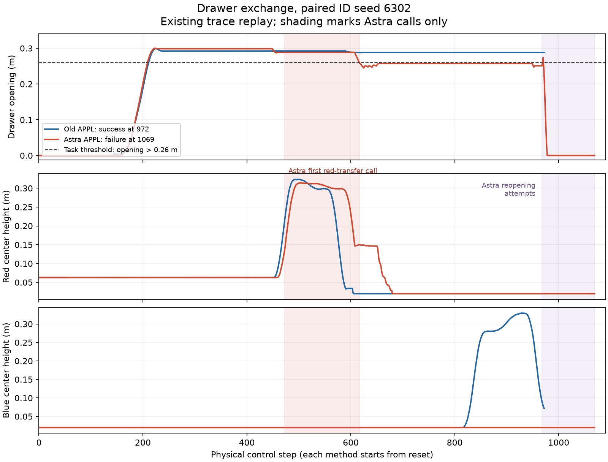

# Drawer exchange: Astra APPL regression postmortem

Reviewed: 2026-09-18. This is a developer-authored, post-hoc analysis of existing
artifacts, not an API-authored prior or a new evaluation. No new API calls,
training updates, simulator steps, policy edits or changes to completion criteria.

## Finding

The regression is concentrated in red placement, preserving the already-open
drawer, and acquiring blue after the handoff. All 60 new drawer trials open the
drawer at some point. In ID, only eight ever lift blue above 0.10 m, and these are
exactly the eight that subsequently place blue inside and complete the task.
The observed chain implicates both the new learned library and its runtime
interruption/switching decisions. It does not isolate the effect of GPT-6 itself.

[Reproducible extraction](../drawer_astra_regression.py),
[per-episode evidence and input hashes](evidence.json),
[completed comparison](../../../../runs/exp2/M1_astra_xhigh/evaluation_followup_20260918/REPORT.md).
Both methods have 30 complete ID and 30 complete position-OOD outcomes for this
task, paired by layout seed. No drawer unknowns are counted as task failures.

## 1. Where the trajectories diverge

Counts below are out of 30. “Ever” predicates can occur at different times;
completion requires all three geometric goals simultaneously.

| Measurement | Old ID | Astra ID | Old OOD | Astra OOD |
|---|---:|---:|---:|---:|
| Task success | 29 | 8 | 14 | 7 |
| Ever drawer open | 30 | 30 | 29 | 30 |
| Ever red on pad | 29 | 23 | 15 | 13 |
| Ever blue center above 0.10 m | 29 | 8 | 14 | 8 |
| Ever blue inside | 29 | 8 | 14 | 8 |
| Drawer open at termination | 29 | 11 | 21 | 18 |
| Drawer below 0.24 m after previously opening | 1 | 16 | 10 | 18 |

The final row is an analysis-only measure with 2 cm hysteresis below the actual
0.26 m opening threshold. It is not an altered success criterion. Height is a
lifting proxy, not proof of gripper attachment. The new OOD case with blue inside
but no success ends with the drawer closed.

Of 22 new ID failures, 15 finish with only red-on-pad, three with only drawer-open,
and four with neither. This is stronger evidence of lost progress and failed
acquisition than of an excessively strict final insertion/release test.

### First red evacuation: a repeated policy–dispatcher interaction

The new dispatcher selects `evacuate_red__h03` for the first red evacuation in
26/30 ID trials; the other four select h01. In **16 of those 26 h03 calls**, the
drawer starts above 0.26 m and ends below it. Only one of these 16 trials later
succeeds. In every case, an **API-authored stop rule** on drawer displacement
interrupts the policy: nine use `< 0.26`, seven use `<= 0.26`.

These calls first lift red substantially, then end around red height 0.15–0.16 m
during descent, with the drawer around 0.258–0.260 m. Thus “red was never lifted
high enough” is not an adequate explanation. The movement loses drawer opening;
the API then interrupts before placement has finished and chooses how to recover.
We have not tested whether continuing the same policy would recover or worsen it.
The h03 call is therefore a strong localization, not a causal verdict that h03
alone is defective or that its stop condition should simply be removed.

New ID has 27 first calls to an `insert_blue` policy. In eight, blue is already
above 0.10 m; all eight eventually succeed. In 19, blue is still at or below that
height; none succeeds. The remaining three never call an insertion policy.
This association is confounded by preceding trajectory quality. It does not
prove that imposing a height guard would fix acquisition. It does show that
the advertised broad overlap is not reliably delivering recovery from the
states actually reached before blue acquisition.

## 2. Paired example: ID seed 6302

The old run succeeds at step 972. Its dedicated red regrasp/lift and red
transport/place policies keep the drawer near 0.29 m; blue is then acquired and
inserted. The new run ends in failure at step 1069:

| New-run steps | Selected policy | Measured consequence |
|---|---|---|
| 0–473 | open_access h01, two calls | Drawer opens; red reaches initial held lift, z=0.138 m; drawer=0.2885 m. |
| 473–617 | evacuate_red h03 | Red reaches z=0.314 m, then descends to 0.150 m; drawer shrinks to 0.2579 m. The API's drawer rule stops the call. |
| 617–885 | insert_blue h01, two calls | Red reaches the pad, but subsequent blue grasp misses; blue stays at source height. Drawer remains just below the opening threshold. |
| 885–968 | evacuate_red h01, then insert_blue h02 | Recovery attempts continue without acquiring blue. |
| 968–1069 | opening/insertion switches, then opening h01 | A brief opening crossing is followed by reclosure; drawer ultimately reaches zero. Red stays on the pad and blue never lifts. API finishes failure. |

The saved public invocation reasons explicitly acknowledge the missed grasp,
unvalidated recovery, and a switch before handle-release readiness. They are
evidence of the dispatcher responding to deviations, not evidence that the
selected policy has learned those recoveries. No contact-body/force log is
available here, so the exact physical contact causing reclosure is not established.

[Old video](../../../../runs/exp2/M1_scaleup/drawer_exchange/evaluation/APPL/ID/6302/replay.mp4),
[new video](../../../../runs/exp2/M1_astra_xhigh/drawer_exchange/evaluation/APPL/ID/6302/replay.mp4),
[new invocation decisions and literal guards](../../../../runs/exp2/M1_astra_xhigh/drawer_exchange/evaluation/APPL/ID/6302/invocations.json).

There are counterexamples to a universal failure claim. New seed 6301 completes
in 937 steps using h03 for red evacuation. Seed 6324 also crosses below 0.26 m
during its first h03 evacuation, but h02 subsequently completes placement,
restores drawer opening and acquires blue; the trial succeeds in 995 steps.

## 3. What changed, and plausible mechanisms

### A. Coarser skills made each policy responsible for more transitions

| Property | Old APPL | Astra APPL |
|---|---|---|
| Skills / independent policies | 6 / 18 | 3 / 9 |
| Mean actions per skill slice | 137–330 | 475–653 |
| Total optimizer updates across policies | 360,000 | 180,000 |
| Updates per policy | 20,000 | 20,000 |
| Original demonstrations / unique actions covered | 12 / 12,809 | 12 / 12,809 |
| Overlapping actions (manifest count) | 5,220 | 6,626 |

The old library separates opening, red regrasp/lift, red transport/place,
blue approach/grasp/lift, blue transport, and blue release/retreat. The new library
has `open_access`, `evacuate_red`, and `insert_blue`.

Actual slices are broader than their names. In demo1000, new open_access covers
[0,475), evacuate_red [195,845), and insert_blue [581,end). Evacuate_red includes
late opening, handle release, red acquisition/transport/placement, retreat, and
early blue acquisition. Insert_blue begins while red is still held during descent.

This broader state-to-action problem, conditioned on just two observations,
plausibly makes phase/contact ambiguity and precision harder to learn from twelve
successful demonstrations. Larger overlap preserves supported nominal transitions;
it does not supply examples of empty grasps, displaced grasps or reopening after
red is already on its pad. **There is no missing-data or insufficient-overlap
finding:** both manifests cover every original action, and new overlap is larger.

Training budget per policy is unchanged while behavior coverage per policy grows.
Aggregate compute is also halved, so this is not an equal-total-compute comparison.
Neither fact alone proves undertraining; there is no longer-training ablation.

### B. Richer prior descriptions do not guarantee their intended mechanism

The h03 red-evacuation model has about 18.6 million parameters and learns soft
attachment/relative-transform features plus action-conditioned future-state and
rigidity losses. These are learned auxiliary objectives, not a physical constraint
that keeps the drawer open. Its finite, low training diffusion loss does not
establish closed-loop robustness or surrogate accuracy off demonstration.

Other API-authored implementations explicitly document interface limitations:

- open_access h02 recomputes a GRU over two observations; it has no persistent
  0.5–1 second contact memory or previous-command channel.
- insert_blue h02 learns contact/hazard conditioning, but the executor still
  commits eight action steps. It does not implement truly adaptive chunk lengths.
- insert_blue h03 uses a training-time consequence objective; it has no
  deployment-time candidate reranking hook.

These are declared approximations in the API's own code/documents, not silently
added framework fallbacks. Their effectiveness needs empirical validation. The
old library also has learned priors; this is not complex-prior versus plain-DP.
Most new policies are 18–20 million parameters. Insert_blue h01 is smaller
(about 4.5 million), but the evidence above does not identify its capacity as the
main bottleneck.

[h03 red prior](../../../../runs/exp2/M1_astra_xhigh/drawer_exchange/policies/evacuate_red/heuristic_03/source/PRIOR.md),
[open h02 prior](../../../../runs/exp2/M1_astra_xhigh/drawer_exchange/policies/open_access/heuristic_02/source/PRIOR.md),
[insert h02 prior](../../../../runs/exp2/M1_astra_xhigh/drawer_exchange/policies/insert_blue/heuristic_02/source/PRIOR.md),
[insert h03 prior](../../../../runs/exp2/M1_astra_xhigh/drawer_exchange/policies/insert_blue/heuristic_03/source/PRIOR.md).

### C. Runtime recovery remains outside demonstrated support

The dispatcher selects policies from their prior and handoff descriptions; those
descriptions are hypotheses, not measured recovery-success tables. A policy that
contains blue acquisition in its nominal slice need not recover from an empty
closed gripper several centimetres off target. A successful initial opening
policy need not reopen the drawer with red already placed and the arm in a
different contact configuration. Interrupting and switching can amplify such
deviations, as the 6302 trace demonstrates.

All 22 new ID failures are `agent_finished` at 702–1431 physical steps. All 23 new
OOD failures also finish voluntarily, at 760–1836 steps. None hits the 5000-step
cap. More available time alone cannot change these already-voluntary stops;
whether different continuation choices would help remains untested.

## 4. Checks against alternative explanations

- **Per-skill normalization regression:** absent. Both libraries use the identical
  full-demonstration normalizer payload, SHA-256
  `e75d5e1c8d9862f1611bf577ea5fa6e6d3fd5a25a69627c1f55602c602a7193f`.
  This does not prove arbitrary off-distribution observations are well behaved.
- **Fewer DDPM sampling steps:** absent. Both use DDPM100, observation horizon 2,
  prediction horizon 16 and execution prefix 8, with the same fixed training recipe.
- **Different goals or extra release requirement:** absent. Both use the same
  simultaneous three geometric goals, with no added release/clearance/hold test.
- **Transport outage counted as failure:** absent in the final drawer matrix;
  all 120 compared outcomes are complete.
- **Obvious proven implementation bug:** not identified by this inspection. The
  h03 implementation has consistent reviewed state packing and quaternion use,
  and completed interface/training checks. This is not an exhaustive proof of
  correctness, nor do interface checks imply good task performance.

Changing model, reasoning effort, segmentation, policy implementations, library
size and runtime decisions together prevents a single-factor causal claim.
Matched initial layouts and training seed do not fix generated designs, API
decisions, or subsequent closed-loop state distributions.

## 5. Smallest useful next experiments — proposed, not executed

1. **GPT-6 Astra/xhigh dispatcher with the frozen old 18-policy library.** Reuse
   checkpoints and make no policy edits. This separates the new dispatcher's
   ability to use a known effective library from the new library's quality, while
   respecting the persistent xhigh rule. Record it as a new diagnostic study.
2. **Controlled handoff comparison.** Reproduce a recorded pre-evacuation state
   using saved action replay (verifying state agreement), then compare existing
   evacuation variants under a predeclared continuation/guard protocol. Measure
   red placement, drawer retention and supported blue takeover separately. This
   can distinguish poor low-level motion from harmful interruption/switching.
3. Only after localization, ask the Runtime API to revise the relevant cut/prior
   with narrower phase responsibility or a matched training budget. It must own
   any new design. Keep test-informed diagnostics separate from frozen formal
   results and use fresh held-out layouts for a new confirmatory claim.

This analysis identifies the failure chain and ranks mechanisms; it does not
claim that extra DDPM steps, a larger network, more overlap, or longer training
has already been demonstrated to repair it.
