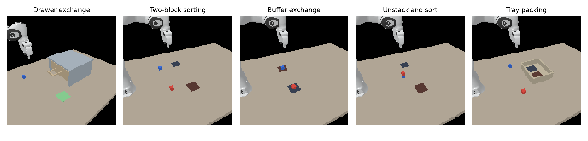
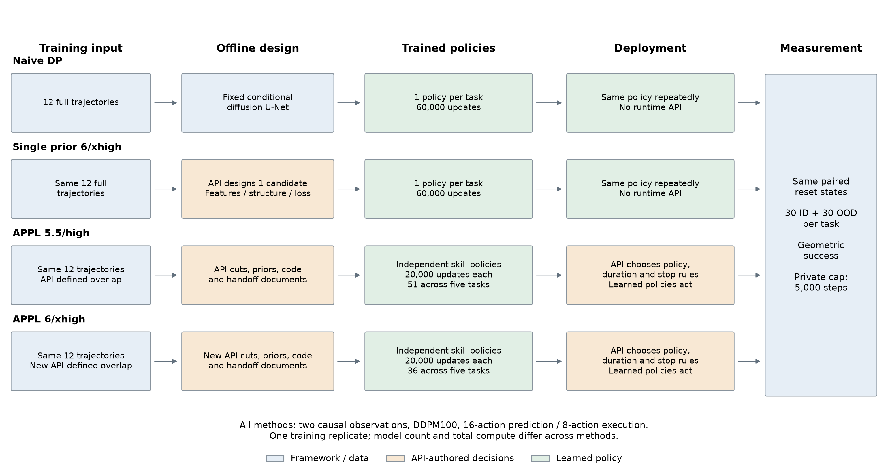
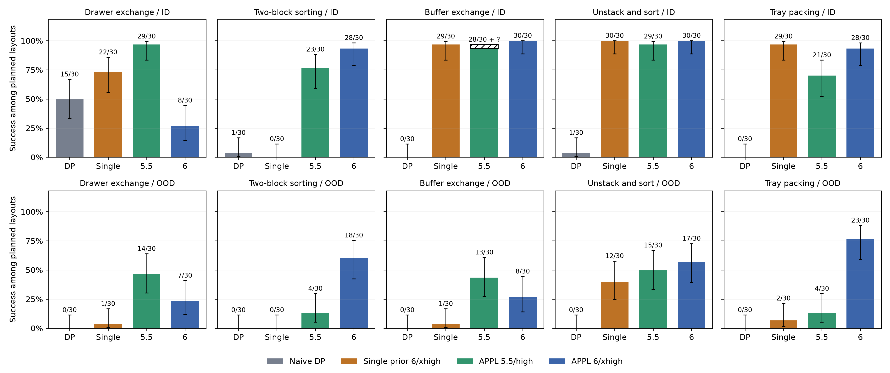

# Exp2: API-designed priors for long-horizon manipulation

Final evidence review: 2026-09-18T15:34:02.470315+00:00.

## 1. Executive summary

The main comparison contains five tasks, twelve original demonstrations per task, four methods, thirty paired ID and thirty paired position-OOD layouts per task. There are **1,200 intended method-layout cells, 1,199 complete outcomes and one retained unknown** in the older APPL 5.5 buffer-exchange ID group. Every new single-policy trial is complete. Historical diagnostic and preliminary studies are reported separately.

| Method | ID successes / 150 planned | Position-OOD successes / 150 planned |
| --- | ---: | ---: |
| Naive DP | 17/150 (11.3%) | 0/150 (0.0%) |
| Single prior 6/xhigh | 110/150 (73.3%) | 16/150 (10.7%) |
| APPL 5.5/high | 130/150; 1 unknown | 50/150 (33.3%) |
| APPL 6/xhigh | 124/150 (82.7%) | 73/150 (48.7%) |

The offline single-prior baseline achieves **126/300** successes with five API-authored full-task models and **zero deployment API calls**. Naive DP achieves 17/300. APPL 5.5 records 180 successes among 299 complete outcomes; APPL 6 records 197/300. These totals describe the tested systems, not isolated causal effects of priors, model family, reasoning effort or runtime agents.

[Executed methods](METHODS.md) · [Development history](HISTORY.md) · [Writing instructions](WRITING_GUIDE.md) · [Machine-readable outcomes](results.json) · [Source catalog](ARTIFACTS.json)

## 2. Tasks and demonstrations



Figure 1. Original reset camera frames from the first predeclared ID layout of each task. Source images are 128x128; the display does not add visual detail.

| Task | Demonstrations | Original actions | Mean control steps per demonstration | Mean simulated duration |
| --- | ---: | ---: | ---: | ---: |
| Drawer exchange | 12 | 12,809 | 1067.4 | 53.4 s |
| Two-block sorting | 12 | 9,237 | 769.8 | 38.5 s |
| Buffer exchange | 12 | 12,742 | 1061.8 | 53.1 s |
| Unstack and sort | 12 | 8,729 | 727.4 | 36.4 s |
| Tray packing | 12 | 8,897 | 741.4 | 37.1 s |

The tasks use the same Panda joint-position interface and 20 Hz control. The new four tasks were designed and their demonstrations collected as developer-owned preparation. OOD changes only initial XY position; it does not change goals, objects or dynamics. Exact IDs, file hashes, layouts, geometry and goal-contract paths are in [task metadata](tasks.json) and [tables](tables/).

## 3. Methods and controls



Figure 2. Executed data, API, training and deployment roles. The common evaluation interface does not imply equal model count or compute. [PDF](figures/protocol.pdf) · [Mathematical interfaces](FORMALISM.md).

Naive DP uses one standard full-task diffusion U-Net. SinglePrior uses one full-task DP whose representation, architecture and/or auxiliary loss are chosen and implemented by GPT-6 Astra/xhigh. APPL additionally uses API-selected trajectory segmentation, independent prior policies and runtime selection with observation-based invocation stops. The framework supplies bounded interfaces and independent geometric evaluation; it does not rewrite API policy source, heuristics, handoffs or runtime decisions.

All methods use the same twelve demonstrations, full-demo normalization, history 2, horizon 16, execution 8, DDPM100 and training seed 0. Full-task models receive 60,000 updates; each APPL prior receives 20,000. Final EMA checkpoints are used. All current success predicates are identical across methods and require one simultaneous geometric conjunction, without release, clearance, velocity or sustained-hold requirements. See [METHODS.md](METHODS.md) for exact thresholds and action alignment.

| Method | Evaluated models | Total formal updates represented | Parameters per model, min–max |
| --- | ---: | ---: | ---: |
| Naive DP | 5 | 300,000 | 16,998,408–16,998,408 |
| Single prior 6/xhigh | 5 | 300,000 | 19,038,112–20,020,712 |
| APPL 5.5/high | 51 | 1,020,000 | 17,840,944–19,605,446 |
| APPL 6/xhigh | 36 | 720,000 | 4,505,681–20,186,659 |

Counts include reused drawer models. Original scale-up newly trained four naive models and 33 APPL models; the additional APPL 6 round trained all 36 models anew; SinglePrior trained five new models. Interface-check updates are separate from formal training; [check receipts](tables/API_interface_checks.csv) give confirmed updates and retained uncertainty bounds for evaluated API packages. Parameter totals, source versions, training receipts and checkpoint hashes are in [POLICY_INDEX.csv](POLICY_INDEX.csv). All 92 API-authored source packages and prior documents are copied byte-for-byte into [policy_cards](policy_cards/).

## 4. Main results

| Task | Split | Naive DP | Single prior 6/xhigh | APPL 5.5/high | APPL 6/xhigh |
| --- | --- | ---: | ---: | ---: | ---: |
| Drawer exchange | ID | 15/30 (50.0%) | 22/30 (73.3%) | 29/30 (96.7%) | 8/30 (26.7%) |
| Drawer exchange | OOD | 0/30 (0.0%) | 1/30 (3.3%) | 14/30 (46.7%) | 7/30 (23.3%) |
| Two-block sorting | ID | 1/30 (3.3%) | 0/30 (0.0%) | 23/30 (76.7%) | 28/30 (93.3%) |
| Two-block sorting | OOD | 0/30 (0.0%) | 0/30 (0.0%) | 4/30 (13.3%) | 18/30 (60.0%) |
| Buffer exchange | ID | 0/30 (0.0%) | 29/30 (96.7%) | 28/30; 1 unknown | 30/30 (100.0%) |
| Buffer exchange | OOD | 0/30 (0.0%) | 1/30 (3.3%) | 13/30 (43.3%) | 8/30 (26.7%) |
| Unstack and sort | ID | 1/30 (3.3%) | 30/30 (100.0%) | 29/30 (96.7%) | 30/30 (100.0%) |
| Unstack and sort | OOD | 0/30 (0.0%) | 12/30 (40.0%) | 15/30 (50.0%) | 17/30 (56.7%) |
| Tray packing | ID | 0/30 (0.0%) | 29/30 (96.7%) | 21/30 (70.0%) | 28/30 (93.3%) |
| Tray packing | OOD | 0/30 (0.0%) | 2/30 (6.7%) | 4/30 (13.3%) | 23/30 (76.7%) |



Figure 3. Successes among thirty planned layouts per task and condition. Error bars are descriptive 95% Wilson intervals for complete groups only. The hatched range marks the retained unknown outcome. There is one training replicate; these intervals do not measure training-seed or repeated-agent variance. Vector exports: [PDF](figures/main_results.pdf), [SVG](figures/main_results.svg).

### What the additional baseline shows

SinglePrior changes the number of observed successes relative to naive DP by +109 across the 300 paired layouts. This comparison holds data and update counts fixed, while allowing API-designed architectures/objectives and their compute to differ. The table is the evidence for task-specific gains or regressions; a low training loss is not counted as manipulation success.

Its ID results are strongly task-dependent: buffer exchange 29/30, unstacking 30/30 and tray packing 29/30, but two-block sorting 0/30. The tested full-task policy approach can complete several of these long-horizon tasks without runtime API decisions; this does not make every task or prior design reliable.

The drawer comparison also changes with this baseline: SinglePrior records 22/30 ID successes with the same offline API model/effort as APPL 6, versus 8/30 for that APPL system. Conversely, APPL 6 records 28/30 on sorting. These observations identify task-specific differences between complete pipelines; they do not isolate a benefit or harm from runtime API decisions alone.

SinglePrior's aggregate drops from 110/150 ID successes to 16/150 under the larger initial-position offsets. APPL 6 records 73/150 OOD successes. Thus offline prior design improves the tested full-task baseline while leaving a substantial position-generalization gap. The present comparison does not identify which combination of skill decomposition, additional training, alternative policies and runtime selection accounts for that gap.

The single-policy result tests whether offline API prior design is useful without deployment-time API decisions. Comparing it with APPL also changes segmentation, policy count, aggregate training and handoff structure. An agent-only ablation would require a separate matched library and execution comparison. No such isolated experiment was run.

### Paired outcomes

The new baseline uses the same initial states as the three earlier methods. [four-method videos of first predeclared seeds](../../../runs/exp2/single_policy_astra_xhigh/paired_examples.html) avoid selecting clips based on outcomes. [Paired win/loss counts](tables/paired_single_prior.csv) compare SinglePrior with each reference using only complete pairs. [APPL 6 versus 5.5 paired counts](../../../runs/exp2/M1_astra_xhigh/evaluation_followup_20260918/results.json) remain available in the original report. Later rounds use previously examined layouts, not a fresh untouched test set.

## 5. Step budgets and termination

| Method | Success by 1500 | By 3000 | By 5000 | Unknown final outcomes |
| --- | ---: | ---: | ---: | ---: |
| Naive DP | 17 | 17 | 17 | 0 |
| Single prior 6/xhigh | 121 | 124 | 126 | 0 |
| APPL 5.5/high | 158 | 177 | 180 | 1 |
| APPL 6/xhigh | 188 | 197 | 197 | 0 |

These are prefixes of the same frozen 5,000-step trajectories, not separate budget interventions. The API never receives the total/remaining physical cap. It may choose to finish early; the executor independently evaluates success.

Naive DP recorded no additional success after step 1500. APPL 5.5 recorded 22 later successes, including three after 3000; most of its complete failures were voluntary API finishes. All 103 APPL 6 task failures were API finishes at steps 437–2408; none exhausted the 5000-step cap. Therefore increasing that cap alone would not extend those already terminated decision trajectories.

SinglePrior recorded 5 successes after 1500 and 2 after 3000. Its unsuccessful complete trials run to the physical cap. Exact statuses for all methods are in [termination.csv](tables/termination.csv).

## 6. Failure evidence and interpretation

### Closed-loop state coverage

Initial-state ID does not guarantee that a learned rollout stays within demonstration support. Retained analyses find missed grasps, extended empty closed-gripper states and failure to lift a required block. The original successful demonstrations contain no summed finger width at or below 5 mm; the four new task datasets have minimum width near 36.5 mm. Finger width is not a contact classifier, and a 3 cm rise is not proof of a secure grasp. These measurements support a state-coverage hypothesis without establishing a single cause.

The old four new-task naive implementations were checked against M0 for training windows, normalization, action transforms and seeded DDPM100 output on tested histories. The measured equality rules out those specific migration errors. The repaired quaternion scaling does not imply that all later failures disappear, nor that every modeling choice is optimal.

A further untested hypothesis is ambiguity in the expert action targets around nearly stationary grasp/release holds. The expert includes fixed dwell periods, while policies receive only two causal observations. Choosing when to leave a hold may therefore be difficult to infer from very similar inputs. This concerns imitation of expert timing, not proof that the physical task requires a clock. No longer-history or action-commitment ablation was run, so this hypothesis remains separate from the measured failure counts.

[Original five-task failure analysis](supporting_reports/SCALEUP_ANALYSIS.md) · [baseline equivalence audit](supporting_reports/naive_equivalence_audit.json) · [demonstration gripper support](supporting_reports/training_gripper_support.json)

### Why newer APPL regressed on drawer exchange

APPL 6 achieved 8/30 drawer ID successes versus 29/30 for APPL 5.5. Its API changed six narrower skills into three broader skills and reduced the drawer portfolio from eighteen to nine models. Both segmentations retained all twelve demonstrations and all 12,809 actions; measured overlapping actions increased from 5,220 to 6,626. Missing overall coverage or a smaller overlap count therefore does not explain the regression.

A read-only review found that all thirty new ID episodes opened the drawer, but only eight lifted blue, and those eight completed the task. Of twenty-six episodes initially selecting red-transfer h03, sixteen returned when the drawer retracted below the API-selected 0.26 m condition; only one of those later succeeded. The evidence points to learned execution, handoff and recovery interactions. It does not isolate which representation, policy boundary, training-budget or agent decision caused the regression.

[Drawer regression report](supporting_reports/DRAWER_ASTRA_REGRESSION.md) · [episode evidence](../analysis/drawer_astra_regression/evidence.json)

### Single-policy failures

The following counts describe final task failures and whether each geometric goal was ever observed during that recorded trajectory. Achieving goals at different times does not satisfy the required simultaneous conjunction. These counts are descriptive and do not, alone, diagnose a grasp or causal mechanism.

| Task | Split | Failed episodes | Ever-achieved goal counts among failures |
| --- | --- | ---: | --- |
| Drawer exchange | ID | 8 | `{'drawer_open': 8, 'red_on_pad': 8}` |
| Drawer exchange | OOD | 29 | `{'drawer_open': 29, 'red_on_pad': 2}` |
| Two-block sorting | ID | 30 | `{'red_at_goal': 7}` |
| Two-block sorting | OOD | 30 | `{'red_at_goal': 2}` |
| Buffer exchange | ID | 1 | `{'blue_at_goal': 1}` |
| Buffer exchange | OOD | 29 | `{'blue_at_goal': 6}` |
| Unstack and sort | ID | 0 | `{}` |
| Unstack and sort | OOD | 18 | `{'red_at_goal': 12}` |
| Tray packing | ID | 1 | `{'red_at_goal': 1}` |
| Tray packing | OOD | 28 | `{'red_at_goal': 18}` |

Among the 174 unsuccessful SinglePrior trajectories, 87 never raised red more than 3 cm above its reset height, 155 never raised blue by that amount, and 77 contained at least 100 consecutive state snapshots with summed finger width at or below 5 mm. These categories can overlap. They are descriptive state-support measurements, not contact ground truth or modified success criteria.

The same measurements were extracted for all 1,199 complete trajectories, with retained diagnostic results reused only after result/trace hash verification. [Failure and normalization table](tables/failure_diagnostics.csv) · [Per-episode measurements](outcome_diagnostics.json). Normalization statistics concern the common 47-dimensional representation of states preceding actions, excluding the terminal state; they do not capture every custom API feature or prove a scaling bug.

Sorting illustrates why failure categories must be separated: 21/30 ID episodes never raised red by 3 cm, and 30/30 never raised blue by that amount, while only 2/30 showed the sustained narrow-finger-width pattern. This locates missing manipulation progress, without classifying every failure as an empty grasp.

Across all 300 SinglePrior trajectories, the largest absolute coordinate under the shared 47-dimensional observation normalizer was 6.33; sorting ID reached 2.86. The old amplification into the hundreds was not observed in these normalized inputs. This does not measure every custom API feature or establish that normalization choices are optimal.

Trajectory durations differ, particularly because APPL may finish early. These failure categories are descriptive and can overlap; their counts are not duration-matched estimates of recovery probability.

## 7. API and compute accounting

| Method/accounting scope | Consumed requests | Retained HTTP failures | Reported total tokens | Cached input tokens |
| --- | ---: | ---: | ---: | ---: |
| APPL 5.5/high | 5,619 | 1 | 198,749,794 | 125,503,488 |
| APPL 6/xhigh | 4,742 | 94 | 187,233,747 | 11,169,664 |
| Single prior 6/xhigh | 116 | 1 | 4,234,991 | 838,016 |

The APPL 5.5 row is the incremental scale-up ledger and excludes reused historical drawer design. APPL 6 covers its whole additional five-task study including all authorized recovery attempts. SinglePrior covers all five offline designs and its one retained tray failure; deployment requests are zero. These scopes must not be treated as identical end-to-end accounting boundaries. Exact input/output splits and scope notes are in [API_COSTS.json](API_COSTS.json).

Cached tokens are a subset of input tokens. HTTP failures can have unreported usage and unknown charges. Counts exclude this Codex conversation, GPU billing and unexecuted work. The retained Astra cost audit estimated $1,859.05 for identical reported usage at the audit’s specified direct-API rates; this is a historical counterfactual estimate, not a provider invoice or a newly checked price. [Exact rates, scope and uncertainty](supporting_reports/astra_token_cost_20260918.json).

Training receipts record parameters, optimizer updates and elapsed time. Shared GPUs and different architectures make elapsed time or update counts unsuitable substitutes for matched FLOPs. Physical simulation pauses for API calls, so reported success does not establish online real-time feasibility.

[Recorded deployment timings](tables/deployment_timing.csv) and [per-episode records](tables/deployment_episode_timing.csv) cover the 1,199 selected complete outcomes. These elapsed times include the actual execution conditions and differ with resource sharing, early termination and trajectory length. They exclude interrupted attempts and preparation, and must not be interpreted as exclusive GPU-hours or a matched latency benchmark.

## 8. Development studies and reproducibility

The older M0 2/5 development and 4/15 confirmation results used different seeds and stricter terminal semantics. Preliminary APPL 1500/3000/5000 results reused the same five ID resets; the 5000 revision also changed feedback and context handling. They explain development but are not pooled into the main comparison. See [HISTORY.md](HISTORY.md).

The main studies retain original inputs, source hashes, API requests/responses, submission versions, checkpoints, paired reset states, per-action traces and original-frame videos. Interrupted attempts are retained; explicitly authorized evaluation recoveries reset the affected initial states. No completed task failure was rerun to replace its score. The one old 5.5 interruption stays unknown.

The 1,200 planned method-layout cells correspond to **1,291 recorded reset attempts**, including attempts interrupted before any action. APPL 6 used 391 attempts: 300 completed outcomes and 91 retained interruptions. The other methods used 300 attempts each, with one retained APPL 5.5 interruption. Thus there are 92 interrupted attempts in the main-study history, but only one unresolved selected outcome. These resets are not independent new layouts. The [attempt ledger](evaluation_attempts.json) preserves every directory and outcome hash; [summary](tables/evaluation_attempt_summary.csv).

SinglePrior evaluation used the authorized maximum of five physical GPUs (0/1/4/6/7). A separately recorded resource wrapper added devices 4/6 for 150 unstarted predeclared cells after ten zero-update, zero-physics action-equivalence checks. Resource configuration copies changed only device allocation. Original admission was guarded before the reserved range; completed outcomes were reused without repeating physical trials. Actual supplemental process exits, results and video hashes are audited in [the resource-completion receipt](../../../runs/exp2/single_policy_astra_xhigh/evaluation_supplement/completed.json). This changes resource scheduling, not model/source/data/seeds/sampling or goals.

Thirty predeclared cells from the original half were also scheduled early on the same original GPUs 0/1/7, using the unchanged original evaluation command and configurations. An admission guard prevents their original coordinator from reaching them before clean completion; its later completed-result path reuses them. These are part of the same 300 physical trials. Their actual process exits, outcomes and video hashes are separately audited in [the thirty-cell scheduling receipt](../../../runs/exp2/single_policy_astra_xhigh/evaluation_tail/completed.json).

All three supervised coordinators exited successfully and all 300 actual policy workers have clean closure receipts. The final [resource snapshot](resource_release.json) found no identified GPU process belonging to this study; unrelated GPU processes were preserved.

All project commands use the locked Exp2 Pixi environment. For read-only report regeneration after experiment completion:

```bash
/home/users/oscar/.pixi/bin/pixi run --manifest-path environments/exp2/pixi.toml --locked --no-install python -m experiments.exp2.paper.build build
```

## 9. Limits and claims supported

The report supports comparisons of these executed pipelines on these paired layouts, plus measured descriptions of their failures. It does not establish an isolated effect of a runtime agent, overlap, auxiliary loss, model family or reasoning effort. Each model has one training seed; later tests reuse layouts already examined. Goals are geometric and can be satisfied while an object remains grasped. OOD is position-only, demonstrations are scripted successful trajectories, and no real robot is tested. Recovery-support, matched-compute, matched-library agent ablations and repeated training/API seeds remain unexecuted follow-ups.

## 10. Artifact access

- [Machine-readable complete comparison](results.json), [all tables](tables/), [policy/source index](POLICY_INDEX.csv).
- [Actual physical-execution audit](physical_execution_audit.json) identifies the 300 new simulations and their real process records separately from later result-reuse jobs.
- [Original-frame task and result figures](figures/); PDF/SVG exports support manuscript layout.
- [four-method paired video examples](../../../runs/exp2/single_policy_astra_xhigh/paired_examples.html); [all 300 new single-policy videos](../../../runs/exp2/single_policy_astra_xhigh/replays.html).
- [all final APPL 6 videos](../../../runs/exp2/M1_astra_xhigh/evaluation_followup_20260918/replays.html); [original DP and APPL 5.5 videos](../../../runs/exp2/M1_scaleup/replays.html).
- [Portable paired examples](execution_examples/index.html) include forty original videos, reset/results and twenty APPL invocation/notebook records, selected by the first predeclared seed. Larger replay collections remain in the repository.
- [API-authored prior catalog](PRIOR_CATALOG.md) and [source packages](policy_cards/) retain exact API content; large checkpoints and raw trajectories remain at their indexed repository paths.
- [Claim/evidence ledger](CLAIMS.csv), [provenance catalog](ARTIFACTS.json), [bundle completion/hash receipt](completion.json), [paper-writing handoff](WRITING_GUIDE.md).

[Supporting historical and diagnostic reports](supporting_reports/README.md) are also included as byte-identical copies. Their original relative links retain the repository context listed in the supporting-report index.
