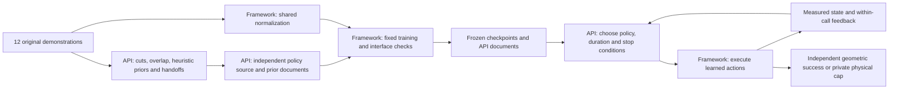

# Source and artifact map

All scientific execution remains in its frozen source/configuration versions.
This paper directory performs read-only analysis of experiment artifacts and
writes documentation exports; it does not train or query an API.

| Location | Responsibility and ownership |
| --- | --- |
| `src/appl/envs/` | Native drawer environment, controller adapter, observations and original evaluator |
| `src/appl/dp_baseline/` | Retained full-trajectory M0 data, normalization, training and deployment |
| `src/appl/demonstrations/` | Tools/prompts that let the API inspect demonstrations and submit segmentation/heuristics |
| `src/appl/prior_policies/` | Shared API design tools, restricted policy workers, training, semantic documents and deployment feedback |
| `src/appl/scaleup/` | Four additional task definitions/acquisition, paired layouts and original DP/APPL five-task study |
| `experiments/exp2/astra/` | Additional GPT-6/xhigh study orchestration, identity checks, resource scheduling and explicit outage continuations |
| `experiments/exp2/single_policy/` | One-candidate full-task API prior baseline, direct learned-policy evaluation and audit |
| `experiments/exp2/analysis/` | Retained diagnostic analyses and separately recorded controlled recovery operations |
| `experiments/exp2/paper/` | Methods/history, artifact exports, final scientific tables/figures and writing handoff |
| `experiments/exp2/configs/` | Exact task, goal and executed study configurations |
| `environments/exp2/` | Locked Pixi environment for all Exp2 commands |
| `data/exp2/` | Original demonstrations, API-derived segment datasets and input provenance |
| `runs/exp2/M1_scaleup/` | Original five-task DP/APPL 5.5 matrix, with its one retained unknown |
| `runs/exp2/M1_scaleup/evaluation_recovery_20260919/` | Authorized same-setting reset resolving that unknown; current paper selects its audited result |
| `runs/exp2/M1_astra_xhigh/` | Additional APPL 6 library and original/interrupted/continued evaluations |
| `runs/exp2/M1_astra_xhigh/evaluation_followup_20260918/` | Final selected APPL 6 results and all recovery provenance links |
| `runs/exp2/single_policy_astra_xhigh/` | Five new full-task prior pipelines and their 300 direct-deployment trials |
| `runs/exp2/M1_initial_test/` | Preliminary eighteen-policy drawer library and retained 5000-step study; M1_v2 remains an alias |
| `runs/exp2/M1_v1/` | Earlier source, API journals and outcomes; checkpoints deleted under explicit authorization |
| `archive/Exp2_M0DP/` | Original M0 diagnosis and settings investigations |
| `archive/Exp2_M1_initial_tests/` | Preserved preliminary 1500/3000 settings, attempts and reports |

`runs/exp2` maps to external runtime storage. Repository paths and their aliases
remain usable. Checkpoint locations are indexed rather than copying large weights
into this bundle. Exp1 source, data and results are separate and preserved.

## APPL ownership and dependencies

SinglePrior removes segmentation and the runtime selection loop: the API writes
one full-task learned policy per task, then the fixed trainer and direct evaluator
use it. Naive DP additionally removes API design. These dependencies explain why
the full-system comparisons are not isolated tests of a single component.

## Finding exact scientific content

- `POLICY_INDEX.csv` links every trained model to its budget, checkpoint hash,
  original folder and copied API source package.
- `policy_cards/` contains API-authored files copied byte-for-byte; no scientific
  explanation in those files was rewritten for this report.
- `segmentations/` contains the exact submitted API plans, heuristic documents
  and original manifests for both APPL rounds.
- `PROMPT_INDEX.csv` points to actual saved requests. `prompts/` exports their
  model/effort, system instructions and tool contracts. Complete conversation
  histories remain at the indexed original journal/request paths.
- `initial_states.json` and `tables/layouts.csv` record the common paired resets.
- `ARTIFACTS.json` and `completion.json` provide provenance and document hashes.

Never import archived experiment runners into active execution or infer an
executed protocol from an old filename alone. Use the final receipts and the
specific configuration/source version associated with the record.
