# Round 3 final report

Status: **validated final locked-test results**. Validated formal training: **98/98** systems, each 20,000 optimizer updates; 98 complete test evaluations (9800 scored episodes). Invalid configurations: 0. Training seed: 0 only.

Design backend is the current Codex session and actual Codex subagents, with no separate API dependency. The coordinating session has historical/source exposure; isolated initial designers receive D2 only. This is a Codex-assisted exploratory experiment, not a claim of a clean unseen-task evaluation of the coordinator. Exact model/session identifiers, token usage and API price are unavailable unless recorded in the design artifacts.

The deployed policies are state-input policies using the same declared numerical observations. Real simulator images inform design and development feedback; these experiments do not measure learned visual generalization. P1/P2/P3 are task-local candidate IDs: the same ID across tasks can denote different mechanisms and architectures.

Observed initial-candidate/N comparisons against B0 on mean C/E: {'helped': 59, 'tied': 4, 'hurt': 9}. Largest delta: drawer N10 P1 +62.5 pp; smallest delta: door N10 P2 -25.0 pp. All per-distribution scores and negative effects appear below. Differences describe these trained models and do not identify causal mechanisms.

Feedback decisions: {'no_revision': 5, 'P4': 1}; additional P4 trainings completed: 2. No-revision decisions add no P4 treatment; any P4 results and their additional costs are separated below.

**pick-place-wall design.** Designer: /root/design_pickwall. Initial demonstration exposure: D2 (two complete demonstrations, 16 real frames). Task-isolated initial design. Read only the design contract, this task's evidence bundle, and the explicitly authorized unfinished historical proposal.draft.json. No implementation/source/expert/reward, old model results, D_N with N>2, other task artifacts, or concrete development/test states read before this save. Full evidence and provenance: [saved proposal](design_records/pick-place-wall/proposal.json).

- P1: [external geometry/common knowledge] Relative displacements separate hand-to-object acquisition geometry from object-to-goal transport geometry. A finite fixed wall makes absolute positions and obstacle clearances relevant. [observation from D2] The LL and HH demos covary object_x with goal_x, yet show acquisition followed by lift and positive-y transport. D1 object is initially x=-0.02395 and goal x=-0.02545; D2 x=0.01853 and goal x=0.02316. [unverified inference] Separate grasp, goal and wall branches may encourage reuse when object_x and goal_x recombine, while retaining world context avoids an incorrect symmetry assumption. Predicted gain: Prospectively modest C-cell gain if raw diffusion overfits the LL/HH co-variation. E-cell gain is more uncertain: negative extrapolated x can lie outside the wall's left extent, changing which clearance relations matter. No expected numeric score or claim that priors must help. [implementation config](configs/pick-place-wall/P1.json); [implementation checks and limitations](audits/pick-place-wall_implementation.json)
- P2: [observation from D2] Acquisition, lift, crossing, and arrival on the goal side are visible and numerically distinguishable, while no opening/release action occurs (gripper commands range0..0.9). [external geometry/common knowledge] A carried finite object needs clearance from the finite wall, and persistent physical events can be defined from observed position/aperture sequences without using expert or reward phase logic. [unverified inference] A learned soft progress variable can organize the shared denoiser and adapt event timing to nuisance variation more effectively than unstructured conditioning; D2 cannot establish this. Predicted gain: Potentially better timing under different initial hand/object offsets and goal heights, with uncertain C/E benefit. The router might instead memorize demonstration progress or impair rare final-phase behavior. [implementation config](configs/pick-place-wall/P2.json); [implementation checks and limitations](audits/pick-place-wall_implementation.json)
- P3: [observation from D2] After acquisition, the object follows the hand with about0.038-0.042 m vertical offset through lift and crossing. The two trajectories have different goal heights and the second descends late. [external geometry/common knowledge] Future hand/object positions and finite-box signed distance provide supervised descriptions of motion and clearance; they can be learned jointly without serving as a runtime controller. [unverified inference] Joint diffusion over actions and short-horizon hand/object motion, combined with separate relation conditioning, may bias learning toward physically consistent factor recombination. Predicting extra channels may instead burden a small dataset. Predicted gain: Possible C/E gains from coupling action learning to relative physical motion and wall-clearance evolution. Greater risk than P1 from learning10-dimensional joint sequences with D2; no numerical prediction. [implementation config](configs/pick-place-wall/P3.json); [implementation checks and limitations](audits/pick-place-wall_implementation.json)

Initial feasibility revision: 1 saved amendment; original proposal preserved. Details: [amendment](design_records/pick-place-wall/initial_feasibility_revision.json). Reason: After the original isolated design was saved/frozen, implementation source inspection showed the inherited locked WindowDataset uses zero-padding for invalid action tails. Coordinator required reuse of that common trajectory mask/history path. This padding detail was not given in the isolated contract; this is a feasibility alignment, not feedback from model scores or extra demonstrations..

Feedback decision: no_revision. Rationale: {'main_reason': 'P1 already embodies the direct grasp/goal/wall relation representation and has the strongest observed C result; remaining E and transport failures are heterogeneous. Adding one new mechanism would require choosing among unseparated explanations. The one feedback opportunity is optional, and these data do not warrant freezing a speculative additional treatment.', 'considered_but_rejected': [{'change': 'Combine P1 relations with P2 learned soft phase conditioning', 'reason': "P2's better E proximity/lift proxies but lower E completion do not establish a transferable acquisition advantage, and training phase CE cannot show unseen phase correctness. The original sparse/approximate phase-label concern remains. Combining them could entangle both errors rather than target the demonstrated failure."}, {'change': 'Reduce P3 future/geometry loss or remove its future channels', 'reason': 'The lower C result and finite auxiliary convergence do not isolate harmful auxiliary weight or sampling coupling. Removing all future structure returns to the already tested P1; selecting a new weight from the packet would lack a specific supported value.'}, {'change': 'Strengthen an acquisition-specific gate, auxiliary target, or observation invariance', 'reason': 'The diagnostics are descriptive, some never-near cases lift substantially, and the single C visual is not an E failure trace. The task has a fixed wall and robot, so suppressing world context or imposing a controller/symmetry would be an unsupported or prohibited response.'}], 'positive_outcome_required': False, 'revision_required': False}.

**assembly design.** Designer: /root/design_assembly. Initial demonstration exposure: D2 (two complete demonstrations, 16 real frames). Parent task assignment, user-provided AGENTS instructions and environment context, platform/developer/tool instructions. No additional experiment source or result content was requested or opened. Full evidence and provenance: [saved proposal](design_records/assembly/proposal.json).

- P1: [external geometry/common knowledge] Grasp contact and insertion alignment refer to different physical points: a handle grasp does not imply that the ring center is aligned with the peg. Coordinate differences directly represent these relations. [observation from D2] The handle site lies approximately 0.130 m from the observed ring center throughout both trajectories; initial handle-minus-ring is approximately (+0.130,0,0) m. Both successful demonstrations lift before transporting and descending. [unverified inference] Exposing hand-to-handle and ring-to-goal relations separately may reduce reliance on the LL/HH correlation between initial nut x and peg x. D2 cannot establish extrapolation or recovery. Predicted gain: Prospectively, easier recombination of the grasp location and insertion location in LH/HL layouts and possibly outside the training x intervals. A small-data gain is plausible but no improvement over B0 is assumed. [implementation config](configs/assembly/P1.json); [implementation checks and limitations](audits/assembly_implementation.json)
- P2: [external geometry/common knowledge] A change of coordinates can represent displacement along the horizontal ring-to-peg direction while preserving the vertical gravity axis. Encoding and decoding with the same orthonormal basis leaves the represented world action unchanged before clipping. [observation from D2] During transport the ring moves primarily toward greater world y, with opposite x corrections in the two demonstrations (e.g. demo 1 step 50 action x=-0.1091, demo 2 step 53 x=+0.2136). Ring height peaks near 0.2019 and 0.2005 m before descent. [unverified inference] Expressing carry actions along the observed ring-to-goal displacement could reduce action-distribution variation under crossed x factors, but it may complicate grasping and final alignment. Predicted gain: Prospectively strongest during transport when the required x correction changes independently of the initial nut x. Benefit during grasp or insertion is uncertain and could be negative. [implementation config](configs/assembly/P2.json); [implementation checks and limitations](audits/assembly_implementation.json)
- P3: [observation from D2] The observed sequences support approach, grasp/lift, carry and alignment/descent as useful retrospective groups. The fixed three-observation milestone rules below give event starts [22,45,73] in demo 1 and [25,48,78] in demo 2; these labels are new design heuristics, not native simulator phases. [external geometry/common knowledge] Carrying an object to a vertical peg couples horizontal center alignment to vertical clearance, while hand-to-handle geometry concerns grasp maintenance. Supervising both relations can separate their roles without prescribing an analytic controller. [unverified inference] Jointly learning event probabilities and short-horizon future relations may organize diffusion conditioning more efficiently than an unconstrained relation expansion, especially when initial object and goal x values are recombined. Successful-only labels may instead reinforce brittle sequencing. Predicted gain: Prospectively may improve ordering and retention of grasp geometry across independent object/goal layouts. The combination may be worse at N2 because auxiliary targets and retrospective modes add bias and have no failure examples. [implementation config](configs/assembly/P3.json); [implementation checks and limitations](audits/assembly_implementation.json)

Initial feasibility revision: 1 saved amendment; original proposal preserved. Details: [amendment](design_records/assembly/initial_feasibility_revision.json). Reason: After version 1 was saved and frozen, implementation inspection showed that the design contract omitted detailed inherited default sampling, padding and scheduler spacing. The coordinator requires preserving the locked common baseline conventions. This amendment is based on interface/default feasibility only, before candidate training or model feedback; it does not select or revise a hypothesis based on scores..

Feedback decision: no_revision. Rationale: Choose no_revision. The allowed feedback is informative about current candidate performance and broad failure patterns, but it does not justify one concrete corrective mechanism strongly enough to spend the sole development revision on an assumed cause. P2 already tests the promising anchored-coordinate hypothesis and remains part of the preserved initial experiment. Retaining the original candidates keeps the observed mixed/negative findings intact. This is not a claim that no better assembly prior exists or that P2 will generalize; it records that this one permitted packet does not warrant a specific additional P4 design..

**drawer design.** Designer: /root/design_drawer. Initial demonstration exposure: D2 (two complete demonstrations, 16 real frames). Task-isolated D2 evidence; see saved exposure record Full evidence and provenance: [saved proposal](design_records/drawer/proposal.json).

- P1: [external geometry/common knowledge] Rigid-coordinate changes express cabinet-parallel/perpendicular displacement without mixing x translation with yaw. A prismatic mechanism has one translational rail degree of freedom. This changes representation only; retaining world context avoids asserting whole-scene rotational symmetry. [observation from D2] Both demonstrations lift to ~0.302/0.305m at step25, descend before handle motion at transition69, then displace handle -0.134964/-0.130192m along local y; measured off-rail displacement below1e-8m. Initial goal-minus-handle is local y approximately-0.128m. [unverified inference] Explicit cabinet-relative hand/goal relations and local actions should reduce sensitivity to correlated x/yaw training cells, while world context can preserve approach feasibility. Predicted gain: Prospectively strongest benefit when cabinet x/yaw combinations change but local handle contact and pull geometry remain similar. It may offer no gain if the learned approach remains dependent on the two seen robot configurations. [implementation config](configs/drawer/P1.json); [implementation checks and limitations](audits/drawer/P1_implementation.json)
- P2: [external geometry/common knowledge] Rigid-coordinate changes express cabinet-parallel/perpendicular displacement without mixing x translation with yaw. A prismatic mechanism has one translational rail degree of freedom. This changes representation only; retaining world context avoids asserting whole-scene rotational symmetry. [observation from D2] Both demonstrations lift to ~0.302/0.305m at step25, descend before handle motion at transition69, then displace handle -0.134964/-0.130192m along local y; measured off-rail displacement below1e-8m. Initial goal-minus-handle is local y approximately-0.128m. [unverified inference] Jointly denoising a future rail-distance sequence with world actions may teach the shared network which action subsequences leave the drawer static and which produce task progress, without hard phase gates. Predicted gain: May improve continuity and task progress on new factor combinations by sharing action and future-outcome modeling; less direct yaw transfer than P1. Auxiliary prediction may fail to benefit control. [implementation config](configs/drawer/P2.json); [implementation checks and limitations](audits/drawer/P2_implementation.json)
- P3: [external geometry/common knowledge] Rigid-coordinate changes express cabinet-parallel/perpendicular displacement without mixing x translation with yaw. A prismatic mechanism has one translational rail degree of freedom. This changes representation only; retaining world context avoids asserting whole-scene rotational symmetry. [observation from D2] Both demonstrations lift to ~0.302/0.305m at step25, descend before handle motion at transition69, then displace handle -0.134964/-0.130192m along local y; measured off-rail displacement below1e-8m. Initial goal-minus-handle is local y approximately-0.128m. [unverified inference] Combining the cabinet frame with jointly predicted future hand-handle gap and rail travel could link contact establishment to subsequent progress while retaining a single continuous diffusion policy. Predicted gain: May combine P1 geometric transfer with better contact-to-pull sequencing from predicted future relations. Could underperform either simpler candidate if auxiliary geometry is redundant or difficult to extrapolate. [implementation config](configs/drawer/P3.json); [implementation checks and limitations](audits/drawer/P3_implementation.json)

Feedback decision: no_revision. Rationale: See saved revision.json.

**door design.** Designer: {'actual_subagent_name': '/root/design_door', 'model': 'unavailable', 'session_id': 'unavailable', 'tokens': 'unavailable', 'cost': 'unavailable'}. Initial demonstration exposure: D2 (two complete demonstrations, 16 real frames). Task-isolated D2 evidence; see saved exposure record Full evidence and provenance: [saved proposal](design_records/door/proposal.json).

- P1: [external geometry/common knowledge] An orthonormal cabinet yaw frame expresses relative displacement and command directions consistently across yaw; known z-axis hinge does not imply whole-environment equivariance. Geometry source is task_materials.json source_knowledge and declared yaw fields; rotation algebra is common geometry. [observation from D2] Both image sequences approach above handle then descend before planar opening; object z stays0.15003595m. LL hand reaches~0.3274m and HH~0.3326m before descending. [unverified inference] Explicit cabinet-relative relations may reduce spurious correlation between door_x and yaw while retained world fields allow fixed robot constraints to be learned. Predicted gain: May improve C cross-combinations and moderate yaw extrapolation through explicit relative features and rotated action coordinates; large yaw may still fail due to fixed-gripper reach/contact. [implementation config](configs/door/P1.json); [implementation checks and limitations](audits/door_plugin_v1.json)
- P2: [external geometry/common knowledge] A rigid body rotating around world z preserves its height; future handle displacement and door orientation constrain coherent opening motion. Source: task_materials.json z-hinge declaration; projected quaternion direction uses standard quaternion rotation. [observation from D2] Handle motion starts after initial approach at approximately step41LL and49HH (>1mm displacement). Terminal opening follows a planar curve; measured hand-handle gaps reach~0.0253m LL and~0.0271m HH. [unverified inference] Joint action/future-geometry denoising may make handle engagement and rotation more legible to the network than action-only imitation. Predicted gain: May improve contact continuity by jointly learning action and future handle/hand geometry; may instead waste limited capacity or overfit two trajectory futures. [implementation config](configs/door/P2.json); [implementation checks and limitations](audits/door_plugin_v1.json)
- P3: [external geometry/common knowledge] Coordinate re-expression applies equally to action vectors and future displacement labels; retaining world state and yaw preserves information about fixed robot/table. Source: supplied task_materials geometry and common rotation algebra. [observation from D2] Approach/descend/open sequence is shared across both layouts despite world-coordinate differences; raw quaternion local+y has stable unit xy projection while local+x is nearly vertical. [unverified inference] Combining cabinet-relative action learning with joint future-geometry denoising may make learned interaction dynamics more reusable across position/yaw combinations. Predicted gain: Prospective complementary benefit: relational coordinates address layout nuisance while future targets address contact/rotation consistency. No presumption that combination beats either component. [implementation config](configs/door/P3.json); [implementation checks and limitations](audits/door_plugin_v1.json)

Feedback decision: no_revision. Rationale: Choose no_revision. The strongest observed improvement is already represented by the original P1, while P3 already tests the proposed combination. Adding or tuning the auxiliary objective is not supported by an observed success gain. A moving door-attached frame or learned contact-stage specialization could be considered prospectively, but the available descriptive endpoint summaries and successful-only frames cannot distinguish their intended causes from fixed-gripper contact limitations or general closed-loop error. I therefore do not add a speculative fourth design, duplicate P1, change the formal budgets, or seek another feedback cycle. This decision does not claim the task is solved or that P1 is the locked-test winner; the original formal candidates remain subject to the authorized evaluations..

**peg-insert-side design.** Designer: {'subagent_name': '/root/design_peg', 'model': 'not exposed', 'session': 'not exposed', 'tokens': 'not exposed', 'cost': 'not exposed'}. Initial demonstration exposure: D2 (two complete demonstrations, 16 real frames). Task-isolated D2 evidence; see saved exposure record Full evidence and provenance: [saved proposal](design_records/peg-insert-side/proposal.json).

- P1: [external geometry/common knowledge] A fixed-axis insertion has separate axial x travel and transverse yz alignment; relative hand/grasp and head/goal locations express these relations. [observation from D2] The observed head is offset from the grasp site by approximately[-0.13,0,-0.01]m in both D2 episodes; grasp-hand offsets settle after lift. [unverified inference] Separating relative grasp and insertion geometry may reduce reliance on correlated initial peg_y/box_y in LL/HH and aid LH/HL compositions. Predicted gain: Prospective: expose independent grasp and head-goal errors to improve recombination; fixed metric scaling may avoid small-D_N variance amplification. [implementation config](configs/peg-insert-side/P1.json); [implementation checks and limitations](audits/peg_plugin_implementation.json)
- P2: [external geometry/common knowledge] A fixed-axis insertion has separate axial x travel and transverse yz alignment; relative hand/grasp and head/goal locations express these relations. [observation from D2] The observed head is offset from the grasp site by approximately[-0.13,0,-0.01]m in both D2 episodes; grasp-hand offsets settle after lift. [unverified inference] Jointly denoising action and its future peg motion/grasp relation can share knowledge of action consequences, reducing implausible action chunks under new layouts. Predicted gain: Prospective: future physical relation supervision may regularize action chunk learning and promote consistent grasp-then-transport predictions; may also fail from extra modeling burden. [implementation config](configs/peg-insert-side/P2.json); [implementation checks and limitations](audits/peg_plugin_implementation.json)
- P3: [external geometry/common knowledge] A fixed-axis insertion has separate axial x travel and transverse yz alignment; relative hand/grasp and head/goal locations express these relations. [observation from D2] The observed head is offset from the grasp site by approximately[-0.13,0,-0.01]m in both D2 episodes; grasp-hand offsets settle after lift. [unverified inference] Separating relative grasp and insertion geometry may reduce reliance on correlated initial peg_y/box_y in LL/HH and aid LH/HL compositions. [unverified inference] The P1 relation features provide direct context for P2 future-relation joint diffusion, potentially making its extra supervision easier to learn from little data. Predicted gain: Prospective: combination may improve compositional layouts by coupling current task geometry to predicted physical consequences; additive gain is uncertain. [implementation config](configs/peg-insert-side/P3.json); [implementation checks and limitations](audits/peg_plugin_implementation.json)

Feedback decision: P4. Rationale: Choose P4 from P1 to test one remaining representation hypothesis: retain the successful explicit relations while replacing direct absolute object/goal position blocks with hand-relative positions. P3 provides no additional observed E successes over P1 and P2 underperforms in this packet, so P4 retains action-only diffusion. The evidence motivates a bounded test, not a guaranteed improvement; no controller, auxiliary training objective or hyperparameter search is added..

**stick-push design.** Designer: {'actual_subagent_name': '/root/design_stick', 'model': 'not exposed', 'session_id': 'not exposed', 'tokens': 'not exposed', 'cost': 'not exposed'}. Initial demonstration exposure: D2 (two complete demonstrations, 16 real frames). Task-isolated D2 evidence; see saved exposure record Full evidence and provenance: [saved proposal](design_records/stick-push/proposal.json).

- P1: [external geometry/common knowledge] Differences between point coordinates express relative position in metres and cancel common translations; gravity fixes world z. These are algebraic facts, not inferred invariance of the robot or table. [observation from D2] Demo1 steps0-30 and demo2 steps0-30 lower the hand while closing around the stick; later hand-stick offsets stabilize near x=0.024m,z=0.043m. Steps43/42 onward lift and transport, with container moving only late (roughly steps67/64). [unverified inference] Explicit hand-stick, tool-container and container-goal relations may weaken the incidental training correlation between stick_x and target_y. Predicted gain: Prospective only; may improve compositional factor transfer by exposing the task relations but could fail or underperform B0. [implementation config](configs/stick-push/P1.json); [implementation checks and limitations](design_records/stick-push/implementation_audit.json)
- P2: [external geometry/common knowledge] Differences between point coordinates express relative position in metres and cancel common translations; gravity fixes world z. These are algebraic facts, not inferred invariance of the robot or table. [observation from D2] Demo1 steps0-30 and demo2 steps0-30 lower the hand while closing around the stick; later hand-stick offsets stabilize near x=0.024m,z=0.043m. Steps43/42 onward lift and transport, with container moving only late (roughly steps67/64). [unverified inference] Explicit hand-stick, tool-container and container-goal relations may weaken the incidental training correlation between stick_x and target_y. [external geometry/common knowledge] A horizontal orthonormal basis can align its x-axis to container-to-goal displacement while leaving gravity z unchanged; inverse rotation recovers world displacements exactly. [unverified inference] Goal-frame actions may transfer lateral target variation, but fixed robot and stick geometry can make this representation worse. Retaining frame direction and world anchor preserves those asymmetries. Predicted gain: Prospective only; may improve compositional factor transfer by exposing the task relations but could fail or underperform B0. [implementation config](configs/stick-push/P2.json); [implementation checks and limitations](design_records/stick-push/implementation_audit.json)
- P3: [external geometry/common knowledge] Differences between point coordinates express relative position in metres and cancel common translations; gravity fixes world z. These are algebraic facts, not inferred invariance of the robot or table. [observation from D2] Demo1 steps0-30 and demo2 steps0-30 lower the hand while closing around the stick; later hand-stick offsets stabilize near x=0.024m,z=0.043m. Steps43/42 onward lift and transport, with container moving only late (roughly steps67/64). [unverified inference] Explicit hand-stick, tool-container and container-goal relations may weaken the incidental training correlation between stick_x and target_y. [external geometry/common knowledge] A manipulating hand, held tool and pushed object have coupled motions, but action-to-motion dynamics depend on contact and cannot be inferred as a universal rigid controller. [unverified inference] Jointly denoising action and short-horizon physical motions may encourage a contact-sensitive action representation. Sparse successful trajectories may instead make the auxiliary task misleading. Predicted gain: Prospective only; may improve compositional factor transfer by exposing the task relations but could fail or underperform B0. [implementation config](configs/stick-push/P3.json); [implementation checks and limitations](design_records/stick-push/implementation_audit.json)

Feedback decision: no_revision. Rationale: See saved revision.json.

## Complete candidate results

All valid candidates and negative effects are retained. NA means pending, invalid, or (for P4 N2/N10) outside the authorized matrix. Brackets are 95% binomial Wilson intervals for fixed trained models. C/E are equally weighted.

| Task | N | Candidate | IID [95% CI] | C [95% CI] | E [95% CI] | OOD | IID−OOD pp | Δ B0 pp | Status/reason |
|---|---:|---|---|---|---|---:|---:|---:|---|
| pick-place-wall | 2 | B0 | 50.0% [29.9, 70.1] | 5.0% [1.4, 16.5] | 0.0% [0.0, 8.8] | 2.5% | +47.5 | +0.0 | evaluated |
| pick-place-wall | 2 | P1 | 35.0% [18.1, 56.7] | 15.0% [7.1, 29.1] | 2.5% [0.4, 12.9] | 8.8% | +26.2 | +6.2 | evaluated |
| pick-place-wall | 2 | P2 | 60.0% [38.7, 78.1] | 35.0% [22.1, 50.5] | 0.0% [0.0, 8.8] | 17.5% | +42.5 | +15.0 | evaluated |
| pick-place-wall | 2 | P3 | 50.0% [29.9, 70.1] | 7.5% [2.6, 19.9] | 5.0% [1.4, 16.5] | 6.2% | +43.8 | +3.8 | evaluated |
| pick-place-wall | 5 | B0 | 50.0% [29.9, 70.1] | 37.5% [24.2, 53.0] | 0.0% [0.0, 8.8] | 18.8% | +31.2 | +0.0 | evaluated |
| pick-place-wall | 5 | P1 | 65.0% [43.3, 81.9] | 35.0% [22.1, 50.5] | 7.5% [2.6, 19.9] | 21.2% | +43.8 | +2.5 | evaluated |
| pick-place-wall | 5 | P2 | 65.0% [43.3, 81.9] | 32.5% [20.1, 48.0] | 5.0% [1.4, 16.5] | 18.8% | +46.2 | +0.0 | evaluated |
| pick-place-wall | 5 | P3 | 60.0% [38.7, 78.1] | 25.0% [14.2, 40.2] | 7.5% [2.6, 19.9] | 16.2% | +43.8 | -2.5 | evaluated |
| pick-place-wall | 10 | B0 | 80.0% [58.4, 91.9] | 37.5% [24.2, 53.0] | 17.5% [8.7, 31.9] | 27.5% | +52.5 | +0.0 | evaluated |
| pick-place-wall | 10 | P1 | 95.0% [76.4, 99.1] | 27.5% [16.1, 42.8] | 42.5% [28.5, 57.8] | 35.0% | +60.0 | +7.5 | evaluated |
| pick-place-wall | 10 | P2 | 95.0% [76.4, 99.1] | 30.0% [18.1, 45.4] | 15.0% [7.1, 29.1] | 22.5% | +72.5 | -5.0 | evaluated |
| pick-place-wall | 10 | P3 | 95.0% [76.4, 99.1] | 12.5% [5.5, 26.1] | 42.5% [28.5, 57.8] | 27.5% | +67.5 | +0.0 | evaluated |
| pick-place-wall | 20 | B0 | 95.0% [76.4, 99.1] | 57.5% [42.2, 71.5] | 15.0% [7.1, 29.1] | 36.2% | +58.7 | +0.0 | evaluated |
| pick-place-wall | 20 | P1 | 95.0% [76.4, 99.1] | 80.0% [65.2, 89.5] | 45.0% [30.7, 60.2] | 62.5% | +32.5 | +26.2 | evaluated |
| pick-place-wall | 20 | P2 | 95.0% [76.4, 99.1] | 30.0% [18.1, 45.4] | 27.5% [16.1, 42.8] | 28.7% | +66.2 | -7.5 | evaluated |
| pick-place-wall | 20 | P3 | 95.0% [76.4, 99.1] | 95.0% [83.5, 98.6] | 47.5% [32.9, 62.5] | 71.2% | +23.8 | +35.0 | evaluated |
| assembly | 2 | B0 | 60.0% [38.7, 78.1] | 0.0% [0.0, 8.8] | 12.5% [5.5, 26.1] | 6.2% | +53.8 | +0.0 | evaluated |
| assembly | 2 | P1 | 80.0% [58.4, 91.9] | 0.0% [0.0, 8.8] | 15.0% [7.1, 29.1] | 7.5% | +72.5 | +1.2 | evaluated |
| assembly | 2 | P2 | 85.0% [64.0, 94.8] | 0.0% [0.0, 8.8] | 30.0% [18.1, 45.4] | 15.0% | +70.0 | +8.8 | evaluated |
| assembly | 2 | P3 | 90.0% [69.9, 97.2] | 0.0% [0.0, 8.8] | 32.5% [20.1, 48.0] | 16.2% | +73.8 | +10.0 | evaluated |
| assembly | 5 | B0 | 65.0% [43.3, 81.9] | 0.0% [0.0, 8.8] | 10.0% [4.0, 23.1] | 5.0% | +60.0 | +0.0 | evaluated |
| assembly | 5 | P1 | 100.0% [83.9, 100.0] | 0.0% [0.0, 8.8] | 40.0% [26.3, 55.4] | 20.0% | +80.0 | +15.0 | evaluated |
| assembly | 5 | P2 | 100.0% [83.9, 100.0] | 32.5% [20.1, 48.0] | 35.0% [22.1, 50.5] | 33.8% | +66.2 | +28.7 | evaluated |
| assembly | 5 | P3 | 100.0% [83.9, 100.0] | 15.0% [7.1, 29.1] | 40.0% [26.3, 55.4] | 27.5% | +72.5 | +22.5 | evaluated |
| assembly | 10 | B0 | 100.0% [83.9, 100.0] | 17.5% [8.7, 31.9] | 35.0% [22.1, 50.5] | 26.2% | +73.8 | +0.0 | evaluated |
| assembly | 10 | P1 | 100.0% [83.9, 100.0] | 12.5% [5.5, 26.1] | 42.5% [28.5, 57.8] | 27.5% | +72.5 | +1.2 | evaluated |
| assembly | 10 | P2 | 100.0% [83.9, 100.0] | 57.5% [42.2, 71.5] | 50.0% [35.2, 64.8] | 53.8% | +46.2 | +27.5 | evaluated |
| assembly | 10 | P3 | 100.0% [83.9, 100.0] | 70.0% [54.6, 81.9] | 50.0% [35.2, 64.8] | 60.0% | +40.0 | +33.8 | evaluated |
| assembly | 20 | B0 | 100.0% [83.9, 100.0] | 55.0% [39.8, 69.3] | 35.0% [22.1, 50.5] | 45.0% | +55.0 | +0.0 | evaluated |
| assembly | 20 | P1 | 100.0% [83.9, 100.0] | 32.5% [20.1, 48.0] | 50.0% [35.2, 64.8] | 41.2% | +58.8 | -3.8 | evaluated |
| assembly | 20 | P2 | 100.0% [83.9, 100.0] | 62.5% [47.0, 75.8] | 50.0% [35.2, 64.8] | 56.2% | +43.8 | +11.2 | evaluated |
| assembly | 20 | P3 | 100.0% [83.9, 100.0] | 80.0% [65.2, 89.5] | 50.0% [35.2, 64.8] | 65.0% | +35.0 | +20.0 | evaluated |
| drawer | 2 | B0 | 85.0% [64.0, 94.8] | 72.5% [57.2, 83.9] | 0.0% [0.0, 8.8] | 36.2% | +48.8 | +0.0 | evaluated |
| drawer | 2 | P1 | 100.0% [83.9, 100.0] | 100.0% [91.2, 100.0] | 90.0% [76.9, 96.0] | 95.0% | +5.0 | +58.8 | evaluated |
| drawer | 2 | P2 | 100.0% [83.9, 100.0] | 100.0% [91.2, 100.0] | 35.0% [22.1, 50.5] | 67.5% | +32.5 | +31.2 | evaluated |
| drawer | 2 | P3 | 100.0% [83.9, 100.0] | 100.0% [91.2, 100.0] | 67.5% [52.0, 79.9] | 83.8% | +16.2 | +47.5 | evaluated |
| drawer | 5 | B0 | 100.0% [83.9, 100.0] | 92.5% [80.1, 97.4] | 0.0% [0.0, 8.8] | 46.2% | +53.8 | +0.0 | evaluated |
| drawer | 5 | P1 | 100.0% [83.9, 100.0] | 100.0% [91.2, 100.0] | 75.0% [59.8, 85.8] | 87.5% | +12.5 | +41.2 | evaluated |
| drawer | 5 | P2 | 100.0% [83.9, 100.0] | 100.0% [91.2, 100.0] | 15.0% [7.1, 29.1] | 57.5% | +42.5 | +11.2 | evaluated |
| drawer | 5 | P3 | 100.0% [83.9, 100.0] | 100.0% [91.2, 100.0] | 95.0% [83.5, 98.6] | 97.5% | +2.5 | +51.2 | evaluated |
| drawer | 10 | B0 | 100.0% [83.9, 100.0] | 75.0% [59.8, 85.8] | 0.0% [0.0, 8.8] | 37.5% | +62.5 | +0.0 | evaluated |
| drawer | 10 | P1 | 100.0% [83.9, 100.0] | 100.0% [91.2, 100.0] | 100.0% [91.2, 100.0] | 100.0% | +0.0 | +62.5 | evaluated |
| drawer | 10 | P2 | 100.0% [83.9, 100.0] | 100.0% [91.2, 100.0] | 60.0% [44.6, 73.7] | 80.0% | +20.0 | +42.5 | evaluated |
| drawer | 10 | P3 | 100.0% [83.9, 100.0] | 100.0% [91.2, 100.0] | 67.5% [52.0, 79.9] | 83.8% | +16.2 | +46.2 | evaluated |
| drawer | 20 | B0 | 100.0% [83.9, 100.0] | 87.5% [73.9, 94.5] | 0.0% [0.0, 8.8] | 43.8% | +56.2 | +0.0 | evaluated |
| drawer | 20 | P1 | 100.0% [83.9, 100.0] | 100.0% [91.2, 100.0] | 90.0% [76.9, 96.0] | 95.0% | +5.0 | +51.2 | evaluated |
| drawer | 20 | P2 | 100.0% [83.9, 100.0] | 100.0% [91.2, 100.0] | 82.5% [68.1, 91.3] | 91.2% | +8.8 | +47.5 | evaluated |
| drawer | 20 | P3 | 100.0% [83.9, 100.0] | 100.0% [91.2, 100.0] | 97.5% [87.1, 99.6] | 98.8% | +1.2 | +55.0 | evaluated |
| door | 2 | B0 | 100.0% [83.9, 100.0] | 100.0% [91.2, 100.0] | 0.0% [0.0, 8.8] | 50.0% | +50.0 | +0.0 | evaluated |
| door | 2 | P1 | 100.0% [83.9, 100.0] | 100.0% [91.2, 100.0] | 57.5% [42.2, 71.5] | 78.8% | +21.3 | +28.7 | evaluated |
| door | 2 | P2 | 100.0% [83.9, 100.0] | 100.0% [91.2, 100.0] | 0.0% [0.0, 8.8] | 50.0% | +50.0 | +0.0 | evaluated |
| door | 2 | P3 | 100.0% [83.9, 100.0] | 100.0% [91.2, 100.0] | 97.5% [87.1, 99.6] | 98.8% | +1.2 | +48.8 | evaluated |
| door | 5 | B0 | 100.0% [83.9, 100.0] | 100.0% [91.2, 100.0] | 0.0% [0.0, 8.8] | 50.0% | +50.0 | +0.0 | evaluated |
| door | 5 | P1 | 100.0% [83.9, 100.0] | 100.0% [91.2, 100.0] | 77.5% [62.5, 87.7] | 88.8% | +11.3 | +38.8 | evaluated |
| door | 5 | P2 | 100.0% [83.9, 100.0] | 100.0% [91.2, 100.0] | 0.0% [0.0, 8.8] | 50.0% | +50.0 | +0.0 | evaluated |
| door | 5 | P3 | 100.0% [83.9, 100.0] | 100.0% [91.2, 100.0] | 90.0% [76.9, 96.0] | 95.0% | +5.0 | +45.0 | evaluated |
| door | 10 | B0 | 100.0% [83.9, 100.0] | 100.0% [91.2, 100.0] | 50.0% [35.2, 64.8] | 75.0% | +25.0 | +0.0 | evaluated |
| door | 10 | P1 | 100.0% [83.9, 100.0] | 100.0% [91.2, 100.0] | 72.5% [57.2, 83.9] | 86.2% | +13.7 | +11.2 | evaluated |
| door | 10 | P2 | 100.0% [83.9, 100.0] | 100.0% [91.2, 100.0] | 0.0% [0.0, 8.8] | 50.0% | +50.0 | -25.0 | evaluated |
| door | 10 | P3 | 100.0% [83.9, 100.0] | 100.0% [91.2, 100.0] | 85.0% [70.9, 92.9] | 92.5% | +7.5 | +17.5 | evaluated |
| door | 20 | B0 | 100.0% [83.9, 100.0] | 100.0% [91.2, 100.0] | 75.0% [59.8, 85.8] | 87.5% | +12.5 | +0.0 | evaluated |
| door | 20 | P1 | 100.0% [83.9, 100.0] | 100.0% [91.2, 100.0] | 100.0% [91.2, 100.0] | 100.0% | +0.0 | +12.5 | evaluated |
| door | 20 | P2 | 100.0% [83.9, 100.0] | 100.0% [91.2, 100.0] | 25.0% [14.2, 40.2] | 62.5% | +37.5 | -25.0 | evaluated |
| door | 20 | P3 | 100.0% [83.9, 100.0] | 100.0% [91.2, 100.0] | 97.5% [87.1, 99.6] | 98.8% | +1.2 | +11.2 | evaluated |
| peg-insert-side | 2 | B0 | 50.0% [29.9, 70.1] | 2.5% [0.4, 12.9] | 2.5% [0.4, 12.9] | 2.5% | +47.5 | +0.0 | evaluated |
| peg-insert-side | 2 | P1 | 100.0% [83.9, 100.0] | 52.5% [37.5, 67.1] | 50.0% [35.2, 64.8] | 51.2% | +48.8 | +48.8 | evaluated |
| peg-insert-side | 2 | P2 | 85.0% [64.0, 94.8] | 30.0% [18.1, 45.4] | 0.0% [0.0, 8.8] | 15.0% | +70.0 | +12.5 | evaluated |
| peg-insert-side | 2 | P3 | 100.0% [83.9, 100.0] | 55.0% [39.8, 69.3] | 50.0% [35.2, 64.8] | 52.5% | +47.5 | +50.0 | evaluated |
| peg-insert-side | 5 | B0 | 100.0% [83.9, 100.0] | 20.0% [10.5, 34.8] | 30.0% [18.1, 45.4] | 25.0% | +75.0 | +0.0 | evaluated |
| peg-insert-side | 5 | P1 | 100.0% [83.9, 100.0] | 100.0% [91.2, 100.0] | 50.0% [35.2, 64.8] | 75.0% | +25.0 | +50.0 | evaluated |
| peg-insert-side | 5 | P2 | 100.0% [83.9, 100.0] | 30.0% [18.1, 45.4] | 0.0% [0.0, 8.8] | 15.0% | +85.0 | -10.0 | evaluated |
| peg-insert-side | 5 | P3 | 100.0% [83.9, 100.0] | 100.0% [91.2, 100.0] | 52.5% [37.5, 67.1] | 76.2% | +23.8 | +51.3 | evaluated |
| peg-insert-side | 10 | B0 | 100.0% [83.9, 100.0] | 45.0% [30.7, 60.2] | 30.0% [18.1, 45.4] | 37.5% | +62.5 | +0.0 | evaluated |
| peg-insert-side | 10 | P1 | 100.0% [83.9, 100.0] | 97.5% [87.1, 99.6] | 52.5% [37.5, 67.1] | 75.0% | +25.0 | +37.5 | evaluated |
| peg-insert-side | 10 | P2 | 100.0% [83.9, 100.0] | 27.5% [16.1, 42.8] | 10.0% [4.0, 23.1] | 18.8% | +81.2 | -18.8 | evaluated |
| peg-insert-side | 10 | P3 | 100.0% [83.9, 100.0] | 100.0% [91.2, 100.0] | 50.0% [35.2, 64.8] | 75.0% | +25.0 | +37.5 | evaluated |
| peg-insert-side | 20 | B0 | 100.0% [83.9, 100.0] | 52.5% [37.5, 67.1] | 25.0% [14.2, 40.2] | 38.8% | +61.3 | +0.0 | evaluated |
| peg-insert-side | 20 | P1 | 100.0% [83.9, 100.0] | 100.0% [91.2, 100.0] | 50.0% [35.2, 64.8] | 75.0% | +25.0 | +36.2 | evaluated |
| peg-insert-side | 20 | P2 | 100.0% [83.9, 100.0] | 90.0% [76.9, 96.0] | 7.5% [2.6, 19.9] | 48.8% | +51.2 | +10.0 | evaluated |
| peg-insert-side | 20 | P3 | 100.0% [83.9, 100.0] | 100.0% [91.2, 100.0] | 52.5% [37.5, 67.1] | 76.2% | +23.8 | +37.5 | evaluated |
| stick-push | 2 | B0 | 100.0% [83.9, 100.0] | 97.5% [87.1, 99.6] | 45.0% [30.7, 60.2] | 71.2% | +28.7 | +0.0 | evaluated |
| stick-push | 2 | P1 | 100.0% [83.9, 100.0] | 100.0% [91.2, 100.0] | 100.0% [91.2, 100.0] | 100.0% | +0.0 | +28.8 | evaluated |
| stick-push | 2 | P2 | 70.0% [48.1, 85.5] | 75.0% [59.8, 85.8] | 45.0% [30.7, 60.2] | 60.0% | +10.0 | -11.2 | evaluated |
| stick-push | 2 | P3 | 100.0% [83.9, 100.0] | 100.0% [91.2, 100.0] | 100.0% [91.2, 100.0] | 100.0% | +0.0 | +28.8 | evaluated |
| stick-push | 5 | B0 | 100.0% [83.9, 100.0] | 97.5% [87.1, 99.6] | 75.0% [59.8, 85.8] | 86.2% | +13.7 | +0.0 | evaluated |
| stick-push | 5 | P1 | 100.0% [83.9, 100.0] | 100.0% [91.2, 100.0] | 97.5% [87.1, 99.6] | 98.8% | +1.2 | +12.5 | evaluated |
| stick-push | 5 | P2 | 100.0% [83.9, 100.0] | 100.0% [91.2, 100.0] | 100.0% [91.2, 100.0] | 100.0% | +0.0 | +13.8 | evaluated |
| stick-push | 5 | P3 | 100.0% [83.9, 100.0] | 100.0% [91.2, 100.0] | 100.0% [91.2, 100.0] | 100.0% | +0.0 | +13.8 | evaluated |
| stick-push | 10 | B0 | 95.0% [76.4, 99.1] | 90.0% [76.9, 96.0] | 55.0% [39.8, 69.3] | 72.5% | +22.5 | +0.0 | evaluated |
| stick-push | 10 | P1 | 100.0% [83.9, 100.0] | 100.0% [91.2, 100.0] | 97.5% [87.1, 99.6] | 98.8% | +1.2 | +26.2 | evaluated |
| stick-push | 10 | P2 | 100.0% [83.9, 100.0] | 100.0% [91.2, 100.0] | 100.0% [91.2, 100.0] | 100.0% | +0.0 | +27.5 | evaluated |
| stick-push | 10 | P3 | 100.0% [83.9, 100.0] | 100.0% [91.2, 100.0] | 100.0% [91.2, 100.0] | 100.0% | +0.0 | +27.5 | evaluated |
| stick-push | 20 | B0 | 95.0% [76.4, 99.1] | 90.0% [76.9, 96.0] | 82.5% [68.1, 91.3] | 86.2% | +8.7 | +0.0 | evaluated |
| stick-push | 20 | P1 | 100.0% [83.9, 100.0] | 100.0% [91.2, 100.0] | 100.0% [91.2, 100.0] | 100.0% | +0.0 | +13.8 | evaluated |
| stick-push | 20 | P2 | 100.0% [83.9, 100.0] | 100.0% [91.2, 100.0] | 100.0% [91.2, 100.0] | 100.0% | +0.0 | +13.8 | evaluated |
| stick-push | 20 | P3 | 100.0% [83.9, 100.0] | 100.0% [91.2, 100.0] | 100.0% [91.2, 100.0] | 100.0% | +0.0 | +13.8 | evaluated |
| peg-insert-side | 5 | P4 | 100.0% [83.9, 100.0] | 70.0% [54.6, 81.9] | 50.0% [35.2, 64.8] | 60.0% | +40.0 | +35.0 | evaluated |
| peg-insert-side | 20 | P4 | 100.0% [83.9, 100.0] | 97.5% [87.1, 99.6] | 50.0% [35.2, 64.8] | 73.8% | +26.2 | +35.0 | evaluated |

## Development selection and observed effects

Selection uses this N's dev mean C/E, then IID, fewer parameters, and candidate ID. initial-selected is chosen programmatically among P1/P2/P3; final-system includes B0 and eligible P4. P4 never participates at N2/N10. These choices are frozen before locked testing. Development-selected results reuse the states used for selection and therefore have selection bias; their bootstrap intervals do not adjust for selection.

| Task | N | initial-selected | final-system | B0 fallback |
|---|---:|---|---|---|
| pick-place-wall | 2 | P2 | P2 | False |
| pick-place-wall | 5 | P1 | P1 | False |
| pick-place-wall | 10 | P1 | P1 | False |
| pick-place-wall | 20 | P3 | P3 | False |
| assembly | 2 | P3 | P3 | False |
| assembly | 5 | P2 | P2 | False |
| assembly | 10 | P3 | P3 | False |
| assembly | 20 | P3 | P3 | False |
| drawer | 2 | P1 | P1 | False |
| drawer | 5 | P3 | P3 | False |
| drawer | 10 | P1 | P1 | False |
| drawer | 20 | P3 | P3 | False |
| door | 2 | P3 | P3 | False |
| door | 5 | P1 | P1 | False |
| door | 10 | P3 | P3 | False |
| door | 20 | P1 | P1 | False |
| peg-insert-side | 2 | P1 | P1 | False |
| peg-insert-side | 5 | P1 | P1 | False |
| peg-insert-side | 10 | P1 | P1 | False |
| peg-insert-side | 20 | P1 | P1 | False |
| stick-push | 2 | P1 | P1 | False |
| stick-push | 5 | P1 | P1 | False |
| stick-push | 10 | P3 | P3 | False |
| stick-push | 20 | P1 | P1 | False |

Observed candidate/N comparisons: {'helped': 61, 'tied': 4, 'hurt': 9}. These are descriptive effects for one trained seed.
- pick-place-wall N2 P1: OOD +6.2 pp; IID -15.0 pp; paired OOD 95% bootstrap [0.0, 12.5]. 
- pick-place-wall N2 P2: OOD +15.0 pp; IID +10.0 pp; paired OOD 95% bootstrap [7.5, 22.5]. Both IID and OOD improved, so the gain may include improved fitting.
- pick-place-wall N2 P3: OOD +3.8 pp; IID +0.0 pp; paired OOD 95% bootstrap [0.0, 8.75]. 
- pick-place-wall N5 P1: OOD +2.5 pp; IID +15.0 pp; paired OOD 95% bootstrap [-7.500000000000001, 12.5]. Both IID and OOD improved, so the gain may include improved fitting.
- pick-place-wall N5 P2: OOD +0.0 pp; IID +15.0 pp; paired OOD 95% bootstrap [-10.0, 10.0]. 
- pick-place-wall N5 P3: OOD -2.5 pp; IID +10.0 pp; paired OOD 95% bootstrap [-12.5, 7.500000000000001]. 
- pick-place-wall N10 P1: OOD +7.5 pp; IID +15.0 pp; paired OOD 95% bootstrap [-1.250000000000001, 17.5]. Both IID and OOD improved, so the gain may include improved fitting.
- pick-place-wall N10 P2: OOD -5.0 pp; IID +15.0 pp; paired OOD 95% bootstrap [-16.25, 6.25]. 
- pick-place-wall N10 P3: OOD +0.0 pp; IID +15.0 pp; paired OOD 95% bootstrap [-10.0, 8.75]. 
- pick-place-wall N20 P1: OOD +26.2 pp; IID +0.0 pp; paired OOD 95% bootstrap [15.0, 37.5]. 
- pick-place-wall N20 P2: OOD -7.5 pp; IID +0.0 pp; paired OOD 95% bootstrap [-18.75, 3.7500000000000004]. 
- pick-place-wall N20 P3: OOD +35.0 pp; IID +0.0 pp; paired OOD 95% bootstrap [25.0, 45.0]. 
- assembly N2 P1: OOD +1.2 pp; IID +20.0 pp; paired OOD 95% bootstrap [-2.5, 5.0]. Both IID and OOD improved, so the gain may include improved fitting.
- assembly N2 P2: OOD +8.8 pp; IID +25.0 pp; paired OOD 95% bootstrap [3.75, 15.0]. Both IID and OOD improved, so the gain may include improved fitting.
- assembly N2 P3: OOD +10.0 pp; IID +30.0 pp; paired OOD 95% bootstrap [3.75, 16.25]. Both IID and OOD improved, so the gain may include improved fitting.
- assembly N5 P1: OOD +15.0 pp; IID +35.0 pp; paired OOD 95% bootstrap [7.5, 22.5]. Both IID and OOD improved, so the gain may include improved fitting.
- assembly N5 P2: OOD +28.7 pp; IID +35.0 pp; paired OOD 95% bootstrap [18.75, 38.75]. Both IID and OOD improved, so the gain may include improved fitting.
- assembly N5 P3: OOD +22.5 pp; IID +35.0 pp; paired OOD 95% bootstrap [13.750000000000002, 31.25]. Both IID and OOD improved, so the gain may include improved fitting.
- assembly N10 P1: OOD +1.2 pp; IID +0.0 pp; paired OOD 95% bootstrap [-6.25, 8.75]. 
- assembly N10 P2: OOD +27.5 pp; IID +0.0 pp; paired OOD 95% bootstrap [18.75, 37.5]. 
- assembly N10 P3: OOD +33.8 pp; IID +0.0 pp; paired OOD 95% bootstrap [23.75, 43.75]. 
- assembly N20 P1: OOD -3.8 pp; IID +0.0 pp; paired OOD 95% bootstrap [-12.5, 5.0]. 
- assembly N20 P2: OOD +11.2 pp; IID +0.0 pp; paired OOD 95% bootstrap [3.7500000000000004, 18.75]. 
- assembly N20 P3: OOD +20.0 pp; IID +0.0 pp; paired OOD 95% bootstrap [11.25, 28.749999999999996]. 
- drawer N2 P1: OOD +58.8 pp; IID +15.0 pp; paired OOD 95% bootstrap [51.21875, 67.5]. Both IID and OOD improved, so the gain may include improved fitting.
- drawer N2 P2: OOD +31.2 pp; IID +15.0 pp; paired OOD 95% bootstrap [21.250000000000004, 41.25]. Both IID and OOD improved, so the gain may include improved fitting.
- drawer N2 P3: OOD +47.5 pp; IID +15.0 pp; paired OOD 95% bootstrap [37.5, 57.49999999999999]. Both IID and OOD improved, so the gain may include improved fitting.
- drawer N5 P1: OOD +41.2 pp; IID +0.0 pp; paired OOD 95% bootstrap [32.5, 48.75]. 
- drawer N5 P2: OOD +11.2 pp; IID +0.0 pp; paired OOD 95% bootstrap [5.0, 18.75]. 
- drawer N5 P3: OOD +51.2 pp; IID +0.0 pp; paired OOD 95% bootstrap [46.25, 56.25]. 
- drawer N10 P1: OOD +62.5 pp; IID +0.0 pp; paired OOD 95% bootstrap [56.25, 68.75]. 
- drawer N10 P2: OOD +42.5 pp; IID +0.0 pp; paired OOD 95% bootstrap [32.49999999999999, 52.5]. 
- drawer N10 P3: OOD +46.2 pp; IID +0.0 pp; paired OOD 95% bootstrap [36.25, 56.25]. 
- drawer N20 P1: OOD +51.2 pp; IID +0.0 pp; paired OOD 95% bootstrap [43.75, 57.50000000000001]. 
- drawer N20 P2: OOD +47.5 pp; IID +0.0 pp; paired OOD 95% bootstrap [40.0, 55.00000000000001]. 
- drawer N20 P3: OOD +55.0 pp; IID +0.0 pp; paired OOD 95% bootstrap [50.0, 61.25000000000001]. 
- door N2 P1: OOD +28.7 pp; IID +0.0 pp; paired OOD 95% bootstrap [21.25, 36.25]. 
- door N2 P2: OOD +0.0 pp; IID +0.0 pp; paired OOD 95% bootstrap [0.0, 0.0]. 
- door N2 P3: OOD +48.8 pp; IID +0.0 pp; paired OOD 95% bootstrap [46.25, 50.0]. 
- door N5 P1: OOD +38.8 pp; IID +0.0 pp; paired OOD 95% bootstrap [32.5, 45.0]. 
- door N5 P2: OOD +0.0 pp; IID +0.0 pp; paired OOD 95% bootstrap [0.0, 0.0]. 
- door N5 P3: OOD +45.0 pp; IID +0.0 pp; paired OOD 95% bootstrap [40.0, 48.75]. 
- door N10 P1: OOD +11.2 pp; IID +0.0 pp; paired OOD 95% bootstrap [-2.5, 23.75]. 
- door N10 P2: OOD -25.0 pp; IID +0.0 pp; paired OOD 95% bootstrap [-32.5, -17.5]. 
- door N10 P3: OOD +17.5 pp; IID +0.0 pp; paired OOD 95% bootstrap [5.0, 28.749999999999996]. 
- door N20 P1: OOD +12.5 pp; IID +0.0 pp; paired OOD 95% bootstrap [6.25, 20.0]. 
- door N20 P2: OOD -25.0 pp; IID +0.0 pp; paired OOD 95% bootstrap [-32.5, -17.5]. 
- door N20 P3: OOD +11.2 pp; IID +0.0 pp; paired OOD 95% bootstrap [3.75, 18.75]. 
- peg-insert-side N2 P1: OOD +48.8 pp; IID +50.0 pp; paired OOD 95% bootstrap [37.5, 60.0]. Both IID and OOD improved, so the gain may include improved fitting.
- peg-insert-side N2 P2: OOD +12.5 pp; IID +35.0 pp; paired OOD 95% bootstrap [3.7500000000000004, 20.0]. Both IID and OOD improved, so the gain may include improved fitting.
- peg-insert-side N2 P3: OOD +50.0 pp; IID +50.0 pp; paired OOD 95% bootstrap [38.75, 61.25000000000001]. Both IID and OOD improved, so the gain may include improved fitting.
- peg-insert-side N5 P1: OOD +50.0 pp; IID +0.0 pp; paired OOD 95% bootstrap [41.25, 58.75]. 
- peg-insert-side N5 P2: OOD -10.0 pp; IID +0.0 pp; paired OOD 95% bootstrap [-22.5, 2.4999999999999996]. 
- peg-insert-side N5 P3: OOD +51.3 pp; IID +0.0 pp; paired OOD 95% bootstrap [42.5, 60.0]. 
- peg-insert-side N10 P1: OOD +37.5 pp; IID +0.0 pp; paired OOD 95% bootstrap [26.25, 48.75]. 
- peg-insert-side N10 P2: OOD -18.8 pp; IID +0.0 pp; paired OOD 95% bootstrap [-31.25, -6.249999999999999]. 
- peg-insert-side N10 P3: OOD +37.5 pp; IID +0.0 pp; paired OOD 95% bootstrap [27.500000000000004, 47.5]. 
- peg-insert-side N20 P1: OOD +36.2 pp; IID +0.0 pp; paired OOD 95% bootstrap [26.249999999999996, 46.25]. 
- peg-insert-side N20 P2: OOD +10.0 pp; IID +0.0 pp; paired OOD 95% bootstrap [-3.749999999999999, 23.75]. 
- peg-insert-side N20 P3: OOD +37.5 pp; IID +0.0 pp; paired OOD 95% bootstrap [27.468750000000014, 48.75]. 
- stick-push N2 P1: OOD +28.8 pp; IID +0.0 pp; paired OOD 95% bootstrap [20.0, 36.25000000000001]. 
- stick-push N2 P2: OOD -11.2 pp; IID -30.0 pp; paired OOD 95% bootstrap [-25.0, 2.4999999999999996]. 
- stick-push N2 P3: OOD +28.8 pp; IID +0.0 pp; paired OOD 95% bootstrap [20.0, 36.25000000000001]. 
- stick-push N5 P1: OOD +12.5 pp; IID +0.0 pp; paired OOD 95% bootstrap [6.25, 20.0]. 
- stick-push N5 P2: OOD +13.8 pp; IID +0.0 pp; paired OOD 95% bootstrap [7.5, 21.25]. 
- stick-push N5 P3: OOD +13.8 pp; IID +0.0 pp; paired OOD 95% bootstrap [7.5, 21.25]. 
- stick-push N10 P1: OOD +26.2 pp; IID +5.0 pp; paired OOD 95% bootstrap [17.5, 35.0]. Both IID and OOD improved, so the gain may include improved fitting.
- stick-push N10 P2: OOD +27.5 pp; IID +5.0 pp; paired OOD 95% bootstrap [18.75, 36.25000000000001]. Both IID and OOD improved, so the gain may include improved fitting.
- stick-push N10 P3: OOD +27.5 pp; IID +5.0 pp; paired OOD 95% bootstrap [18.75, 36.25000000000001]. Both IID and OOD improved, so the gain may include improved fitting.
- stick-push N20 P1: OOD +13.8 pp; IID +5.0 pp; paired OOD 95% bootstrap [6.25, 22.499999999999996]. Both IID and OOD improved, so the gain may include improved fitting.
- stick-push N20 P2: OOD +13.8 pp; IID +5.0 pp; paired OOD 95% bootstrap [6.25, 22.499999999999996]. Both IID and OOD improved, so the gain may include improved fitting.
- stick-push N20 P3: OOD +13.8 pp; IID +5.0 pp; paired OOD 95% bootstrap [6.25, 22.499999999999996]. Both IID and OOD improved, so the gain may include improved fitting.
- peg-insert-side N5 P4: OOD +35.0 pp; IID +0.0 pp; paired OOD 95% bootstrap [25.0, 44.99999999999999]. 
- peg-insert-side N20 P4: OOD +35.0 pp; IID +0.0 pp; paired OOD 95% bootstrap [25.0, 45.0]. 

## Shared floors and ceilings

These exact-zero or exact-perfect C/E groups include all four initial models B0/P1/P2/P3. All reported models completed 20k updates. IID scores and the pretraining expert calibration provide context; calibration uses different states and does not prove reachability of every evaluation snapshot. Data replays and semantic audits are retained; these scores alone do not justify changing splits or success criteria.

| Task | N | Split | Initial-model scores | IID successes B0/P1/P2/P3 | Expert calibration | Demo replay |
|---|---:|---|---|---|---|---|
| assembly | 2 | C | all zero | 12/16/17/18 (each /20) | 20/20 | True |
| door | 2 | C | all perfect | 20/20/20/20 (each /20) | 20/20 | True |
| door | 5 | C | all perfect | 20/20/20/20 (each /20) | 20/20 | True |
| door | 10 | C | all perfect | 20/20/20/20 (each /20) | 20/20 | True |
| door | 20 | C | all perfect | 20/20/20/20 (each /20) | 20/20 | True |

## Feedback revision and additional costs

Feedback episodes below are the existing N5 B0/P1/P2/P3 development episodes made available to the feedback designer; they are a subset of main-model development totals, not extra rollouts. Packet frames count prepared evidence. Each implemented P4 adds two independent from-scratch formal trainings, N5 and N20, under the unchanged per-model budget. P4 training time includes completed P4 systems only; pending or interrupted work is excluded.

| Task | Decision | Feedback cycles | Feedback episodes | Packet frames | P4 trained/planned | P4 dev episodes | P4 train wall h | P4 worker active h |
|---|---|---:|---:|---:|---:|---:|---:|---:|
| pick-place-wall | no_revision | 1 | 200 | 8 | 0/0 | 0 | 0.000 | 0.000 |
| assembly | no_revision | 1 | 200 | 8 | 0/0 | 0 | 0.000 | 0.000 |
| drawer | no_revision | 1 | 200 | 8 | 0/0 | 0 | 0.000 | 0.000 |
| door | no_revision | 1 | 200 | 8 | 0/0 | 0 | 0.000 | 0.000 |
| peg-insert-side | P4 | 1 | 200 | 8 | 2/2 | 100 | 0.356 | 0.352 |
| stick-push | no_revision | 1 | 200 | 8 | 0/0 | 0 | 0.000 | 0.000 |

P4 implementation debug is additional work, already included in the global debug ledger below. These are completed debug-session updates and wall seconds only. CPU feature/backward audits with zero optimizer updates, other unaggregated checks, and unfinished work have no invented timing estimate.

| Task | Frozen base candidate | Main revision intent | P4 debug updates | P4 debug wall s |
|---|---|---|---:|---:|
| peg-insert-side | P1 | Express peg and goal positions through hand-relative coordinates in the retained conditioning block, reducing direct access to correlated absolute object/goal placement while retaining absolute hand context for the fixed robot. | 20 | 5.410 |

P4 comparisons on test mean C/E; initial selection is frozen. The base-candidate is the original design actually revised; initial-selected is the programmatic P1/P2/P3 winner for this N and can differ from that base. Both are descriptive fixed-model comparisons; neither alone identifies a causal mechanism. A no_revision decision has no P4 effect estimate. NA means a required validated result is unavailable.

| Task | N | Reference kind | Reference candidate | Reference OOD | P4 OOD | P4 Δ reference pp [paired 95% CI] |
|---|---:|---|---|---:|---:|---|
| peg-insert-side | 5 | base-candidate | P1 | 75.0% | 60.0% | -15.0 [-22.5, -8.8] |
| peg-insert-side | 5 | initial-selected | P1 | 75.0% | 60.0% | -15.0 [-22.5, -8.8] |
| peg-insert-side | 20 | base-candidate | P1 | 75.0% | 73.8% | -1.2 [-3.8, +0.0] |
| peg-insert-side | 20 | initial-selected | P1 | 75.0% | 73.8% | -1.2 [-3.8, +0.0] |

## Equal task averages

Averages below require all six tasks for the same N/method. Missing tasks are never silently dropped. P1/P2/P3 average the corresponding task-local proposal slots; they do not evaluate one shared architecture across six tasks. Selection is frozen.

| N | Method | Mean task IID | Mean task C | Mean task E | Mean task OOD |
|---:|---|---:|---:|---:|---:|
| 2 | B0 | 74.2% | 46.2% | 10.0% | 28.1% |
| 2 | P1 | 85.8% | 61.2% | 52.5% | 56.9% |
| 2 | P2 | 83.3% | 56.7% | 18.3% | 37.5% |
| 2 | P3 | 90.0% | 60.4% | 58.8% | 59.6% |
| 2 | initial-selected | 91.7% | 64.6% | 61.7% | 63.1% |
| 2 | final-system | 91.7% | 64.6% | 61.7% | 63.1% |
| 5 | B0 | 85.8% | 57.9% | 19.2% | 38.5% |
| 5 | P1 | 94.2% | 72.5% | 57.9% | 65.2% |
| 5 | P2 | 94.2% | 65.8% | 25.8% | 45.8% |
| 5 | P3 | 93.3% | 73.3% | 64.2% | 68.8% |
| 5 | initial-selected | 94.2% | 77.9% | 60.4% | 69.2% |
| 5 | final-system | 94.2% | 77.9% | 60.4% | 69.2% |
| 10 | B0 | 95.8% | 60.8% | 31.2% | 46.0% |
| 10 | P1 | 99.2% | 72.9% | 67.9% | 70.4% |
| 10 | P2 | 99.2% | 69.2% | 39.2% | 54.2% |
| 10 | P3 | 99.2% | 80.4% | 65.8% | 73.1% |
| 10 | initial-selected | 99.2% | 82.5% | 71.7% | 77.1% |
| 10 | final-system | 99.2% | 82.5% | 71.7% | 77.1% |
| 20 | B0 | 98.3% | 73.8% | 38.8% | 56.2% |
| 20 | P1 | 99.2% | 85.4% | 72.5% | 79.0% |
| 20 | P2 | 99.2% | 80.4% | 48.8% | 64.6% |
| 20 | P3 | 99.2% | 95.8% | 74.2% | 85.0% |
| 20 | initial-selected | 99.2% | 95.8% | 74.2% | 85.0% |
| 20 | final-system | 99.2% | 95.8% | 74.2% | 85.0% |

## Data and computation

| Task | D2 transitions | D5 | D10 | D20 | Training cells |
|---|---:|---:|---:|---:|---|
| pick-place-wall | 163 | 413 | 810 | 1590 | LL/HH nested alternating |
| assembly | 179 | 446 | 885 | 1781 | LL/HH nested alternating |
| drawer | 178 | 443 | 889 | 1774 | LL/HH nested alternating |
| door | 220 | 542 | 1090 | 2171 | LL/HH nested alternating |
| peg-insert-side | 168 | 415 | 834 | 1632 | LL/HH nested alternating |
| stick-push | 148 | 370 | 734 | 1473 | LL/HH nested alternating |

### Data quality

| Task | Expert IID | Expert C | Expert E | Collection attempts / failures | Accepted / fully replayed | Max replay error |
|---|---:|---:|---:|---:|---:|---:|
| pick-place-wall | 20/20 | 20/20 | 20/20 | 20 / 0 | 20 / 20 (passed=True) | 2.9794643530145493e-08 |
| assembly | 20/20 | 20/20 | 20/20 | 20 / 0 | 20 / 20 (passed=True) | 2.9799133494101682e-08 |
| drawer | 20/20 | 20/20 | 20/20 | 20 / 0 | 20 / 20 (passed=True) | 2.9749189334182802e-08 |
| door | 20/20 | 20/20 | 20/20 | 20 / 0 | 20 / 20 (passed=True) | 2.9796717204710887e-08 |
| peg-insert-side | 20/20 | 20/20 | 18/20 | 20 / 0 | 20 / 20 (passed=True) | 2.9798488565546677e-08 |
| stick-push | 20/20 | 20/20 | 20/20 | 20 / 0 | 20 / 20 (passed=True) | 2.9793336131511694e-08 |

Failed demonstration collection reasons by task: pick-place-wall: none; assembly: none; drawer: none; door: none; peg-insert-side: none; stick-push: none.

Expert calibration, accepted demonstrations and replay checks are infrastructure/data evidence, not learned-policy evaluations. Expert failures remain in the calibration record and do not by themselves prove a layout impossible.

Accounted debug optimizer updates: 980 (780 completed session-ledger updates + 200 independent recovery-reference updates). Debug session wall time: 498.57s; separate reference active time: 11.374955515842885s. Infrastructure closed-loop steps recorded: 16. Debug session ledger plus separate uninterrupted recovery reference; CPU one-update mathematical checks and test-suite optimizer work are additional unaggregated diagnostics. No debug work counts as formal training.

### Offline descriptive failure diagnostics

These summaries use saved rollout observations only, plus cabinet progress already present in the saved trajectory. The frozen descriptive thresholds are 5 cm hand/interaction proximity, 3 cm observed object lift, and 0.1 recorded cabinet progress. Proximity does not establish contact or grasp. Distances to declared observed goal points do not replace native success rules. No policy inputs, termination categories or scored outcomes change. See the per-episode [diagnostic JSON](reports/test_offline_diagnostics.json) for distances, lift and original termination reasons.

| Run | Split | Descriptive labels | Mean minimum hand distance (m) | Mean peak lift (m) | Mean final goal-point distance (m) |
|---|---|---|---:|---:|---:|
| r3_pick-place-wall_B0_n2_s0 | IID | {'never_near_interaction_point': 7, 'scored_success': 10, 'lift_observed_goal_not_completed': 3} | 0.05713923276553554 | 0.14925743490457535 | 0.17751525884443822 |
| r3_pick-place-wall_B0_n2_s0 | C | {'never_near_interaction_point': 23, 'lift_observed_goal_not_completed': 15, 'scored_success': 2} | 0.06989609098113837 | 0.08141905362717808 | 0.2967650742293695 |
| r3_pick-place-wall_B0_n2_s0 | E | {'near_object_without_lift': 2, 'never_near_interaction_point': 36, 'lift_observed_goal_not_completed': 2} | 0.082179761611799 | 0.024804543470963836 | 0.2948490427968684 |
| r3_pick-place-wall_P1_n2_s0 | IID | {'never_near_interaction_point': 10, 'scored_success': 7, 'lift_observed_goal_not_completed': 3} | 0.053689847581841886 | 0.10848291665315628 | 0.23407904411149918 |
| r3_pick-place-wall_P1_n2_s0 | C | {'never_near_interaction_point': 26, 'scored_success': 6, 'near_object_without_lift': 1, 'lift_observed_goal_not_completed': 7} | 0.055975458447437745 | 0.08344867103733122 | 0.2779954770155374 |
| r3_pick-place-wall_P1_n2_s0 | E | {'never_near_interaction_point': 31, 'near_object_without_lift': 1, 'scored_success': 1, 'lift_observed_goal_not_completed': 7} | 0.06263647548829043 | 0.03991814432665706 | 0.3145796005777154 |
| r3_pick-place-wall_P2_n2_s0 | IID | {'never_near_interaction_point': 5, 'scored_success': 12, 'near_object_without_lift': 3} | 0.05062146424369879 | 0.14380237301811577 | 0.1706910969327698 |
| r3_pick-place-wall_P2_n2_s0 | C | {'scored_success': 14, 'never_near_interaction_point': 23, 'near_object_without_lift': 1, 'lift_observed_goal_not_completed': 2} | 0.053396853248623796 | 0.09392983922734857 | 0.2184511501350098 |
| r3_pick-place-wall_P2_n2_s0 | E | {'lift_observed_goal_not_completed': 17, 'never_near_interaction_point': 23} | 0.060126866418482736 | 0.07139597865752875 | 0.28836301878837056 |
| r3_pick-place-wall_P3_n2_s0 | IID | {'never_near_interaction_point': 9, 'lift_observed_goal_not_completed': 1, 'scored_success': 10} | 0.05133178951904127 | 0.12944444138556718 | 0.1830486794112987 |
| r3_pick-place-wall_P3_n2_s0 | C | {'never_near_interaction_point': 20, 'lift_observed_goal_not_completed': 16, 'scored_success': 3, 'near_object_without_lift': 1} | 0.05302409535573893 | 0.08264616872183979 | 0.26831069561180937 |
| r3_pick-place-wall_P3_n2_s0 | E | {'lift_observed_goal_not_completed': 7, 'never_near_interaction_point': 28, 'scored_success': 2, 'near_object_without_lift': 3} | 0.05729331778772841 | 0.05252401172183454 | 0.2813764223442377 |
| r3_pick-place-wall_B0_n5_s0 | IID | {'never_near_interaction_point': 10, 'scored_success': 10} | 0.0549130910498473 | 0.1298514581285417 | 0.19141946930396114 |
| r3_pick-place-wall_B0_n5_s0 | C | {'never_near_interaction_point': 20, 'lift_observed_goal_not_completed': 5, 'scored_success': 15} | 0.05563818634236138 | 0.11915293368510901 | 0.21471628809652127 |
| r3_pick-place-wall_B0_n5_s0 | E | {'lift_observed_goal_not_completed': 9, 'never_near_interaction_point': 31} | 0.0714342940347443 | 0.055129414331167935 | 0.2946218310112779 |
| r3_pick-place-wall_P1_n5_s0 | IID | {'near_object_without_lift': 2, 'never_near_interaction_point': 4, 'scored_success': 13, 'lift_observed_goal_not_completed': 1} | 0.046886822329206934 | 0.16210389463230968 | 0.1579289361795584 |
| r3_pick-place-wall_P1_n5_s0 | C | {'lift_observed_goal_not_completed': 11, 'never_near_interaction_point': 15, 'scored_success': 14} | 0.04999631885361534 | 0.1615854763891548 | 0.1876977693387859 |
| r3_pick-place-wall_P1_n5_s0 | E | {'lift_observed_goal_not_completed': 11, 'never_near_interaction_point': 26, 'scored_success': 3} | 0.057761510304334164 | 0.08023539148271083 | 0.28450267460468914 |
| r3_pick-place-wall_P2_n5_s0 | IID | {'never_near_interaction_point': 6, 'scored_success': 13, 'near_object_without_lift': 1} | 0.05109593693423141 | 0.1539134087972343 | 0.1529975530730336 |
| r3_pick-place-wall_P2_n5_s0 | C | {'scored_success': 13, 'never_near_interaction_point': 23, 'near_object_without_lift': 4} | 0.053300511302896904 | 0.09271007007919252 | 0.22207823318320377 |
| r3_pick-place-wall_P2_n5_s0 | E | {'lift_observed_goal_not_completed': 14, 'never_near_interaction_point': 19, 'scored_success': 2, 'near_object_without_lift': 5} | 0.05478876732631057 | 0.07842033514752984 | 0.27765166444746886 |
| r3_pick-place-wall_P3_n5_s0 | IID | {'never_near_interaction_point': 8, 'scored_success': 12} | 0.05170975508262393 | 0.14168920032680035 | 0.166691535457898 |
| r3_pick-place-wall_P3_n5_s0 | C | {'lift_observed_goal_not_completed': 15, 'never_near_interaction_point': 15, 'scored_success': 10} | 0.04913050489582302 | 0.1481498556677252 | 0.2279341260388093 |
| r3_pick-place-wall_P3_n5_s0 | E | {'lift_observed_goal_not_completed': 13, 'never_near_interaction_point': 23, 'scored_success': 3, 'near_object_without_lift': 1} | 0.05364361535696831 | 0.06976057491265238 | 0.2657411959163002 |
| r3_pick-place-wall_B0_n10_s0 | IID | {'never_near_interaction_point': 4, 'scored_success': 16} | 0.04394796264741304 | 0.18949558855965734 | 0.11364209835301671 |
| r3_pick-place-wall_B0_n10_s0 | C | {'never_near_interaction_point': 21, 'lift_observed_goal_not_completed': 4, 'scored_success': 15} | 0.05355042150316754 | 0.1196488842368126 | 0.20633235604786773 |
| r3_pick-place-wall_B0_n10_s0 | E | {'lift_observed_goal_not_completed': 10, 'never_near_interaction_point': 23, 'scored_success': 7} | 0.06459983985091516 | 0.07948980052024127 | 0.25199548483355866 |
| r3_pick-place-wall_P1_n10_s0 | IID | {'scored_success': 19, 'lift_observed_goal_not_completed': 1} | 0.04035201098353251 | 0.23225532863289117 | 0.06967996362371995 |
| r3_pick-place-wall_P1_n10_s0 | C | {'never_near_interaction_point': 21, 'scored_success': 11, 'lift_observed_goal_not_completed': 4, 'near_object_without_lift': 4} | 0.05161147991621282 | 0.16280450415797532 | 0.20989203273227625 |
| r3_pick-place-wall_P1_n10_s0 | E | {'scored_success': 17, 'never_near_interaction_point': 20, 'lift_observed_goal_not_completed': 3} | 0.056665461308794865 | 0.11889358381740749 | 0.1890602941079699 |
| r3_pick-place-wall_P2_n10_s0 | IID | {'scored_success': 19, 'lift_observed_goal_not_completed': 1} | 0.04207350231715702 | 0.23167257253080606 | 0.0691183925333417 |
| r3_pick-place-wall_P2_n10_s0 | C | {'scored_success': 12, 'near_object_without_lift': 11, 'never_near_interaction_point': 14, 'lift_observed_goal_not_completed': 3} | 0.049643088965168794 | 0.09877830767072737 | 0.20937120803624168 |
| r3_pick-place-wall_P2_n10_s0 | E | {'lift_observed_goal_not_completed': 23, 'never_near_interaction_point': 10, 'scored_success': 6, 'near_object_without_lift': 1} | 0.048541177929213294 | 0.1326370461843908 | 0.2504957216065211 |
| r3_pick-place-wall_P3_n10_s0 | IID | {'scored_success': 19, 'lift_observed_goal_not_completed': 1} | 0.03883279307957484 | 0.23374264556914567 | 0.07023731825704796 |
| r3_pick-place-wall_P3_n10_s0 | C | {'lift_observed_goal_not_completed': 29, 'scored_success': 5, 'never_near_interaction_point': 5, 'near_object_without_lift': 1} | 0.04608523318190716 | 0.13107377318665386 | 0.2748877825006807 |
| r3_pick-place-wall_P3_n10_s0 | E | {'scored_success': 17, 'never_near_interaction_point': 17, 'near_object_without_lift': 1, 'lift_observed_goal_not_completed': 5} | 0.049631872744239226 | 0.12276696893386543 | 0.1894341853715265 |
| r3_pick-place-wall_B0_n20_s0 | IID | {'scored_success': 19, 'never_near_interaction_point': 1} | 0.040271708527437444 | 0.22241816027089953 | 0.07987234372876471 |
| r3_pick-place-wall_B0_n20_s0 | C | {'never_near_interaction_point': 13, 'scored_success': 23, 'lift_observed_goal_not_completed': 4} | 0.047270015635422734 | 0.1648625573143363 | 0.1653581333402905 |
| r3_pick-place-wall_B0_n20_s0 | E | {'lift_observed_goal_not_completed': 13, 'never_near_interaction_point': 21, 'scored_success': 6} | 0.05552888736198981 | 0.0830548731610179 | 0.2534697162799226 |
| r3_pick-place-wall_P1_n20_s0 | IID | {'scored_success': 19, 'lift_observed_goal_not_completed': 1} | 0.03864221437735367 | 0.23360959533602 | 0.07115555054837558 |
| r3_pick-place-wall_P1_n20_s0 | C | {'scored_success': 32, 'lift_observed_goal_not_completed': 5, 'never_near_interaction_point': 3} | 0.04636495666731611 | 0.21930549535900354 | 0.09543941037592517 |
| r3_pick-place-wall_P1_n20_s0 | E | {'scored_success': 18, 'never_near_interaction_point': 20, 'lift_observed_goal_not_completed': 2} | 0.05492462182877587 | 0.11857658596709371 | 0.1883521836305997 |
| r3_pick-place-wall_P2_n20_s0 | IID | {'scored_success': 19, 'lift_observed_goal_not_completed': 1} | 0.042422151955761725 | 0.23299182895570994 | 0.07252620741552204 |
| r3_pick-place-wall_P2_n20_s0 | C | {'scored_success': 12, 'near_object_without_lift': 12, 'never_near_interaction_point': 14, 'lift_observed_goal_not_completed': 2} | 0.04944956512855706 | 0.1032559840939939 | 0.23317414808547926 |
| r3_pick-place-wall_P2_n20_s0 | E | {'lift_observed_goal_not_completed': 12, 'never_near_interaction_point': 15, 'scored_success': 11, 'near_object_without_lift': 2} | 0.049284782404668895 | 0.13475539861246943 | 0.23068081857409067 |
| r3_pick-place-wall_P3_n20_s0 | IID | {'scored_success': 19, 'lift_observed_goal_not_completed': 1} | 0.038281898833529546 | 0.2330651955679059 | 0.0714902372743673 |
| r3_pick-place-wall_P3_n20_s0 | C | {'scored_success': 38, 'lift_observed_goal_not_completed': 2} | 0.04080679154989929 | 0.22883013915270567 | 0.08597517792139413 |
| r3_pick-place-wall_P3_n20_s0 | E | {'scored_success': 19, 'lift_observed_goal_not_completed': 13, 'never_near_interaction_point': 8} | 0.04513467470788015 | 0.18461567503400148 | 0.16383161463304466 |
| r3_assembly_B0_n2_s0 | IID | {'lift_observed_goal_not_completed': 3, 'never_near_interaction_point': 5, 'scored_success': 12} | 0.05032565423284367 | 0.13439166713505984 | 0.07024566300227193 |
| r3_assembly_B0_n2_s0 | C | {'lift_observed_goal_not_completed': 22, 'never_near_interaction_point': 18} | 0.04987958075592903 | 0.11260868073441088 | 0.13957755885516815 |
| r3_assembly_B0_n2_s0 | E | {'scored_success': 5, 'never_near_interaction_point': 32, 'lift_observed_goal_not_completed': 3} | 0.0828204626082734 | 0.04041806105524302 | 0.2025994929772017 |
| r3_assembly_P1_n2_s0 | IID | {'never_near_interaction_point': 4, 'scored_success': 16} | 0.05030488234393602 | 0.14428222561255097 | 0.05277369407788699 |
| r3_assembly_P1_n2_s0 | C | {'never_near_interaction_point': 19, 'lift_observed_goal_not_completed': 21} | 0.04900572470898466 | 0.1130331783555448 | 0.14521612222700506 |
| r3_assembly_P1_n2_s0 | E | {'never_near_interaction_point': 25, 'lift_observed_goal_not_completed': 9, 'scored_success': 6} | 0.061682487293856 | 0.1103180952835828 | 0.17422029653755844 |
| r3_assembly_P2_n2_s0 | IID | {'never_near_interaction_point': 3, 'scored_success': 17} | 0.05048498783934956 | 0.15421065324917435 | 0.03984000635665578 |
| r3_assembly_P2_n2_s0 | C | {'never_near_interaction_point': 39, 'lift_observed_goal_not_completed': 1} | 0.07040305154268758 | 0.035599255468696356 | 0.21572658934065875 |
| r3_assembly_P2_n2_s0 | E | {'scored_success': 12, 'never_near_interaction_point': 28} | 0.0835266890132084 | 0.05999252358451486 | 0.1804680132772659 |
| r3_assembly_P3_n2_s0 | IID | {'scored_success': 18, 'never_near_interaction_point': 2} | 0.04774908987033903 | 0.17982860952615737 | 0.026927230486990594 |
| r3_assembly_P3_n2_s0 | C | {'lift_observed_goal_not_completed': 22, 'never_near_interaction_point': 18} | 0.046123104463527576 | 0.10686676497571171 | 0.16471665953222744 |
| r3_assembly_P3_n2_s0 | E | {'scored_success': 13, 'never_near_interaction_point': 24, 'lift_observed_goal_not_completed': 3} | 0.07566494467137104 | 0.07205819631926716 | 0.1680508334586454 |
| r3_assembly_B0_n5_s0 | IID | {'never_near_interaction_point': 5, 'scored_success': 13, 'lift_observed_goal_not_completed': 2} | 0.05422557316466795 | 0.13302557105198504 | 0.07031643157225143 |
| r3_assembly_B0_n5_s0 | C | {'never_near_interaction_point': 21, 'lift_observed_goal_not_completed': 19} | 0.04872377628936336 | 0.08692510686814785 | 0.1461031978434652 |
| r3_assembly_B0_n5_s0 | E | {'scored_success': 4, 'never_near_interaction_point': 28, 'lift_observed_goal_not_completed': 8} | 0.06802799740367674 | 0.06005987240932882 | 0.19279910552401583 |
| r3_assembly_P1_n5_s0 | IID | {'scored_success': 20} | 0.0475039604162919 | 0.18028961718082429 | 0.008489957722061344 |
| r3_assembly_P1_n5_s0 | C | {'never_near_interaction_point': 40} | 0.06881766693058758 | 0.018092661770060657 | 0.2038426873754557 |
| r3_assembly_P1_n5_s0 | E | {'scored_success': 16, 'never_near_interaction_point': 24} | 0.08739288666399493 | 0.07117701843380927 | 0.1615367376211904 |
| r3_assembly_P2_n5_s0 | IID | {'scored_success': 20} | 0.047706179813035245 | 0.18012571856379508 | 0.006685619579068346 |
| r3_assembly_P2_n5_s0 | C | {'scored_success': 13, 'never_near_interaction_point': 27} | 0.061316457364164356 | 0.058177254442125556 | 0.1535716527601378 |
| r3_assembly_P2_n5_s0 | E | {'scored_success': 14, 'never_near_interaction_point': 26} | 0.07546311691143719 | 0.06303508630953729 | 0.16939937540501165 |
| r3_assembly_P3_n5_s0 | IID | {'scored_success': 20} | 0.04764915738660761 | 0.17992331832647324 | 0.008804633245998481 |
| r3_assembly_P3_n5_s0 | C | {'never_near_interaction_point': 27, 'scored_success': 6, 'lift_observed_goal_not_completed': 7} | 0.0594709969132851 | 0.062883590022102 | 0.16273450561648944 |
| r3_assembly_P3_n5_s0 | E | {'scored_success': 16, 'never_near_interaction_point': 24} | 0.07632118470075125 | 0.07094891425222158 | 0.1612153121162399 |
| r3_assembly_B0_n10_s0 | IID | {'scored_success': 20} | 0.04811001908251404 | 0.17902108505368233 | 0.00770960960844555 |
| r3_assembly_B0_n10_s0 | C | {'never_near_interaction_point': 13, 'lift_observed_goal_not_completed': 20, 'scored_success': 7} | 0.03720031838915555 | 0.12402063976041973 | 0.09739212654528592 |
| r3_assembly_B0_n10_s0 | E | {'scored_success': 14, 'never_near_interaction_point': 19, 'lift_observed_goal_not_completed': 7} | 0.06352361714139745 | 0.0982622035779059 | 0.14245874365344502 |
| r3_assembly_P1_n10_s0 | IID | {'scored_success': 20} | 0.04731122324453961 | 0.17988845705986023 | 0.008297948220742183 |
| r3_assembly_P1_n10_s0 | C | {'never_near_interaction_point': 35, 'scored_success': 5} | 0.06287525871439353 | 0.05523844286799431 | 0.18236109524478944 |
| r3_assembly_P1_n10_s0 | E | {'scored_success': 17, 'never_near_interaction_point': 23} | 0.07827254385053943 | 0.07509466041810811 | 0.15481002090944257 |
| r3_assembly_P2_n10_s0 | IID | {'scored_success': 20} | 0.046963320605554956 | 0.1800648756325245 | 0.006529473390832758 |
| r3_assembly_P2_n10_s0 | C | {'scored_success': 23, 'never_near_interaction_point': 17} | 0.05678058488858488 | 0.10004030717536808 | 0.09601298623966345 |
| r3_assembly_P2_n10_s0 | E | {'scored_success': 20, 'never_near_interaction_point': 20} | 0.06584834381360923 | 0.08974846112541854 | 0.13602339913856953 |
| r3_assembly_P3_n10_s0 | IID | {'scored_success': 20} | 0.047030761011942604 | 0.18030222579836847 | 0.007046601508473846 |
| r3_assembly_P3_n10_s0 | C | {'scored_success': 28, 'never_near_interaction_point': 12} | 0.05264356982890889 | 0.17211424075067044 | 0.04977938758325495 |
| r3_assembly_P3_n10_s0 | E | {'scored_success': 20, 'never_near_interaction_point': 20} | 0.064852355346424 | 0.08897269503213465 | 0.13829820781831959 |
| r3_assembly_B0_n20_s0 | IID | {'scored_success': 20} | 0.04587698547353304 | 0.18014589324593544 | 0.007380211075166542 |
| r3_assembly_B0_n20_s0 | C | {'scored_success': 22, 'never_near_interaction_point': 2, 'lift_observed_goal_not_completed': 16} | 0.03646467187379212 | 0.16832549087703227 | 0.033379760386842004 |
| r3_assembly_B0_n20_s0 | E | {'lift_observed_goal_not_completed': 3, 'never_near_interaction_point': 23, 'scored_success': 14} | 0.06813022653021313 | 0.08089530766010285 | 0.15586617394821434 |
| r3_assembly_P1_n20_s0 | IID | {'scored_success': 20} | 0.04701086709277713 | 0.17974979281425477 | 0.00714528753466884 |
| r3_assembly_P1_n20_s0 | C | {'scored_success': 13, 'never_near_interaction_point': 27} | 0.0573261372403752 | 0.13126065768301487 | 0.11143244530481318 |
| r3_assembly_P1_n20_s0 | E | {'scored_success': 20, 'never_near_interaction_point': 20} | 0.07669233362214707 | 0.08748078979551792 | 0.1380889284668147 |
| r3_assembly_P2_n20_s0 | IID | {'scored_success': 20} | 0.0468983726858694 | 0.17957234084606172 | 0.006281447712018678 |
| r3_assembly_P2_n20_s0 | C | {'scored_success': 25, 'never_near_interaction_point': 15} | 0.05532599988545177 | 0.10936716962605715 | 0.08581353351601421 |
| r3_assembly_P2_n20_s0 | E | {'scored_success': 20, 'never_near_interaction_point': 20} | 0.06372544588367328 | 0.09202612373046577 | 0.1356957898856141 |
| r3_assembly_P3_n20_s0 | IID | {'scored_success': 20} | 0.04683970418443399 | 0.1800399102270603 | 0.0075262636902661524 |
| r3_assembly_P3_n20_s0 | C | {'scored_success': 32, 'never_near_interaction_point': 8} | 0.05264480317905131 | 0.16092145196162164 | 0.043040427634615366 |
| r3_assembly_P3_n20_s0 | E | {'scored_success': 20, 'never_near_interaction_point': 20} | 0.06634407670641156 | 0.08898967001587152 | 0.13829887921509018 |
| r3_drawer_B0_n2_s0 | IID | {'scored_success': 17, 'recorded_joint_violation': 3} | 0.028725390826739562 | 0.0 | 0.0018490961743991886 |
| r3_drawer_B0_n2_s0 | C | {'scored_success': 29, 'recorded_joint_violation': 11} | 0.02753889834740262 | 0.0 | 0.0024666922333813402 |
| r3_drawer_B0_n2_s0 | E | {'never_near_interaction_point': 40} | 0.19522151850141933 | 0.0 | 0.127999998472805 |
| r3_drawer_P1_n2_s0 | IID | {'scored_success': 20} | 0.01628788447802957 | 0.0 | 0.0028892109677030983 |
| r3_drawer_P1_n2_s0 | C | {'scored_success': 40} | 0.017760123857255138 | 0.0 | 0.00364532429888461 |
| r3_drawer_P1_n2_s0 | E | {'scored_success': 36, 'recorded_joint_violation': 4} | 0.030958448909138507 | 0.0 | 0.008301695389417732 |
| r3_drawer_P2_n2_s0 | IID | {'scored_success': 20} | 0.015932059613533514 | 0.0 | 0.0024983446531512414 |
| r3_drawer_P2_n2_s0 | C | {'scored_success': 40} | 0.018781345624039703 | 0.0 | 0.00300678939277661 |
| r3_drawer_P2_n2_s0 | E | {'scored_success': 14, 'recorded_joint_violation': 21, 'never_near_interaction_point': 5} | 0.04215843434025107 | 0.0 | 0.054715929421711273 |
| r3_drawer_P3_n2_s0 | IID | {'scored_success': 20} | 0.01655434752708214 | 0.0 | 0.00399006840123936 |
| r3_drawer_P3_n2_s0 | C | {'scored_success': 40} | 0.018115509649250044 | 0.0 | 0.0047865106975896726 |
| r3_drawer_P3_n2_s0 | E | {'scored_success': 27, 'recorded_joint_violation': 13} | 0.03681112185878953 | 0.0 | 0.0085429653755655 |
| r3_drawer_B0_n5_s0 | IID | {'scored_success': 20} | 0.016026917071787782 | 0.0 | 0.0020677094658810976 |
| r3_drawer_B0_n5_s0 | C | {'scored_success': 37, 'recorded_joint_violation': 3} | 0.019199519551277182 | 0.0 | 0.0024967304014297653 |
| r3_drawer_B0_n5_s0 | E | {'never_near_interaction_point': 40} | 0.19244180830777524 | 0.0 | 0.127999998472805 |
| r3_drawer_P1_n5_s0 | IID | {'scored_success': 20} | 0.015819463702826702 | 0.0 | 0.0018741376498503444 |
| r3_drawer_P1_n5_s0 | C | {'scored_success': 40} | 0.016857261563162407 | 0.0 | 0.0022162920838672794 |
| r3_drawer_P1_n5_s0 | E | {'never_near_interaction_point': 2, 'scored_success': 30, 'recorded_joint_violation': 8} | 0.04179584796999558 | 0.0 | 0.004514117574091694 |
| r3_drawer_P2_n5_s0 | IID | {'scored_success': 20} | 0.015888220860236828 | 0.0 | 0.0016987724815334803 |
| r3_drawer_P2_n5_s0 | C | {'scored_success': 40} | 0.017953336862609037 | 0.0 | 0.0018759424717980245 |
| r3_drawer_P2_n5_s0 | E | {'never_near_interaction_point': 23, 'recorded_joint_violation': 11, 'scored_success': 6} | 0.06979096780530761 | 0.0 | 0.09179059838382035 |
| r3_drawer_P3_n5_s0 | IID | {'scored_success': 20} | 0.01629732703914812 | 0.0 | 0.0023662914550842996 |
| r3_drawer_P3_n5_s0 | C | {'scored_success': 40} | 0.017317760429672428 | 0.0 | 0.0019005891786621257 |
| r3_drawer_P3_n5_s0 | E | {'scored_success': 38, 'recorded_joint_violation': 2} | 0.054044478689355226 | 0.0 | 0.0038328879679575567 |
| r3_drawer_B0_n10_s0 | IID | {'scored_success': 20} | 0.01646016194911463 | 0.0 | 0.0017654253968776338 |
| r3_drawer_B0_n10_s0 | C | {'scored_success': 30, 'recorded_joint_violation': 10} | 0.018022825986471692 | 0.0 | 0.0026954367937713193 |
| r3_drawer_B0_n10_s0 | E | {'never_near_interaction_point': 40} | 0.2157069834774313 | 0.0 | 0.127999998472805 |
| r3_drawer_P1_n10_s0 | IID | {'scored_success': 20} | 0.015853340747398668 | 0.0 | 0.0018678028219754664 |
| r3_drawer_P1_n10_s0 | C | {'scored_success': 40} | 0.017179530575188666 | 0.0 | 0.0017619623475633277 |
| r3_drawer_P1_n10_s0 | E | {'scored_success': 40} | 0.044265495824216704 | 0.0 | 0.003756805332030167 |
| r3_drawer_P2_n10_s0 | IID | {'scored_success': 20} | 0.015869955864219177 | 0.0 | 0.0027265411659537627 |
| r3_drawer_P2_n10_s0 | C | {'scored_success': 40} | 0.017770189740322174 | 0.0 | 0.0021522466079990686 |
| r3_drawer_P2_n10_s0 | E | {'recorded_joint_violation': 2, 'scored_success': 24, 'never_near_interaction_point': 14} | 0.0624085593292556 | 0.0 | 0.05089491171823239 |
| r3_drawer_P3_n10_s0 | IID | {'scored_success': 20} | 0.01645651662209723 | 0.0 | 0.0011219671476537785 |
| r3_drawer_P3_n10_s0 | C | {'scored_success': 40} | 0.01737357413301468 | 0.0 | 0.0017828526466740324 |
| r3_drawer_P3_n10_s0 | E | {'scored_success': 27, 'never_near_interaction_point': 11, 'recorded_joint_violation': 2} | 0.04591099157783054 | 0.0 | 0.028525213748445154 |
| r3_drawer_B0_n20_s0 | IID | {'scored_success': 20} | 0.0163982243768941 | 0.0 | 0.002029602169357942 |
| r3_drawer_B0_n20_s0 | C | {'scored_success': 35, 'recorded_joint_violation': 5} | 0.017990290463296532 | 0.0 | 0.0018489905021306248 |
| r3_drawer_B0_n20_s0 | E | {'never_near_interaction_point': 40} | 0.11963941163023842 | 0.0 | 0.127999998472805 |
| r3_drawer_P1_n20_s0 | IID | {'scored_success': 20} | 0.015938867697953066 | 0.0 | 0.0012380094866985777 |
| r3_drawer_P1_n20_s0 | C | {'scored_success': 40} | 0.017282760905289414 | 0.0 | 0.001993892934121297 |
| r3_drawer_P1_n20_s0 | E | {'scored_success': 36, 'recorded_joint_violation': 4} | 0.047408249504921306 | 0.0 | 0.004686402029090561 |
| r3_drawer_P2_n20_s0 | IID | {'scored_success': 20} | 0.015572813602204444 | 0.0 | 0.0018899856377785629 |
| r3_drawer_P2_n20_s0 | C | {'scored_success': 40} | 0.01762381294523251 | 0.0 | 0.0018918052694172414 |
| r3_drawer_P2_n20_s0 | E | {'scored_success': 33, 'recorded_joint_violation': 7} | 0.03741081973471151 | 0.0 | 0.005676189701136149 |
| r3_drawer_P3_n20_s0 | IID | {'scored_success': 20} | 0.016625862680145282 | 0.0 | 0.002011544532879341 |
| r3_drawer_P3_n20_s0 | C | {'scored_success': 40} | 0.01702295009620063 | 0.0 | 0.0023907443703785826 |
| r3_drawer_P3_n20_s0 | E | {'scored_success': 39, 'recorded_joint_violation': 1} | 0.032547427384824815 | 0.0 | 0.004602295219873291 |
| r3_door_B0_n2_s0 | IID | {'scored_success': 20} | 0.027182233509006403 | 0.0 | 0.024803742487581694 |
| r3_door_B0_n2_s0 | C | {'scored_success': 40} | 0.03302252035234078 | 0.0 | 0.025867693875682208 |
| r3_door_B0_n2_s0 | E | {'never_near_interaction_point': 40} | 0.0970655518081592 | 0.0 | 0.5604042379903136 |
| r3_door_P1_n2_s0 | IID | {'scored_success': 20} | 0.025662078082857875 | 0.0 | 0.02588308669076595 |
| r3_door_P1_n2_s0 | C | {'scored_success': 40} | 0.026628819410067044 | 0.0 | 0.025772096111139543 |
| r3_door_P1_n2_s0 | E | {'scored_success': 23, 'near_handle_goal_not_completed': 14, 'never_near_interaction_point': 3} | 0.038140364385988126 | 0.0 | 0.1076908123817498 |
| r3_door_P2_n2_s0 | IID | {'scored_success': 20} | 0.027030178782370795 | 0.0 | 0.0264033408781801 |
| r3_door_P2_n2_s0 | C | {'scored_success': 40} | 0.031158215326177817 | 0.0 | 0.025489282099632783 |
| r3_door_P2_n2_s0 | E | {'recorded_joint_violation': 6, 'never_near_interaction_point': 34} | 0.10870156558567076 | 0.0 | 0.5333826819057602 |
| r3_door_P3_n2_s0 | IID | {'scored_success': 20} | 0.02553253964446019 | 0.0 | 0.025222777627161304 |
| r3_door_P3_n2_s0 | C | {'scored_success': 40} | 0.0269416094674298 | 0.0 | 0.025500564269996896 |
| r3_door_P3_n2_s0 | E | {'scored_success': 39, 'near_handle_goal_not_completed': 1} | 0.029814661796662634 | 0.0 | 0.03738974502495586 |
| r3_door_B0_n5_s0 | IID | {'scored_success': 20} | 0.025824472927925595 | 0.0 | 0.025499095443508046 |
| r3_door_B0_n5_s0 | C | {'scored_success': 40} | 0.03120688465721467 | 0.0 | 0.025954853996656795 |
| r3_door_B0_n5_s0 | E | {'never_near_interaction_point': 40} | 0.09805122903874378 | 0.0 | 0.5601708117298335 |
| r3_door_P1_n5_s0 | IID | {'scored_success': 20} | 0.025428752724393173 | 0.0 | 0.025967170469662154 |
| r3_door_P1_n5_s0 | C | {'scored_success': 40} | 0.02607907441135513 | 0.0 | 0.0250724849370082 |
| r3_door_P1_n5_s0 | E | {'scored_success': 31, 'near_handle_goal_not_completed': 9} | 0.029218588841533756 | 0.0 | 0.07654161655709853 |
| r3_door_P2_n5_s0 | IID | {'scored_success': 20} | 0.026632185305067353 | 0.0 | 0.025607285883304142 |
| r3_door_P2_n5_s0 | C | {'scored_success': 40} | 0.030105615382317923 | 0.0 | 0.025454597007242653 |
| r3_door_P2_n5_s0 | E | {'never_near_interaction_point': 19, 'recorded_joint_violation': 21} | 0.11818052784378268 | 0.0 | 0.5658471630365156 |
| r3_door_P3_n5_s0 | IID | {'scored_success': 20} | 0.025313152842473763 | 0.0 | 0.025987975704148476 |
| r3_door_P3_n5_s0 | C | {'scored_success': 40} | 0.02622921439412469 | 0.0 | 0.025789004697705 |
| r3_door_P3_n5_s0 | E | {'scored_success': 36, 'near_handle_goal_not_completed': 4} | 0.03157044990844185 | 0.0 | 0.05515059722412945 |
| r3_door_B0_n10_s0 | IID | {'scored_success': 20} | 0.025701234410406233 | 0.0 | 0.025271609755147244 |
| r3_door_B0_n10_s0 | C | {'scored_success': 40} | 0.026595532118072706 | 0.0 | 0.025377849738449986 |
| r3_door_B0_n10_s0 | E | {'never_near_interaction_point': 20, 'scored_success': 20} | 0.07398285875424644 | 0.0 | 0.29351577535993145 |
| r3_door_P1_n10_s0 | IID | {'scored_success': 20} | 0.025446019593464597 | 0.0 | 0.025281075648100827 |
| r3_door_P1_n10_s0 | C | {'scored_success': 40} | 0.025923538785573085 | 0.0 | 0.025306020632362647 |
| r3_door_P1_n10_s0 | E | {'scored_success': 29, 'near_handle_goal_not_completed': 11} | 0.02997339159946367 | 0.0 | 0.08040660951485115 |
| r3_door_P2_n10_s0 | IID | {'scored_success': 20} | 0.025445003480869997 | 0.0 | 0.026059817826615365 |
| r3_door_P2_n10_s0 | C | {'scored_success': 40} | 0.027844548345522767 | 0.0 | 0.025375812367896534 |
| r3_door_P2_n10_s0 | E | {'never_near_interaction_point': 20, 'recorded_joint_violation': 20} | 0.12316842076260832 | 0.0 | 0.5064149715640502 |
| r3_door_P3_n10_s0 | IID | {'scored_success': 20} | 0.025420147697701106 | 0.0 | 0.02570703029693585 |
| r3_door_P3_n10_s0 | C | {'scored_success': 40} | 0.02604544872303872 | 0.0 | 0.025646220846824684 |
| r3_door_P3_n10_s0 | E | {'scored_success': 34, 'never_near_interaction_point': 2, 'near_handle_goal_not_completed': 4} | 0.03805058180265136 | 0.0 | 0.07545342143705921 |
| r3_door_B0_n20_s0 | IID | {'scored_success': 20} | 0.025478182502492848 | 0.0 | 0.025044392884748246 |
| r3_door_B0_n20_s0 | C | {'scored_success': 40} | 0.025928636039968554 | 0.0 | 0.02575955575967409 |
| r3_door_B0_n20_s0 | E | {'scored_success': 30, 'never_near_interaction_point': 10} | 0.052628608647075345 | 0.0 | 0.1480794514002693 |
| r3_door_P1_n20_s0 | IID | {'scored_success': 20} | 0.02560016127777969 | 0.0 | 0.025174106611067015 |
| r3_door_P1_n20_s0 | C | {'scored_success': 40} | 0.025754177339227045 | 0.0 | 0.025462088457628006 |
| r3_door_P1_n20_s0 | E | {'scored_success': 40} | 0.031212876623040915 | 0.0 | 0.03114268417061413 |
| r3_door_P2_n20_s0 | IID | {'scored_success': 20} | 0.025463654571113485 | 0.0 | 0.025707181309252515 |
| r3_door_P2_n20_s0 | C | {'scored_success': 40} | 0.027255323590427545 | 0.0 | 0.025155952910078903 |
| r3_door_P2_n20_s0 | E | {'scored_success': 10, 'recorded_joint_violation': 20, 'never_near_interaction_point': 10} | 0.11380576155450647 | 0.0 | 0.431288759181305 |
| r3_door_P3_n20_s0 | IID | {'scored_success': 20} | 0.025274437932098805 | 0.0 | 0.025363231915071272 |
| r3_door_P3_n20_s0 | C | {'scored_success': 40} | 0.0258195248767903 | 0.0 | 0.025579218973651063 |
| r3_door_P3_n20_s0 | E | {'scored_success': 39, 'recorded_joint_violation': 1} | 0.035017556135065575 | 0.0 | 0.030030802364972808 |
| r3_peg-insert-side_B0_n2_s0 | IID | {'lift_observed_goal_not_completed': 7, 'scored_success': 10, 'never_near_interaction_point': 1, 'near_object_without_lift': 2} | 0.02892685904227656 | 0.10097382767125965 | 0.11791998729800524 |
| r3_peg-insert-side_B0_n2_s0 | C | {'never_near_interaction_point': 8, 'lift_observed_goal_not_completed': 19, 'near_object_without_lift': 12, 'scored_success': 1} | 0.03921947182266939 | 0.059118328429758546 | 0.19637772827432703 |
| r3_peg-insert-side_B0_n2_s0 | E | {'never_near_interaction_point': 21, 'near_object_without_lift': 4, 'lift_observed_goal_not_completed': 14, 'scored_success': 1} | 0.05695687051388498 | 0.04520155624486506 | 0.26059341189710217 |
| r3_peg-insert-side_P1_n2_s0 | IID | {'scored_success': 20} | 0.025933730599375628 | 0.11904989443719387 | 0.0634566725259941 |
| r3_peg-insert-side_P1_n2_s0 | C | {'scored_success': 21, 'lift_observed_goal_not_completed': 19} | 0.02527846973047567 | 0.12332270294427872 | 0.09712696531731504 |
| r3_peg-insert-side_P1_n2_s0 | E | {'scored_success': 20, 'never_near_interaction_point': 10, 'lift_observed_goal_not_completed': 10} | 0.04304593595880747 | 0.09532564366236329 | 0.15110473042739014 |
| r3_peg-insert-side_P2_n2_s0 | IID | {'scored_success': 17, 'near_object_without_lift': 2, 'lift_observed_goal_not_completed': 1} | 0.03145796221064927 | 0.10558988293632865 | 0.08398283332609177 |
| r3_peg-insert-side_P2_n2_s0 | C | {'never_near_interaction_point': 4, 'scored_success': 12, 'near_object_without_lift': 4, 'lift_observed_goal_not_completed': 20} | 0.033072810471093485 | 0.10794849530793726 | 0.1494479580630821 |
| r3_peg-insert-side_P2_n2_s0 | E | {'lift_observed_goal_not_completed': 3, 'never_near_interaction_point': 34, 'near_object_without_lift': 3} | 0.05832273558749823 | 0.016035987716168165 | 0.26343533235007416 |
| r3_peg-insert-side_P3_n2_s0 | IID | {'scored_success': 20} | 0.025774542453211025 | 0.11857055835425853 | 0.06301804814038721 |
| r3_peg-insert-side_P3_n2_s0 | C | {'scored_success': 22, 'lift_observed_goal_not_completed': 18} | 0.024648111206496726 | 0.1285708464682102 | 0.10102679380115384 |
| r3_peg-insert-side_P3_n2_s0 | E | {'scored_success': 20, 'never_near_interaction_point': 10, 'lift_observed_goal_not_completed': 10} | 0.042432357497345634 | 0.09965386735275387 | 0.1569072553778163 |
| r3_peg-insert-side_B0_n5_s0 | IID | {'scored_success': 20} | 0.026109072916107902 | 0.1196136761456728 | 0.06049789116573836 |
| r3_peg-insert-side_B0_n5_s0 | C | {'never_near_interaction_point': 6, 'near_object_without_lift': 10, 'lift_observed_goal_not_completed': 16, 'scored_success': 8} | 0.04279117989015744 | 0.07049656454473734 | 0.16199641932066675 |
| r3_peg-insert-side_B0_n5_s0 | E | {'never_near_interaction_point': 21, 'scored_success': 12, 'lift_observed_goal_not_completed': 4, 'near_object_without_lift': 3} | 0.06221956845796424 | 0.050413465779274705 | 0.23767671059933995 |
| r3_peg-insert-side_P1_n5_s0 | IID | {'scored_success': 20} | 0.026195985235071696 | 0.11987559981644154 | 0.06241129883725614 |
| r3_peg-insert-side_P1_n5_s0 | C | {'scored_success': 40} | 0.024883205972813703 | 0.11517671011388302 | 0.05656220165657579 |
| r3_peg-insert-side_P1_n5_s0 | E | {'scored_success': 20, 'never_near_interaction_point': 10, 'lift_observed_goal_not_completed': 10} | 0.041455234130967356 | 0.08895132699981331 | 0.1505109826143704 |
| r3_peg-insert-side_P2_n5_s0 | IID | {'scored_success': 20} | 0.02690474622912039 | 0.11919191963970661 | 0.06254833055161588 |
| r3_peg-insert-side_P2_n5_s0 | C | {'near_object_without_lift': 8, 'scored_success': 12, 'lift_observed_goal_not_completed': 15, 'never_near_interaction_point': 5} | 0.036402024755502624 | 0.09033155734650791 | 0.15373611010383978 |
| r3_peg-insert-side_P2_n5_s0 | E | {'never_near_interaction_point': 25, 'lift_observed_goal_not_completed': 10, 'near_object_without_lift': 5} | 0.05801502160352785 | 0.02626013378612697 | 0.25031882941588446 |
| r3_peg-insert-side_P3_n5_s0 | IID | {'scored_success': 20} | 0.026328634817239394 | 0.11988410465419293 | 0.06328238741864431 |
| r3_peg-insert-side_P3_n5_s0 | C | {'scored_success': 40} | 0.02421377082263383 | 0.12048274427652358 | 0.05956732319288678 |
| r3_peg-insert-side_P3_n5_s0 | E | {'scored_success': 21, 'never_near_interaction_point': 10, 'lift_observed_goal_not_completed': 8, 'near_object_without_lift': 1} | 0.04024464425265555 | 0.08683967483229935 | 0.14650768664862918 |
| r3_peg-insert-side_B0_n10_s0 | IID | {'scored_success': 20} | 0.024989511026745716 | 0.1198792327195406 | 0.060346171604319675 |
| r3_peg-insert-side_B0_n10_s0 | C | {'scored_success': 18, 'lift_observed_goal_not_completed': 20, 'near_object_without_lift': 2} | 0.03261580935613843 | 0.11262690746225416 | 0.12715282186464233 |
| r3_peg-insert-side_B0_n10_s0 | E | {'near_object_without_lift': 2, 'never_near_interaction_point': 15, 'lift_observed_goal_not_completed': 11, 'scored_success': 12} | 0.05349574646011281 | 0.07154416078701616 | 0.2516748311858016 |
| r3_peg-insert-side_P1_n10_s0 | IID | {'scored_success': 20} | 0.025881337359662766 | 0.12006236128509044 | 0.06307199361691808 |
| r3_peg-insert-side_P1_n10_s0 | C | {'near_object_without_lift': 1, 'scored_success': 39} | 0.026235172447539812 | 0.11417068191803992 | 0.06591075150762601 |
| r3_peg-insert-side_P1_n10_s0 | E | {'scored_success': 21, 'never_near_interaction_point': 10, 'lift_observed_goal_not_completed': 9} | 0.04597764613675099 | 0.10782340029254556 | 0.1520720946687492 |
| r3_peg-insert-side_P2_n10_s0 | IID | {'scored_success': 20} | 0.0259969226609267 | 0.11916233636438847 | 0.06086739532655259 |
| r3_peg-insert-side_P2_n10_s0 | C | {'near_object_without_lift': 16, 'lift_observed_goal_not_completed': 11, 'never_near_interaction_point': 2, 'scored_success': 11} | 0.040855360520535525 | 0.062060311110690235 | 0.15258457101178666 |
| r3_peg-insert-side_P2_n10_s0 | E | {'lift_observed_goal_not_completed': 9, 'never_near_interaction_point': 22, 'near_object_without_lift': 5, 'scored_success': 4} | 0.059766515469131476 | 0.03137538549490273 | 0.25967870592346004 |
| r3_peg-insert-side_P3_n10_s0 | IID | {'scored_success': 20} | 0.026034372387665677 | 0.11983439810574055 | 0.06333158293906514 |
| r3_peg-insert-side_P3_n10_s0 | C | {'scored_success': 40} | 0.023927054709517715 | 0.11308384910225869 | 0.06271971260497443 |
| r3_peg-insert-side_P3_n10_s0 | E | {'scored_success': 20, 'never_near_interaction_point': 10, 'lift_observed_goal_not_completed': 10} | 0.042081656956860135 | 0.09657083535566927 | 0.15677090590511522 |
| r3_peg-insert-side_B0_n20_s0 | IID | {'scored_success': 20} | 0.025898650252241223 | 0.11969256661832332 | 0.06194031111886128 |
| r3_peg-insert-side_B0_n20_s0 | C | {'scored_success': 21, 'lift_observed_goal_not_completed': 19} | 0.024734939918369274 | 0.11653214283287525 | 0.10325933725230463 |
| r3_peg-insert-side_B0_n20_s0 | E | {'lift_observed_goal_not_completed': 13, 'never_near_interaction_point': 14, 'scored_success': 10, 'near_object_without_lift': 3} | 0.04612871835338607 | 0.06635345024988056 | 0.2655033123241049 |
| r3_peg-insert-side_P1_n20_s0 | IID | {'scored_success': 20} | 0.025808498505615184 | 0.11966859437525272 | 0.06400553003124933 |
| r3_peg-insert-side_P1_n20_s0 | C | {'scored_success': 40} | 0.024511092992262718 | 0.11794960722327233 | 0.06267625455931912 |
| r3_peg-insert-side_P1_n20_s0 | E | {'scored_success': 20, 'never_near_interaction_point': 10, 'lift_observed_goal_not_completed': 9, 'near_object_without_lift': 1} | 0.04422629195505516 | 0.09202334168367088 | 0.16441789436235893 |
| r3_peg-insert-side_P2_n20_s0 | IID | {'scored_success': 20} | 0.026885741446864463 | 0.11857107393443585 | 0.06303057836972074 |
| r3_peg-insert-side_P2_n20_s0 | C | {'scored_success': 36, 'near_object_without_lift': 1, 'lift_observed_goal_not_completed': 3} | 0.029788211305732826 | 0.11513329902663827 | 0.0712751414996426 |
| r3_peg-insert-side_P2_n20_s0 | E | {'lift_observed_goal_not_completed': 12, 'never_near_interaction_point': 21, 'near_object_without_lift': 4, 'scored_success': 3} | 0.04958537443283066 | 0.043979905312880874 | 0.257610859077391 |
| r3_peg-insert-side_P3_n20_s0 | IID | {'scored_success': 20} | 0.026078911060764143 | 0.11968350149691105 | 0.0637629635382018 |
| r3_peg-insert-side_P3_n20_s0 | C | {'scored_success': 40} | 0.02402035043887456 | 0.12246661745011807 | 0.06277437519264271 |
| r3_peg-insert-side_P3_n20_s0 | E | {'scored_success': 21, 'never_near_interaction_point': 10, 'lift_observed_goal_not_completed': 9} | 0.052153756297062225 | 0.09777287552133203 | 0.1512013216053098 |
| r3_stick-push_B0_n2_s0 | IID | {'scored_success': 20} | 0.04869191950948651 | 0.0711925070732832 | 0.11526792906012631 |
| r3_stick-push_B0_n2_s0 | C | {'scored_success': 39, 'never_near_interaction_point': 1} | 0.04953639043418508 | 0.06939520547166467 | 0.11864014190870562 |
| r3_stick-push_B0_n2_s0 | E | {'scored_success': 18, 'never_near_interaction_point': 22} | 0.06017929258428136 | 0.03692467175424099 | 0.15183104646891277 |
| r3_stick-push_P1_n2_s0 | IID | {'scored_success': 20} | 0.04723093779712046 | 0.07106243446469307 | 0.11560993016338059 |
| r3_stick-push_P1_n2_s0 | C | {'scored_success': 40} | 0.047715045977519674 | 0.0710506496950984 | 0.11338575394432446 |
| r3_stick-push_P1_n2_s0 | E | {'scored_success': 40} | 0.051543292684856065 | 0.07014804463833571 | 0.11511932797146089 |
| r3_stick-push_P2_n2_s0 | IID | {'scored_success': 14, 'never_near_interaction_point': 6} | 0.05337257605402611 | 0.049344667978584764 | 0.1407031075196108 |
| r3_stick-push_P2_n2_s0 | C | {'scored_success': 30, 'never_near_interaction_point': 10} | 0.054575627702522854 | 0.05165722104720771 | 0.1365436293153658 |
| r3_stick-push_P2_n2_s0 | E | {'scored_success': 18, 'never_near_interaction_point': 22} | 0.06070992335096972 | 0.03437769720330834 | 0.16717760198586867 |
| r3_stick-push_P3_n2_s0 | IID | {'scored_success': 20} | 0.04700400605639625 | 0.07138273306190968 | 0.11614023094455675 |
| r3_stick-push_P3_n2_s0 | C | {'scored_success': 40} | 0.04752890161144259 | 0.07112500965595245 | 0.11544673491604511 |
| r3_stick-push_P3_n2_s0 | E | {'scored_success': 40} | 0.05104364864524621 | 0.0695553869009018 | 0.11568696449444774 |
| r3_stick-push_B0_n5_s0 | IID | {'scored_success': 20} | 0.048793189390026165 | 0.07045929804444313 | 0.11523935764077335 |
| r3_stick-push_B0_n5_s0 | C | {'scored_success': 39, 'never_near_interaction_point': 1} | 0.05041051384447787 | 0.06884000319987535 | 0.11296759609409188 |
| r3_stick-push_B0_n5_s0 | E | {'scored_success': 30, 'never_near_interaction_point': 10} | 0.05750569237427017 | 0.053425174625590446 | 0.13103326362663728 |
| r3_stick-push_P1_n5_s0 | IID | {'scored_success': 20} | 0.04830295707205742 | 0.07021001391112805 | 0.11498369578629133 |
| r3_stick-push_P1_n5_s0 | C | {'scored_success': 40} | 0.04835830051296448 | 0.0707194397225976 | 0.11383535136138692 |
| r3_stick-push_P1_n5_s0 | E | {'scored_success': 39, 'never_near_interaction_point': 1} | 0.052101255880687244 | 0.06966735646128655 | 0.11302458078371544 |
| r3_stick-push_P2_n5_s0 | IID | {'scored_success': 20} | 0.04977594052844377 | 0.07013657577335834 | 0.11528743317312504 |
| r3_stick-push_P2_n5_s0 | C | {'scored_success': 40} | 0.050244812986580456 | 0.06962884590029716 | 0.11556119212499472 |
| r3_stick-push_P2_n5_s0 | E | {'scored_success': 40} | 0.05395971151894312 | 0.0678992036730051 | 0.11507448059049394 |
| r3_stick-push_P3_n5_s0 | IID | {'scored_success': 20} | 0.04822149851310406 | 0.07018370591104031 | 0.11663596971419266 |
| r3_stick-push_P3_n5_s0 | C | {'scored_success': 40} | 0.04859566826996418 | 0.07034969907253981 | 0.11506114089765636 |
| r3_stick-push_P3_n5_s0 | E | {'scored_success': 40} | 0.05114500613366936 | 0.06962499916553497 | 0.11493414070158876 |
| r3_stick-push_B0_n10_s0 | IID | {'scored_success': 19, 'never_near_interaction_point': 1} | 0.05222952283463531 | 0.06709538204595447 | 0.11034671400020976 |
| r3_stick-push_B0_n10_s0 | C | {'scored_success': 36, 'never_near_interaction_point': 4} | 0.053070282775131684 | 0.0639270125888288 | 0.12386650057203759 |
| r3_stick-push_B0_n10_s0 | E | {'scored_success': 22, 'never_near_interaction_point': 18} | 0.06154815130014566 | 0.041817726800218225 | 0.1386060321561009 |
| r3_stick-push_P1_n10_s0 | IID | {'scored_success': 20} | 0.04924417454638532 | 0.07042338810861111 | 0.11482291894069072 |
| r3_stick-push_P1_n10_s0 | C | {'scored_success': 40} | 0.04964184238130624 | 0.06996423210948706 | 0.11427279871709617 |
| r3_stick-push_P1_n10_s0 | E | {'scored_success': 39, 'never_near_interaction_point': 1} | 0.0521046737386998 | 0.06920637134462596 | 0.11228822446115871 |
| r3_stick-push_P2_n10_s0 | IID | {'scored_success': 20} | 0.04878075699937236 | 0.07127690799534321 | 0.11598631211212722 |
| r3_stick-push_P2_n10_s0 | C | {'scored_success': 40} | 0.05051977279739328 | 0.06943888422101736 | 0.11496791629657799 |
| r3_stick-push_P2_n10_s0 | E | {'scored_success': 40} | 0.05327056934288672 | 0.06826410740613938 | 0.11500936780420572 |
| r3_stick-push_P3_n10_s0 | IID | {'scored_success': 20} | 0.04864536553974429 | 0.07075240351259708 | 0.11578242229459443 |
| r3_stick-push_P3_n10_s0 | C | {'scored_success': 40} | 0.048815080710815965 | 0.07051996495574712 | 0.11544005106437707 |
| r3_stick-push_P3_n10_s0 | E | {'scored_success': 40} | 0.051115588482587446 | 0.06948919333517552 | 0.11494984996331839 |
| r3_stick-push_B0_n20_s0 | IID | {'scored_success': 19, 'never_near_interaction_point': 1} | 0.05070271325272348 | 0.06717582624405623 | 0.11696357977491079 |
| r3_stick-push_B0_n20_s0 | C | {'scored_success': 36, 'never_near_interaction_point': 4} | 0.05234755159107281 | 0.06387390843592584 | 0.12389561289956622 |
| r3_stick-push_B0_n20_s0 | E | {'scored_success': 33, 'never_near_interaction_point': 7} | 0.0549315219563532 | 0.05933819548226893 | 0.12530138827906684 |
| r3_stick-push_P1_n20_s0 | IID | {'scored_success': 20} | 0.04901076424451822 | 0.0703844528645277 | 0.11506593975165255 |
| r3_stick-push_P1_n20_s0 | C | {'scored_success': 40} | 0.04849646118149746 | 0.07069980297237635 | 0.11479442479877808 |
| r3_stick-push_P1_n20_s0 | E | {'scored_success': 40} | 0.050502418255877646 | 0.07030055187642574 | 0.11482145510634509 |
| r3_stick-push_P2_n20_s0 | IID | {'scored_success': 20} | 0.04900833148672913 | 0.07073501087725162 | 0.11488547627674259 |
| r3_stick-push_P2_n20_s0 | C | {'scored_success': 40} | 0.04931740857326837 | 0.06997221875935793 | 0.1152299596392207 |
| r3_stick-push_P2_n20_s0 | E | {'scored_success': 40} | 0.05159453769631461 | 0.0687767943367362 | 0.11439501757152663 |
| r3_stick-push_P3_n20_s0 | IID | {'scored_success': 20} | 0.04858180070003463 | 0.07071806006133556 | 0.11388583199878773 |
| r3_stick-push_P3_n20_s0 | C | {'scored_success': 40} | 0.04843234256140479 | 0.07059153337031603 | 0.11448100340060227 |
| r3_stick-push_P3_n20_s0 | E | {'scored_success': 40} | 0.05052687297200844 | 0.06967081036418676 | 0.11541191955897938 |
| r3_peg-insert-side_P4_n5_s0 | IID | {'scored_success': 20} | 0.026124008020779233 | 0.11988770477473736 | 0.06408351928121406 |
| r3_peg-insert-side_P4_n5_s0 | C | {'lift_observed_goal_not_completed': 12, 'scored_success': 28} | 0.024332220928875287 | 0.11575112547725439 | 0.082722363558732 |
| r3_peg-insert-side_P4_n5_s0 | E | {'scored_success': 20, 'never_near_interaction_point': 10, 'lift_observed_goal_not_completed': 10} | 0.03717661094505057 | 0.0850691900588572 | 0.14619675152286188 |
| r3_peg-insert-side_P4_n20_s0 | IID | {'scored_success': 20} | 0.02555009816867731 | 0.12009577266871929 | 0.06280525648907333 |
| r3_peg-insert-side_P4_n20_s0 | C | {'scored_success': 39, 'lift_observed_goal_not_completed': 1} | 0.0233398843928398 | 0.12232637256383896 | 0.0634673818121109 |
| r3_peg-insert-side_P4_n20_s0 | E | {'scored_success': 20, 'never_near_interaction_point': 10, 'lift_observed_goal_not_completed': 10} | 0.037611331450508004 | 0.08423254573717713 | 0.1484382150429706 |

Formal training wall time summed across systems: 16.145 hours. Sum of per-worker synchronized training time: 15.968 worker-hours. Concurrent system times overlap, including when two workers share a GPU; they are not physical GPU occupancy, experiment elapsed time or exclusive GPU kernel time. These totals cover validated completed systems only; running/interrupted formal sessions are not included.

Main-model development episodes: 4800; P4 development episodes: 100. Prepared feedback packet frames: 48 across 6 tasks. Additional P4 trainings completed: 2/12 maximum. Replayed visualization actions add zero policy inference calls and zero scored episodes.

Per-model parameters, measured train wall/synchronized-worker time, mean inference latency and replanning counts are in [the full CSV](reports/test_all_results.csv). Equal updates do not establish equal FLOPs. Every N uses its own complete trajectories and normalization statistics; deployment inputs are shared. Training chunk draws are also recorded in the CSV; each transition defines one training window and repeated draws do not create new demonstrations. Augmentation and derived-label definitions are in each saved proposal and implementation config. Auxiliary label counts are reconstructed separately from the same frozen D_N artifacts; they are not additional demonstrations.

Exact auxiliary tensor shapes, label counts and phase frequencies: [current-D_N tensor inventory](reports/dataset_accounting.json). This reconstruction adds no optimizer updates or rollouts and does not imply that pending runs have trained.

## Figures and real simulator videos

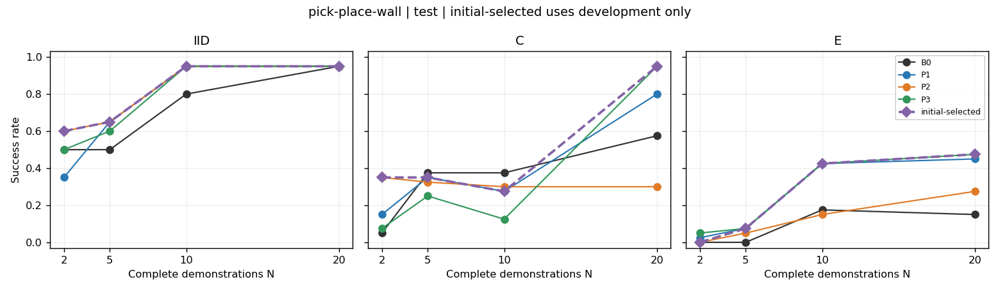

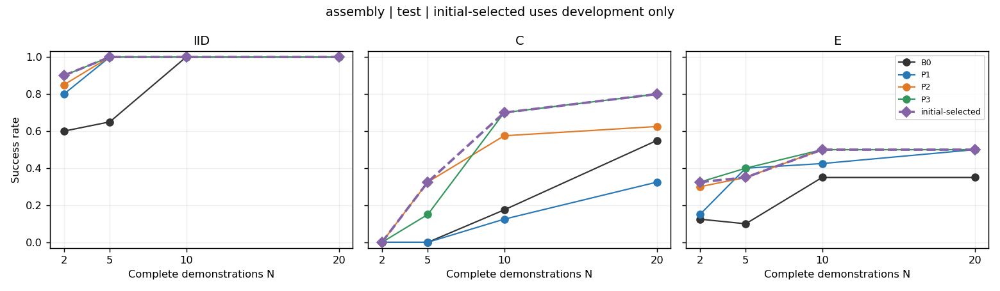

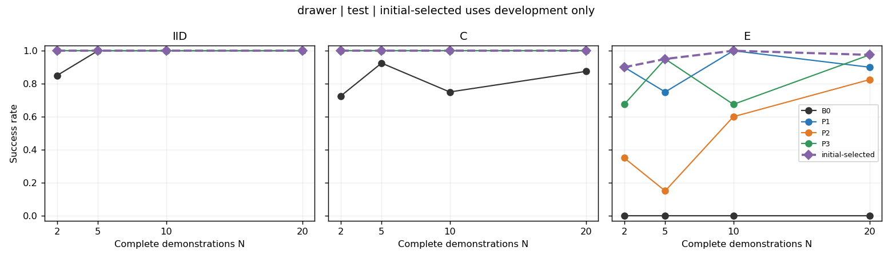

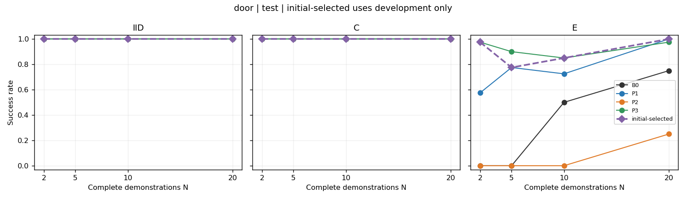

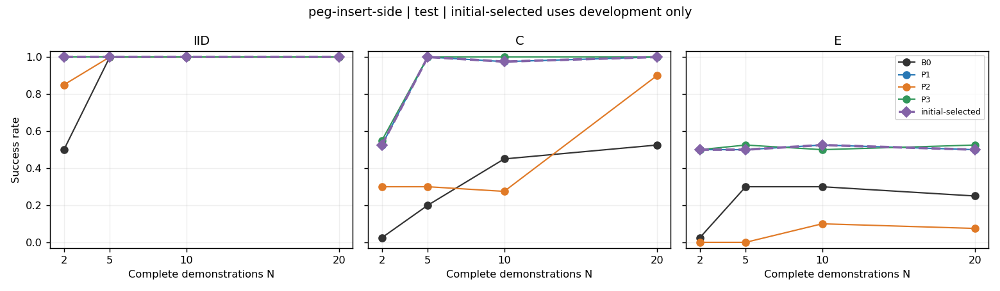

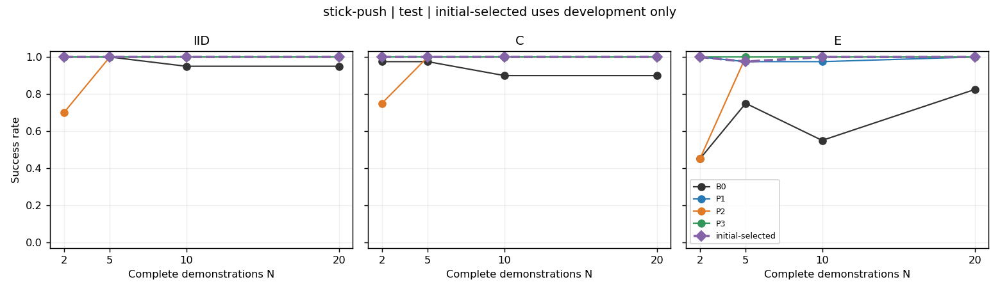

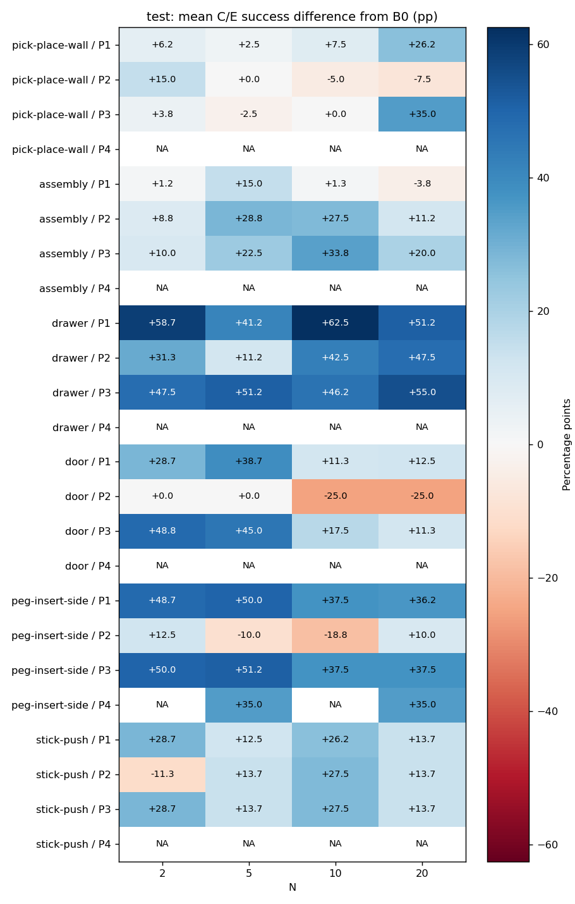

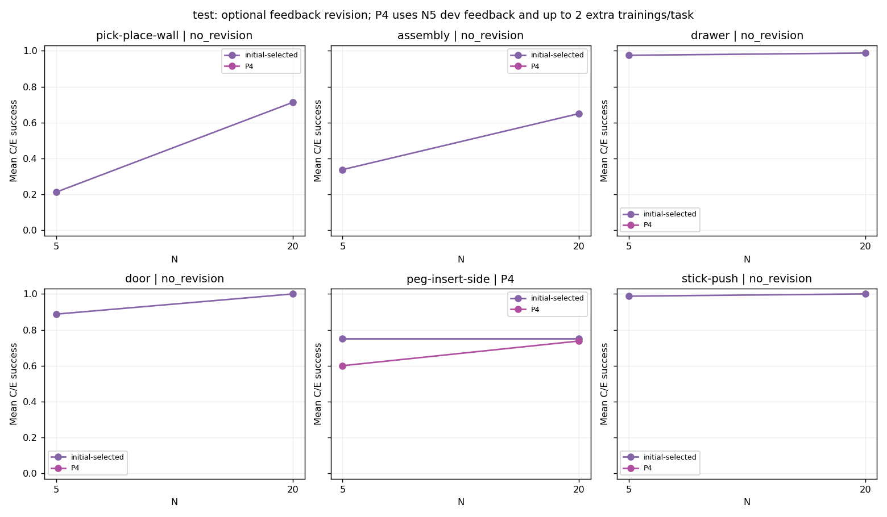

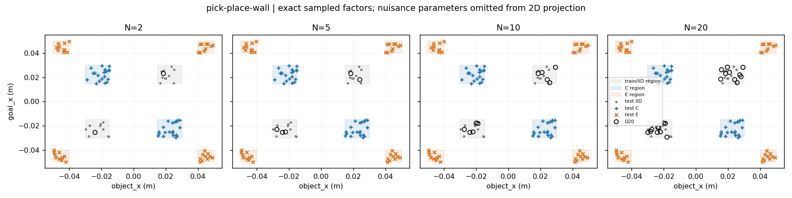

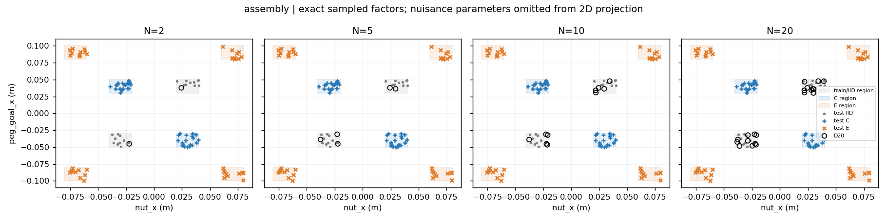

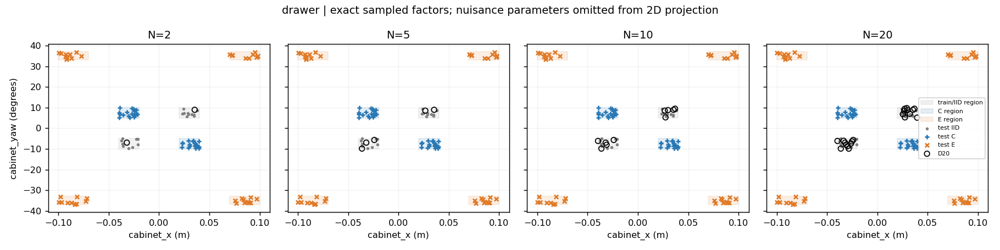

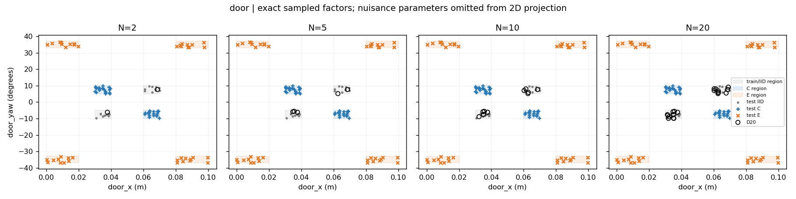

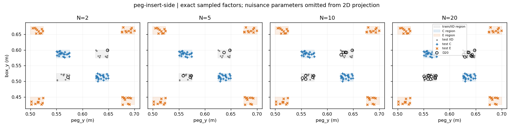

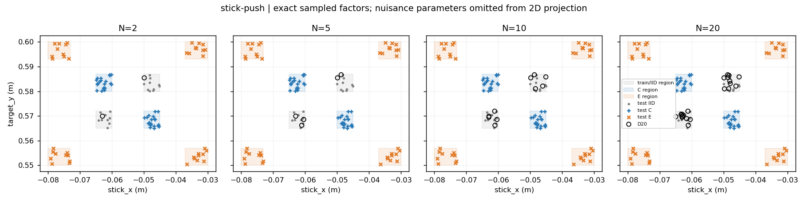

- [pick-place-wall_fixed_C_N20.mp4](videos/pick-place-wall_fixed_C_N20.mp4)
- [pick-place-wall_first_failure_N20.mp4](videos/pick-place-wall_first_failure_N20.mp4)
- [assembly_fixed_C_N20.mp4](videos/assembly_fixed_C_N20.mp4)
- [assembly_first_failure_N20.mp4](videos/assembly_first_failure_N20.mp4)
- [drawer_fixed_C_N20.mp4](videos/drawer_fixed_C_N20.mp4)
- [drawer_first_failure_N20.mp4](videos/drawer_first_failure_N20.mp4)
- [door_fixed_C_N20.mp4](videos/door_fixed_C_N20.mp4)
- [door_first_failure_N20.mp4](videos/door_first_failure_N20.mp4)
- [peg-insert-side_fixed_C_N20.mp4](videos/peg-insert-side_fixed_C_N20.mp4)
- [peg-insert-side_first_failure_N20.mp4](videos/peg-insert-side_first_failure_N20.mp4)
- [stick-push_fixed_C_N20.mp4](videos/stick-push_fixed_C_N20.mp4)
- [stick-push_first_failure_N20.mp4](videos/stick-push_first_failure_N20.mp4)

## Limitations and integrity

One training seed and one nested demonstration family do not establish stability across seeds or data selection. Wilson/bootstrap intervals reflect the sampled deployment states for fixed trained models only. P4 uses N5 development feedback and additional search/training, reported separately. Drawer/door have historical development exposure. These comparisons cannot establish superiority to human design or random search, universal cross-task priors, or that each task needs a distinct prior. Zero/ceiling outcomes and invalid candidates remain visible; no test redistribution or checkpoint selection follows outcomes.

Frozen earlier-round data, configurations and available reports are retained. Some historical checkpoint/run directories were absent from the received migration; their old report claims cannot be independently revalidated from those missing artifacts.
