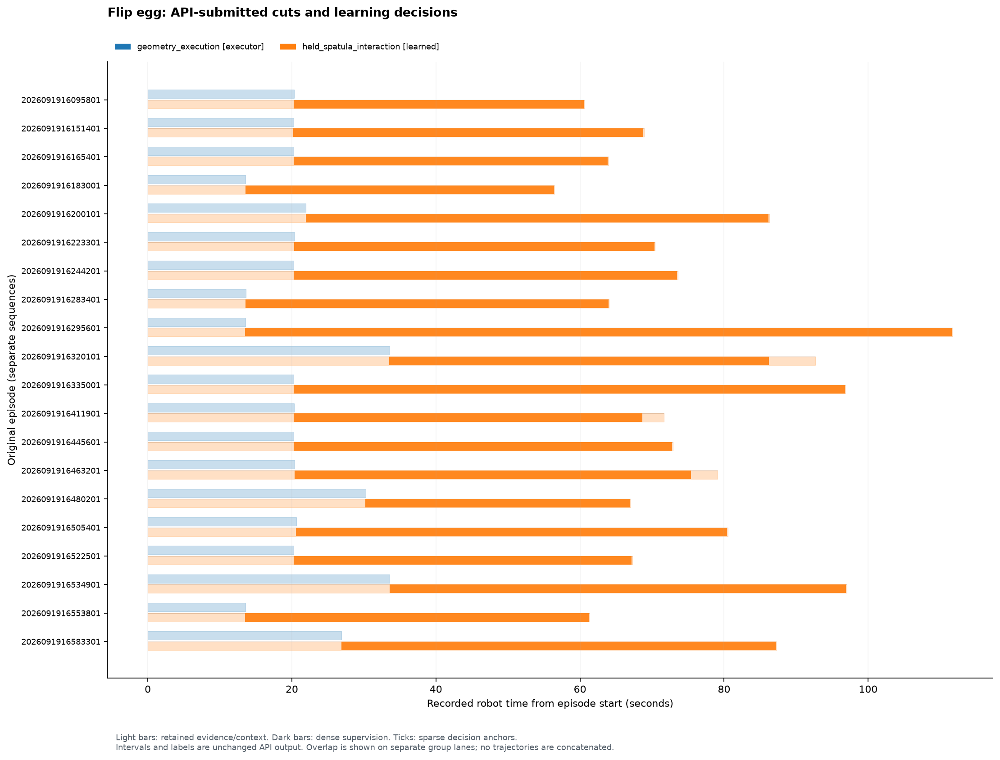

# Flip egg cut_v1：API 拆分与模型输入输出

核对日期：2026-09-21。本轮由 **gpt-6-astra/xhigh** 完成 cut、prior 与接口设计；
79 次请求/返回身份均通过核验，费用估算 **$12.4355135**，不是实际账单。
129 个发布文件、原始切片及来源一致性通过检查。**没有实现或训练模型，没有机器人执行或性能评估。**

本文是开发侧对提交结果的中文解释；科学设计原文保持不变，见
[API 原始方案](../data/flip_egg/cut_v1/plan.json)、
[policy 调用目录](../data/flip_egg/cut_v1/POLICY_CATALOG.md)、
[执行器契约](../data/flip_egg/cut_v1/EXECUTION_CATALOG.md)。

## API 实际怎么分

它选择 **2 个职责/数据组、40 个片段、1 个控制 policy、1 个 prior**。
另有一个需要训练的辅助感知模型，所以整个方案是 **2 个拟议训练组件**。

| 数据组 | 职责 | 数据组织 | 是否训练控制 policy |
| --- | --- | --- | --- |
| `geometry_execution` | 已知锅铲的接近、抓持、抬起及几何运动执行 | 每条示范一个前缀，共 20 段、12,570 行执行/标定证据 | 否；API 提议固定工具抓取配方、planner、夹爪和跟踪适配器 |
| `held_spatula_interaction` | 持铲后的任务相关接近、插入、角度调整、获得支撑、抬起、释放及初始离开 | 20 条完整轨迹作为上下文，只有各自声明的持铲区间承担控制监督 | 是；全部共享 `egg_interaction_v1` |

**这是职责和监督区间的切分，没有把插入、抬起、翻转分别训练成独立 policy。**
API 认为这些过程共享工具、运动变量和观测条件，而且示范中有反复调整与不清晰的阶段边界，
因此选择一个带时间记忆的条件模型。取铲则被分配给已知工具的几何配方。

学习组保留完整轨迹不意味着每行都有控制 loss：开头用于初始目标、抓取几何和历史，
结尾用于短时目标计算及结果观察。执行器前缀与学习上下文有意重用，不能当作额外独立示范。

例如第一条 `episode_2026091916095801`：

- 执行器证据为 `[0,601)`。
- 学习组保留 `[0,1811)`，控制监督仅 `[600,1808)`。
- 每个监督索引 `i` 用 `i+3` 的观测构造短时运动目标；最后三行只作未来目标/结果证据。
- 索引 600 同时是执行器交接证据与控制监督锚点。

浅色是保留的数据，深色是控制监督区间；每条示范单独计时。
[PDF 图](flip_egg_cut_v1/timeline.pdf)与[绘图核验](flip_egg_cut_v1/figure_receipt.json)可单独查看。

## 控制模型的输入

`egg_interaction_v1` 每次读取 **5 个因果历史时刻**，名义偏移为当前、−0.1、−0.2、−0.3、−0.4 秒。
必须选择已到达的原始配对记录，附带真实时间差和有效性；缺少历史用无效标记，不能补未来帧。

| 输入 | 拟议格式或含义 |
| --- | --- |
| 双视角 RGB | 每时刻 `[2,3,224,224]`，物体中心裁剪并保留原图映射；5 时刻合计 `[5,2,3,224,224]` |
| 双视角语义概率图 | 每时刻 `[2,4,224,224]`；背景、锅、蛋物体、锅铲四类，由辅助感知模型预测 |
| 锅铲关键点 | 每时刻 `[2,6,3]`，表示六个关键点的图像位置/可见性 |
| 机器人状态 | 每时刻 22 维：`q[7] + dq[7] + tau_ext[7] + gripper_width_m[1]` |
| 几何状态 | 锅坐标系下工具位姿 9 维（位置 3＋旋转连续表示 6），蛋质心 3＋有效位、平面尺寸 2、锅半径 1 |
| 目标和调用条件 | 当前蛋/锅 track、任务开始时的原始朝上面参考图、允许落入的锅内区域、工具标定及夹持变换 |
| 数据有效性 | 图像年龄、实际时间差、可见性、协方差、裁剪映射及标定版本；部分块的完整固定 schema 留待后续实现 |

锅坐标系以估计锅中心为原点，以测得的支撑面法向为 z，基座 x 在平面上的投影为 x。
锅把朝向作为障碍物信息，不强行成为策略的固定方向。

蛋在锅面或铲面上的三维位置只能在相应支撑状态有证据时从图像射线求交；
飞行或严重遮挡时保留二维证据和“未知”，不能假造落在平面上的位置。
原始深度保留，但设计不在未核实单位和配准前把它当作可信米制深度使用。

本任务的夹爪数值全量有限；`gripper_position` 保留作诊断，不能当成力。
`tau_ext` 也不能直接解释为末端笛卡尔力/力矩。

## 控制模型的输出、监督与执行

主输出为 **6 维短时局部运动**：

`u = [v_Bx, v_By, v_Bz, omega_Bx, omega_By, omega_Bz]`

前三维是铲具局部坐标中的线速度（m/s），后三维是局部旋转向量变化率（rad/s）。
铲具坐标系 `B` 原点设在铲前缘中心，x 从柄指向铲前缘，z 为铲面法向。
另输出 6 维不确定性、有效性/原因、当前观测 ID 和不超过 0.10 秒的执行时长。

API 拟议：小型双视角 CNN＋几何 MLP＋**128 单元 GRU**，输出 **3 分量对角高斯混合**。
部署时选择一个一致的混合分量，不能把相反方向的多个模式平均。
损失包含混合负对数似然、端点/旋转一致性和弱时间正则。
当前六个运动坐标都保留，没有强行将横移、roll 或 yaw 置零。

监督采用示范中**实测铲位姿的短时变化**，不直接复制原始 `v/w` 或关节命令：

`v_B = R_i^T (p_(i+3) - p_i) / dt`

`omega_B = Log(R_i^T R_(i+3)) / dt`

这里的铲位姿依赖未来实现的工具几何与夹持变换；`i+3` 仅用于训练目标。
API 明确指出原始 `w` 的实际坐标转换还需核实，不能只凭 metadata 直接假定解码方式。
**目前完成的是原始切片与目标定义，还没有生成或验证这些数值标签。**

在线名义 10 Hz 重观测/决策，取 `h=0.10 s`：

`p_goal = p_now + R_now v_B h`

`R_goal = R_now Exp(omega_B h)`

通过当前有效的铲—末端—法兰变换，把目标交给执行器跟踪。
policy 不输出关节速度、力矩或夹爪命令；握持设置保持不变。
在接触过程中，执行器必须遵守该短时路径与时间要求，或者明确拒绝，不能绕路后仍称目标完成。

## 辅助模型与抓取配方

`scene_geometry_aux` 是另一个拟议训练模型：双视角共享的 U-Net 风格网络，
通道 32/64/128，输出四类分割、六个锅铲关键点热图及可见性。
API 选择从头训练，没有假设现成外部感知权重。

这需要人工标注训练图像；API 建议以已检查的锚点和每 60 帧一次的图像开始，
再补充遮挡、插入、释放等困难情况。还需实际测量锅铲关键点/网格、夹爪、锅尺寸和支撑面，
并核实相机标定、TCP 与夹持变换。当前数据没有这些现成标注或完整工具资产。

取铲的固定配方也不是现成已验证的能力：API 要从确认过的闭合/抬起证据估计工具相对抓取模板，
再用 planner 连接，并通过夹爪适配器闭合和视觉共运动检查确认持铲。
因此“无需训练取铲 policy”不等于“取铲现在可以部署”。

## Agent 调用与完成判定

1. 建立任务会话，指定蛋、锅、锅铲模板和**任务开始时**的朝上面参考；不把示范终点图像作为在线目标。
2. `geometry_execution.acquire_tool` 完成几何接近、夹持、抬起，并核验持铲。
3. 调用 `egg_interaction_v1`，将六维短时运动交给 `track_local`，按反馈持续重观测和决策。
4. 释放与清空视野后，Agent 对照初始参考确认另一面朝上且蛋被锅支撑；不能确认时返回未知、再观察或请求协助。

“执行器到达几何目标”不是“翻蛋成功”。中断、滑移、明显场景变化或目标拒绝后，旧动作失效；
保留本轮原始目标，重置运动记忆，并重新确认夹持与观测。
安全接触跟踪、夹爪控制和工作区保护都是后续需接入核验的条件，不属于已经证实可用的能力。

## 数据统计与本轮限制

| 项目 | 核对结果 |
| --- | ---: |
| 原始示范 | 20 |
| 原始唯一记录／保留记录 | 45,730 / 45,730 |
| 删除或排除的原始记录 | 0 |
| 控制监督候选锚点 | 32,737 |
| 执行器前缀记录 | 12,570 |
| 因重用而计入两组的源记录 | 12,570 |
| 没有控制监督的唯一记录 | 12,993 |
| 其中执行器覆盖之外的尾部/上下文记录 | 443 |
| API 检查的唯一状态索引／图像-相机索引 | 103 / 231 |

API 将 `16320101`、`16411901`、`16463201` 对应轨迹的人为干预尾部保留为观察证据，
并提前终止自主控制监督；完整 ID 分别为 `episode_2026091916320101`、
`episode_2026091916411901`、`episode_2026091916463201`。
这些尾部不能当作机器人自主成功或恢复示范。

API 拟议按完整场景区块划分 11 条训练、4 条验证、5 条测试；对应候选锚点为
16,061 / 8,331 / 8,345。所有重用记录、目标参考和感知标注随原 episode 一起划分。
这些只是未来训练/评估划分设计，API 已在本轮设计中查看全部 20 条，不能称为设计阶段未见过的隐藏测试。

关键未决事项：人工感知标注、完整输入有效性 schema、工具/锅几何、夹持与标定核实、
目标标签有效性检查、接触跟踪适配和带明确翻转成功标注的评估。
本轮的结构检查和原始切片核验不证明语义边界、派生标签或拟议模型的性能。

## 核验与来源

- [完成回执](../runs/flip_egg/cut_v1/completion_receipt.json)
- [独立产物核验](../runs/flip_egg/cut_v1/validation.json)
- [源数据审计](../runs/flip_egg/cut_v1/data_audit.json)
- [API 费用记录](../runs/flip_egg/cut_v1/cost_ledger.json)
- [完整 API 原文报告](FLIP_EGG_CUT_V1.md)
- [运行来源、审批历史与范围](FLIP_EGG_CUT_V1_STATUS.md)
- [学习组完整 prior/预处理/调用原文](../data/flip_egg/cut_v1/datasets/held_spatula_interaction/heuristic.md)

通用 prompt 与 Push 当前使用的 v5 文本逐字一致，Flip egg 任务文档独立。
接口从 Push 当前版本隔离复制，只修改任务/来源说明、导入和产物路径，保留 fork 清单。
切分、目标定义、感知与模型设计均来自 API；开发侧没有改写提交内容。
