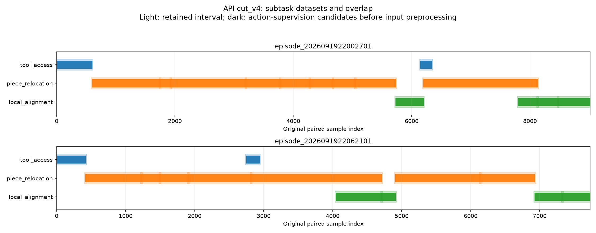

# Push cut_v4：子任务、数据组与 prior 成品

核对日期：2026-09-21。**切分与设计阶段已完成：3 个子任务组、4 个独立
policy 设计、28 个片段。** 全部科学设计来自 GPT-6 Astra/xhigh 的实际
提交，开发者仅执行、核验并在此作中文解释。尚未实现或训练这些 policy。

本轮 27 次请求及返回档位均核验为 Astra/xhigh；API 估算费用为
**USD 5.3269**，不是账单。12 项接口测试、93 个发布文件及原始切片
核验通过。旧 cut_v3 的 14 个冻结文件和 71 个发布文件哈希保持一致。

逐项合理性、训练支持与 agent 接口缺口另见
[详细接口审阅](PUSH_CUT_V4_INTERFACE_AUDIT.md)，包含原始动作测量和图像抽查。

## 实际生成的技能库

| 子任务 / 数据组 | 职责 | 片段数 | 独立 policy | 有限命令监督候选（组内去重） |
| --- | --- | ---: | --- | ---: |
| `tool_access` | 工具接近、脱离、保持间隙及换位，到达调用者指定的工具位姿 | 4 | `access_clearance_v1` | 1,072 |
| `piece_relocation` | 将选定物体推到暂存或目标位置，包含同物体重接触和交接动作 | 16 | `push_boundary_v1`、`push_visual_v1` | 13,370 |
| `local_alignment` | 对已暂存或接近目标的物体进行位置/方向微调，保护邻近物体 | 8 | `align_local_v1` | 3,345 |

各组可复用原始记录，表中数量不能相加当作独立数据量。具体区间和
condition 见 [完整片段 CSV](../runs/push_letters/cut_v4/segment_inventory.csv)。

## 四个 prior 分别做什么

**工具移动 `access_clearance_v1`：** 目标相对位姿、障碍物几何、带滞回的
阶段记忆，以及运动学提议上的学习残差。拟议内部阶段包括离开、平移、
下降和稳定；调用者可指定 approach / depart / transfer 模式。数据包括
两条示范的初始接近，以及两个跨物体过渡片段。
[API 完整设计](../data/push_letters/cut_v4/datasets/tool_access/heuristic.md)。

**几何搬运 `push_boundary_v1`：** 用外轮廓、内孔和局部边界图提出接触
候选；学习短时物体响应模型，通过观测反馈选择接触点和动作。
目标是让不同物体共享局部几何与交互规律。

**视觉搬运 `push_visual_v1`：** 选定物体 mask、目标轮廓和双视角时序
输入，预测短动作序列并逐次重观测。它保留几何提取不稳定或部分遮挡时
的外观与历史信息，独立于几何搬运 policy 训练。
[两个搬运 prior 的 API 完整设计](../data/push_letters/cut_v4/datasets/piece_relocation/heuristic.md)。

**局部微调 `align_local_v1`：** 结合目标误差、接触模式记忆和近期动作
造成的实际物体变化，选择幅度受限的短平移/转动动作，并允许重新接触
或换位。训练组包括六次后续回访及两个较长搬运中的后期纠正片段。
[API 完整设计](../data/push_letters/cut_v4/datasets/local_alignment/heuristic.md)。

这些是 API 的设计机制和预期用途，尚未形成模型权重或实测性能结果。

## Buffer、复用与覆盖

主要片段在可用处保留前后各 **15 行**上下文，按名义记录频率约为各
0.5 秒。API 将这些外围 buffer 用于历史、交接证据和训练标签检查；
动作监督在该子任务的明确监督区间内进行。

另外有四段明确的跨组动作监督复用，范围均为原始索引 [start, stop)：

| 原始轨迹 | 复用区间 | 用途 |
| --- | --- | --- |
| A：`episode_2026091922002701` | [6150, 6340) | 原物体组的释放/接近动作，同时供工具换位学习 |
| B：`episode_2026091922062101` | [2750, 2940) | 同上，以工具终点位姿作为工具组条件 |
| A | [7800, 8130) | L-like 物体搬运后期，同时用于局部纠正 |
| B | [4050, 4710) | R-like 物体后期重复调整，同时用于局部纠正 |

四段共增加 1,370 条监督使用次数。API 要求后续密集跟踪核验工具换位
段中的物体静止条件；若出现真实物体位移，对应动作在工具组的监督
资格需要处理，并保留其物体组训练支持。

全部 **16,745 条**原始记录至少保留一次；共 18,895 条片段记录引用，
其中 2,030 条原始记录在多个片段中出现。基础监督区间覆盖完整时间线，
其中 **16,417 条**具有有限七维原始命令，另 **328 条**缺失该命令，
不能据此构造零命令监督。有效输入转换后的实际训练覆盖需在实现阶段
逐行为统计；当前数量是预处理前的候选，不是已训练样本数。

浅色为保留区间，深色为显式动作监督候选区间；缺失命令和未来输入
转换的有效性未在图中作为逐行遮罩。不同组同时出现表示数据复用。
相邻片段仍分别存储，图中的连续色带不代表将片段拼成了新轨迹。

## Agent 怎样调用

API 定义了公共调用字段：policy ID、调用 ID、场景跟踪版本、所选物理
实例、局部几何目标、受保护物体、可选工具退出位姿、容差和调用时限。
工具组接受工具位姿目标；搬运和微调组接受目标轮廓/方向，或在标定
具备时使用桌面坐标中的位姿。

高层 agent 可先调用工具 policy 到合适位置，再选择几何或视觉搬运。
观察结果后，选择继续搬运、调用局部微调，或调用工具 policy 换位。
四个 policy 并不构成必须依次执行的四阶段流程。详见
[API 调用目录](../data/push_letters/cut_v4/POLICY_CATALOG.md)。

当前设计提供了独立的工具移动与微调调用能力；搬运和微调内部仍能
执行接近、重接触和短暂抬起。**这轮没有提出统一的“所有推动都硬约束
为二维末端运动”的 prior。** 工具 policy 的自由移动训练支持目前只有
四段，其接口中 depart 等模式的覆盖仍需后续实现时按实际行为核对。

## 真机输入转换

API 保留了完整的预处理、感知/跟踪、目标及退出条件转换、动作解码
义务。拟议使用类别无关实例/工具分割、因果双视角跟踪与几何配准。
所需分割权重、标注、工具几何、桌面标定和机器人碰撞模型逐项列为
待获取或验证资产。训练专用未来标签与在线输入明确分开。完整内容见
[API 原文报告](PUSH_CUT_V4.md) 的 model inventory 和各组 heuristic 文档。

## 验证与来源

- [实际 API 方案](../data/push_letters/cut_v4/plan.json)
- [发布清单](../data/push_letters/cut_v4/manifest.json)
- [请求、来源、切片与文件核验](../runs/push_letters/cut_v4/validation.json)
- [独立数值审阅](../runs/push_letters/cut_v4/review.json)
- [成本明细](../runs/push_letters/cut_v4/cost_ledger.json)
- [完整原文报告](PUSH_CUT_V4.md)

这里的中文说明不改写 API 原始方案；核验包括结构、实际请求、来源、
原始切片、有限命令数量和覆盖统计，未进行逐帧物理接触真值标注。
