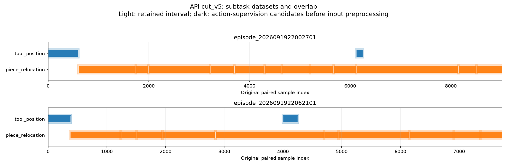

# Push cut_v5：小数据强 prior 提示后的成品

核对日期：2026-09-21。**已完成 2 个子任务数据组、3 个独立 policy/prior
设计、26 个片段。** 29 次实际请求与返回均核对为 GPT-6 Astra/xhigh，
估算费用 **USD 5.48676**；85 个发布文件与原始切片验证通过。
科学方案为 API 原始提交，本报告为开发者解读。尚未实现、训练或执行 policy。

**本轮最重要的结果：小数据要求使 API 更明确地限制学习自由度、采用
物体/接触相对表示，但它选择合并微调、保留完整物体操作，而没有把
平面推单独切成一个可调用数据组。**

## 1. 实际技能库

| 子任务数据组 | 片段 | Policy | 主要设计 |
| --- | ---: | --- | --- |
| `tool_position` | 4 | `tool_waypoint_v1` | 几何规划与运动学控制承担可预测的移动；小模型学习阶段、速度和路径残差 |
| `piece_relocation` | 22 | `piece_contact_graph_v1` | 物体局部边界、孔洞与接触几何；学习接触响应残差及法向/切向运动 |
| 同一搬运组 | 同上 | `piece_goal_field_v1` | 当前/目标形状的密集几何场；小型时序模型学习局部纠正速度与阶段 |

两个物体 policy 独立训练、共享相同的 22 个来源片段。一次搬运或回访
仍然是独立序列，不将不同片段拼成连续轨迹。微调、重复推、换接触侧
和离开动作保留在物体组内部，由 policy 的模式机制处理。

[API 调用目录](../data/push_letters/cut_v5/POLICY_CATALOG.md) ·
[完整 API 方案](PUSH_CUT_V5.md) ·
[逐片段清单](../runs/push_letters/cut_v5/segment_inventory.csv)

## 2. 对用户关注点的直接回答

### Object-centric 是否更明确？

是。接触图 policy 明确使用物体相对坐标、局部边界法向、曲率、孔洞、
工具相对偏移和目标误差，并保留真实尺度和邻物几何。目标场 policy
使用有物理尺度的局部地图，表示当前物体、目标轮廓、工具和障碍，
以形状对应关系承担位置/方向变化；它不是必须估计唯一物体正面的
字母分类模型。后者使用 workspace 对齐的地图，不应将它描述为所有
输入都旋转到了唯一物体坐标系。

这两者都将语义识别、目标布局与操纵几何分开；当前实例及其目标几何
是操纵条件。识别模型、几何估计和所需资产仍待后续实现。

### 是否提出了 2D EE motion？

提出了以平面运动为核心的动作参数化，但**不是只输出两个数的严格
2D policy**：

- 接触图 policy：接触阶段输出局部法向/切向速度，并保留受限的高度与
  姿态残差；接近、reset、离开阶段允许三维运动。
- 目标场 policy：输出 workspace 中的 `vx, vy`，同时包含离散阶段、
  高度变化率和受限角速度残差。

API 根据记录中的非零角命令和工具倾斜，选择保留这些变化。它把强 prior
落实在阶段相关的低维变量、几何规划和残差学习上。物体绕桌面法向旋转
与工具自身旋转仍是不同变量，不能由“平面工具运动”推断物体只能平移。

### 是否将平面推动单独 cut 到一起？

没有。所有物体操作仍汇入 `piece_relocation`，其监督含接近、接触推、
抬起、换边和微调。它没有发布只包含相容平面接触推区间的单独数据组，
也没有给高层 agent 单独的纯平推调用。

API 的解释是：数据极少，平移、偏心旋转和小幅纠正共享同一几何目标，
保留在一组能集中训练支持，内部模式机制承担运动差异。因此，新增要求
确实进入了科学设计，但被它解释为“减少独立技能数量、加强技能内部
结构”，没有产生“更多按运动模式切分”的结果。

## 3. 与 cut_v4 的对照

| 方面 | cut_v4 | cut_v5 |
| --- | --- | --- |
| 子任务组 / policy / 片段 | 3 / 4 / 28 | 2 / 3 / 26 |
| 微调 | 独立 `local_alignment` 组和 policy | 并入物体搬运 |
| 物体组边界依据 | 搬运/回访，并有微调复用 | 物体调用/回访，内部处理 stroke 与模式变化 |
| 几何 prior | 接触提议与响应模型 | 更明确的几何规划 + 低维接触/响应残差 |
| 第二个物体 prior | 双视角时序 RGB / mask | 有尺度的几何目标场与时序 servo |
| 主要动作监督 | 原始七维 `action.dq` | 原始 `action.v/w`；`action.dq` 用于 follower 辅助核验 |
| 接触动作约束 | 有几何与模式结构 | 明确法向/切向或 `vx,vy`，加受限高度/姿态残差 |
| 工具交接 | endpoint pose、稳定状态要求 | endpoint pose + terminal twist + `pass_through/stop` |
| 普通两侧 context buffer | 各 15 行，约 0.5 s | 各 20 行，约 0.67 s |

动作监督的变化有实际意义：它将机器人关节冗余的处理交给经核验的
运动学 follower，使学习更贴近任务空间的运动变量。但后续必须获得
原控制器实现，核对 v/w 的参考系、作用点、单位、滤波/保持语义及
到关节速度的映射，才能落实这套设计。当前发布的是方案，不能把
这个转换记作已经存在或验证成功。

## 4. 数据覆盖与切分时间线

两条轨迹共 16,745 行，全数保留并处于至少一个拟议监督区间。
共物化 18,087 行使用，其中 17,127 次处于监督区间、960 次为上下文。
额外跨组动作复用为 382 行：A[6120,6251)、B[4000,4251)。

| 数据组 | 组内去重监督行 | 有限 `v` 和 `w` | 有限七维命令 `dq` |
| --- | ---: | ---: | ---: |
| 工具定位 | 1,362 | 1,362 | 1,034 |
| 物体搬运 | 15,765 | 15,765 | 15,765 |
| 全局去重 | 16,745 | 16,745 | 16,417 |

表中统计的是原始字段有限性，未计入感知、目标转换或模式标注后的
有效性。工具组 328 行缺少关节命令，但原始 v/w 有限；按这轮 API
设计可作为相应动作分量的候选监督，不能补造关节标签。

浅色是保留区间，深色是监督候选，细白线标记每段监督边界。
每段保留原始索引和独立序列身份；两种物体 prior 使用同一来源组。

## 5. 本轮可以得出的结论

这一次输出显示，“小数据 + 强 motion/representation prior”的要求
促使 API 提出了更具体的低维残差学习与确定性几何分工。
它没有让 API 自动采用我们期待的平面推独立分组；相反，它把微调合并，
以内部模式处理更多行为。因此仍不能把这轮视为按运动模式切分的成品。

若下一步希望改变这一点，需要进一步明确高层调用单元应当对应可共享
的局部交互模式，并让 API 解释该模式对应的核心监督区间与入口/出口。
这属于后续设计选择，本轮没有追加 prompt 修订、重跑或训练。

## 6. 验证与执行来源

- [完成回执](../runs/push_letters/cut_v5/completion_receipt.json)：29 次
  调用全部消费，费用记录无未决项，未训练或执行机器人。
- [独立验证](../runs/push_letters/cut_v5/validation.json)：85 个发布文件、
  原始切片、模型/effort、输入文档和 API 提交来源核验通过。
- [可复现统计](review_cut_v5.py)与[统计结果](../runs/push_letters/cut_v5/review.json)。
- 旧 cut_v3 的 14 个冻结文件/71 个发布文件、旧 cut_v4 的 15/93 个文件
  均保持原哈希。原始数据未修改。
- 新 prompt 仅增加已讨论的 128 词；[精确差异](../runs/push_letters/cut_v5/setup/prompt_derivation.diff)。
- 用户已授权本轮及后续同类数据发送；[持续授权](../authorizations/openai_data_processing_20260921.json)。
  原自动审批拒绝及其解决过程保留在[执行记录](PUSH_CUT_V5_STATUS.md)。
