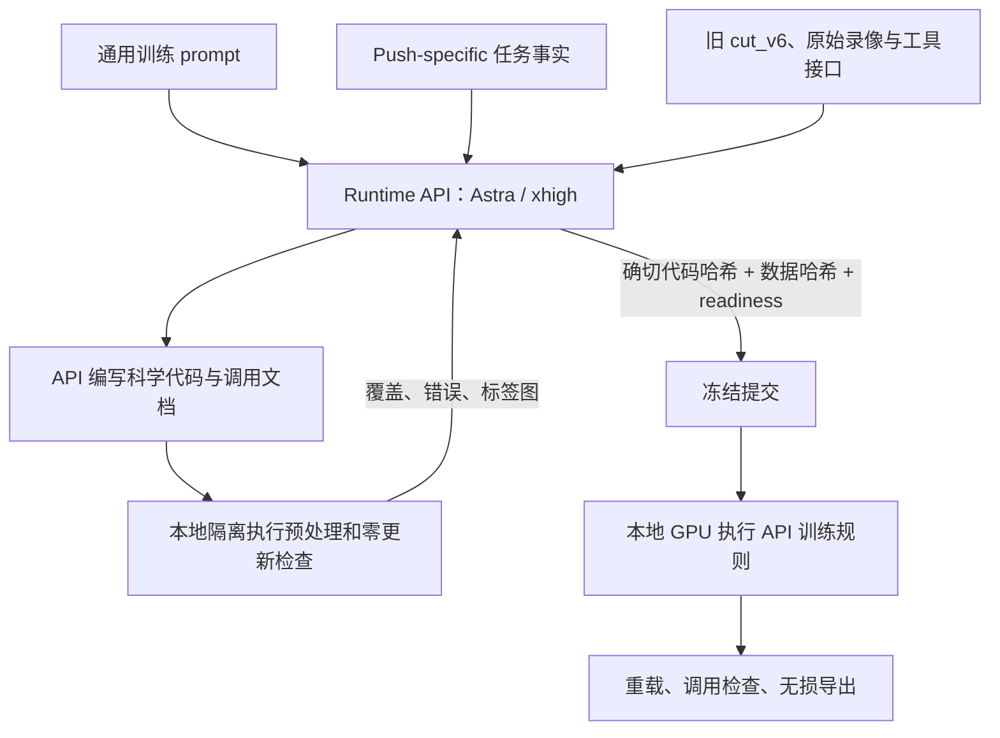
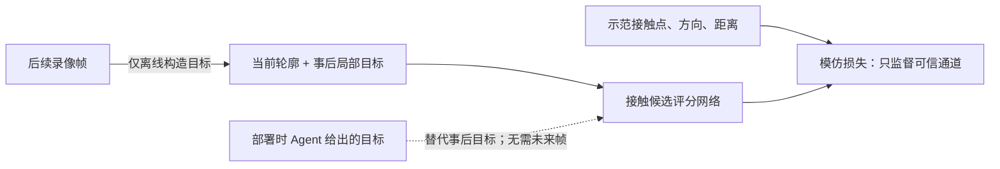
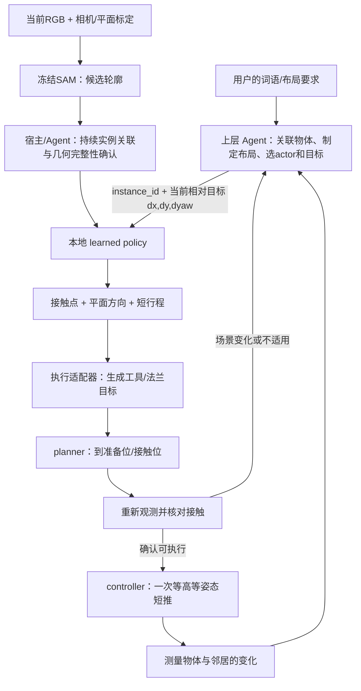

# Push v6：完整设计、API 调用与 Agent 接口

核查日期：2026-09-22。这里的 v6 指 **training_v6**，使用此前完成的 **cut_v6**。
两种编号是不同阶段。本轮没有重新 cut，也没有执行仅留档的新版 cut prompt。
本文为开发者核查说明，不传入正在运行的 Runtime API，不改动其科学设计。
最终API提交 `6483209318...`：130例、3,000次更新，训练及重载/调用检查已完成。
此前144例为第七次检查的中间结果，最终第八次检查修订了起始参考轮廓和工具端点。
最终数值见[训练报告](PUSH_TRAINING_V6.md)和[完成回执](../runs/push_letters/training_v6/completion_receipt.json)。

## 1. 两种 Agent 与一个本地模型

| 角色 | 何时工作 | 实际职责 |
| --- | --- | --- |
| Runtime API / 设计 Agent | 当前离线实现阶段 | 查看数据、编写预处理和模型、决定监督、采样与训练规则、检查后提交 |
| 学到的 shape_push_v1 | 部署时本地推理 | 根据物体几何和明确目标，选择接触点、平面推动方向与短距离 |
| High-level Agent / 任务 Agent | 用户将来连接真机时 | 理解词语、关联物体、制定布局、选物体/目标、调用策略与执行器、根据反馈继续 |

设计API运行在官方OpenAI Responses接口，本轮要求并审计 `gpt-6-astra/xhigh`。
本地策略推理不调用OpenAI API，也不需要API key。上层任务Agent是否调用云端模型，
由接收端系统决定；这里没有声称它已经接通机器人。

## 2. 实际给设计 API 的输入



通用prompt来自 [implement_and_train_final_fit.md](../prompts/implement_and_train_final_fit.md)。
它让API决定数据处理、训练样本、监督、表示、policy数量、模型、损失、优化、停止和
checkpoint选择；鼓励Diffusion Policy，但允许有理由的其他模型。它明确允许prior决定
输入输出，并用 **contact point movement** 作为例子，连接运动交给已有planner/controller。

本轮相对原v5通用prompt的新增要求只有：尽量使用有效示范数据，并实际交付最终拟合的
模型；没有明确保留为独立测试的数据，可在确定学习方案后用于最终训练。它没有指定
130例、96点、864候选、18,497参数、3,000步或一个policy。

[Push任务事实](../task_specifications/push_letters_training.md)提供少量数据、完全新物理
字母与新词的目标、上层Agent职责、显式布局要求、两条原始录像、没有既有真值mask/pose/
成功标签，以及用户声明的planner和controller能力。目标是任务事实，而非某个写死的网络。

原 [cut_v6](../data/push_letters/cut_v6/POLICY_CATALOG.md) 已提出一个几何接触选择器、
12个学习片段和两个完整执行器上下文。它是本轮起始设计；API可以修订派生采样和实现，
保留原cut。旧47个决策锚点只是参考，不再是训练样本白名单。

还有一个需要准确交代的历史输入：本轮与原v5配置相同，仍提供
[v4 prompt/data audit](PUSH_TRAINING_V4_PROMPT_AUDIT.md)。**没有传入已完成v5的模型/训练
结果、v5划分审查或已删除的反馈修正轮内容。** 输入差异见
[setup receipt](../runs/push_letters/training_v6/setup_receipt.json)。

## 3. 固定框架与 API 科学决定的边界

框架提供只读数据工具、受控文件写入、资产下载、检查/提交接口、GPU执行、优化循环、
哈希/日志/usage记录。API决定这些接口内的科学内容：

| 接口 | API 决定的内容 |
| --- | --- |
| prepare_data | 从哪些帧构造什么输入、目标和有效性信息 |
| build_model / make_batch / compute_loss | 网络、batch表示和监督目标 |
| sample_indices / configure_optimizer / before_update | 抽样、优化器与学习率 |
| after_update | 何时停止、保存哪个模型、报告哪些诊断 |
| act / executor_request / calling_cases | 在线输入转换、模型输出、执行目标和可执行调用检查 |

框架只有上限，例如单policy不超过20,000次更新、batch/资源限制、最多三次实现修订，
不是预先强制执行20,000步，也不强制某个A/B划分。
实际实现异常可带真实诊断返回API修复；API明确声明数据/实现阻塞时，通用驱动支持
有界的API自主恢复。网络传输异常不自动重试；训练表现不用于偷偷发起额外搜索。
本轮八次预处理检查是同一次设计会话的实现迭代，只进行了一次正式模型训练。

## 4. 原始录像怎样变成训练样本

两条录像共16,745条原始配对记录保持不变。当前API在原12个学习片段内按15行间隔，
加上原cut参考点，考察了1,075个决策锚点。approach/抬起等执行器轨迹保留作上下文，
不会都变成接触选择网络的动作监督。

每个候选例的转换为：

1. 当前图像经冻结SAM及API后处理，得到物体外边界/内孔；通过相机标定和推断平面转换成米。
2. 图像工具端点与物体轮廓推断接触；记录中的短段工具运动提供方向/距离标签。
3. 约30行之后的物体轮廓配准，得到局部实际物体变化，作为该示范的**事后目标条件**。
4. 接触、方向、距离分别记录可信度；缺失方向或长度时对这些候选维度边缘化，不填零冒充标签。
5. 当前版本再将actor与该cut起始帧的因果参考轮廓匹配，排除完整性无法确认的形状。



这不是让网络猜用户想拼什么词，也不是训练一个预测物体物理演化的动力学模型。
它学习：“给定这种物体几何与这种期望变化，示范采用了什么接触动作”。
未来帧只在离线构造目标时使用；部署时对应的目标由Agent明确给出。

最终检查：1,075个锚点 → 332例接触/运动转换通过 → 130例完整性筛选通过。
130例中A录像43、B录像87；115例完整三通道、15例仅接触监督；11例内孔接触。
只剩9/12个学习片段有监督，A的open-corner/bar finish与B的loop finish为零。
这些相近交互在其他片段仍有数据，但不能因此把覆盖写成12/12。

最终完整性筛选排除了202例；失败既可能是当前轮廓残缺，也可能是cut起始参考本身
不够清楚。**不能断言这202例原始数据都不能学**；当前预处理有保守排除的可能。
离线几何也仍是弱推断，不是经过真机commissioning的测量真值。

## 5. 模型具体学什么

API当前选择一个共享候选评分网络，18,497个可训练参数，SAM冻结。
神经网络输入没有原始RGB、字母ID、词语字符串或机器人关节轨迹。

| 输入 | 大小 | 内容 |
| --- | --- | --- |
| actor轮廓特征 | 96×8 | 局部坐标2、法向2、目标点位移2、内孔标志1、曲率1 |
| 候选动作特征 | 864×20 | 接触/法向/方向、目标关系、力矩代理、行程、工具尺度、障碍距离等 |
| 几何可行性 | 864 | 根据工作区、邻居与工具半径剔除不适用候选 |

864来自96个边界点 × 3个方向 × 3个距离。三个方向围绕内向法向偏转−40°、0°、+40°；
名义距离5/10/20mm，再按物体尺度及调用限制截断。API用局部/目标相关表示、共享参数与
受限动作降低学习负担。大量候选不意味着为每个候选训练一套网络。
当前表示去除了绝对位置，并在目标平移明确时按目标方向定向；近纯旋转时使用
base方向，因此不应称为所有情况下都严格旋转等变。

点网络为8→64→64；对96点做mean/max汇聚得到128维全局上下文。
每个20维候选拼接128维上下文，经148→64→64→1评分器得到分数；屏蔽不可行候选后选最高分。
得分不是校准过的成功概率。它是一个有明确几何约束的示范动作选择器。

实际训练由API选定：AdamW、batch16、3,000步、初始学习率0.0005、warmup及cosine调度，
不用EMA，选最后模型。采样先让全部有效例各进入梯度一次，再按片段均衡抽样。
**A和B都训练，没有再把B整条录像只留给开发。** 最终拟合诊断是训练标签一致性，
不能当成未见字母或真机成功率。

独立采样审计确认全部130例参与梯度，47,986次曝光，与保存的随机数状态一致。
最终训练集接触标签差异16.403mm、API汇总行程差异2.101mm，不能称为精确模仿。
这些不是物体到位误差；不同接触可能也有效，但没有实际闭环结果证明这一点。
训练后的重载预测误差为零，9个API调用案例和独立进程接口检查均通过。

## 6. 真机上 Agent 怎样使用



Agent需要给出明确的米制目标：`goal_delta=[dx,dy,dyaw]` 表示以当前轮廓质心为中心
旋转dyaw，再沿base XY平移dx/dy。可以每次短推后根据同一个世界目标重新计算。
当前实现的输入不是完整目标文字；“拼一个词”仍须由上层转换成每个物体的布局目标。

一次几何调用的必要内容：

| observation | call |
| --- | --- |
| 持久物体ID，96个XY轮廓点、法向和轮廓环编号 | 选中的instance_id |
| 其他物体几何、工作区 | 该物体当前相对目标[dx,dy,dyaw] |
| 工具半径、接触高度、标定标识与有效性 | scene_revision、reference_id |
| 观测时效、不确定度、完整性确认 | 容差、短推距离上限、执行反馈/中断 |

也可先传RGB给`act`，但该分支返回 `associate_instances` 和候选轮廓，尚不返回动作。
宿主/Agent需关联和确认几何，再传已关联Scene。SAM提案不是完整场景真值。
离线使用颜色引导的点提示和参考框，在线原图分支使用网格提示；几何转换/特征
代码共享，但两种感知输入的误差分布不保证一致，需在接收端核验实际轮廓质量。
`geometry_complete_validated=True` 是上游完成确认的声明，不是这里已经实现并验证好的
自动场景验证器。可用过去清楚观测的 `causal_shape_references` 补孔洞并进一步匹配。

`proposed` 的关键输出为：

```text
contact_point_m: [x, y]       # 物体边界接触点，base XY，米
direction_unit: [ux, uy]     # 平面单位推动方向
stroke_length_m: L           # 一次短推长度
outward_normal: [nx, ny]     # 由几何提供，供工具半径偏置
```

接触高度来自调用方，不是网络预测。执行适配器用边界点、法向、工具半径和标定变换
生成standoff/contact/end法兰目标；该短推阶段保持高度和姿态。网络没有输出竖直抬升的
维度；接近、下降、换侧、撤离属于planner的明确阶段。

适配器输出始终是 `execute=False` 的目标说明，不能直接当关节指令。真实planner/
controller、标定、碰撞模型与guard绑定仍由接收端提供。

## 7. Agent如何理解结束、失败与记忆

`proposed` 只表示有一个候选动作。到达准备位也不表示物体到位。
`already_at_goal` 要求上游测得稳定，且平移/旋转误差在调用容差内。
`needs_view`、`stale_scene`、`no_safe_candidate`、`calibration_required` 等均有独立处理含义。
上层根据推后物体变化继续选接触、换物体或调整布局，不按录像阶段硬编码执行。

网络本身无时序隐藏状态；外部memory保存actor/reference、目标、标定与无进展计数。
换目标/物体/标定或中断需遵循reset约定。当前内部key包含数值goal_delta，重新计算
目标可能重置计数，所以Agent还需要自己的整体尝试次数/无进展管理。

## 8. 当前核查结论

**科学设计所有权与调用流程符合当前约定**：通用流程固定，API决定具体科学实现；
未固定47例、未强制大开发集、未将v5表现作为本轮修正反馈；原cut和旧版本保留。
所学动作与planner职责可分离，接口能表达实际的局部推移选择。

仍需明确三个实质边界：

- 最终130例是弱标签且只来自两条同一批物体的录像；完整性规则可能过度筛除有效经验。
- 场景完整性/持久关联、词语布局与物理执行由上游承担；不能把一个确认布尔值视为已实现这些能力。
- 当前框架缺乏跨修订阶段缓存，导致重复SAM/几何计算；这是效率问题，与模型是否能学习是不同问题。

因此可以确认“设计分工和调用契约可检查、没有回到手写固定样本方案”，不能据此宣称
整个自主机器人系统已经集成完毕。正式权重的梯度更新、重载和独立进程调用已验证；
实际迁移结果见[迁移回执](PUSH_V6_DEPLOYMENT_CHECK.json)，它们仍不等于新物体真机性能。

给Agent的入口：[部署README](../deployment_pipeline_v2/README.md)。最终导出中保留
API的POLICY_CATALOG、CALLING、FINAL_QUALITY、HANDOFF和每个policy的usage/prior文档。
`example --bundle push_v6` 用真实权重跑离线示例，示例标定明确为合成值。
